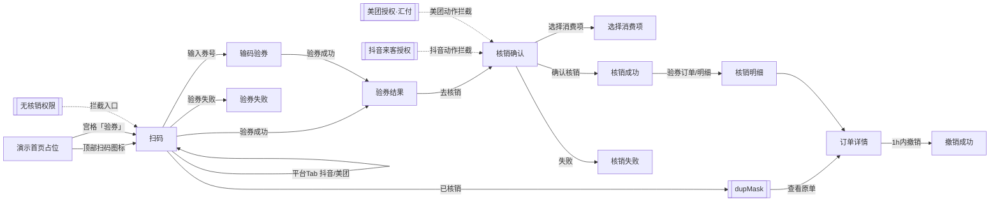
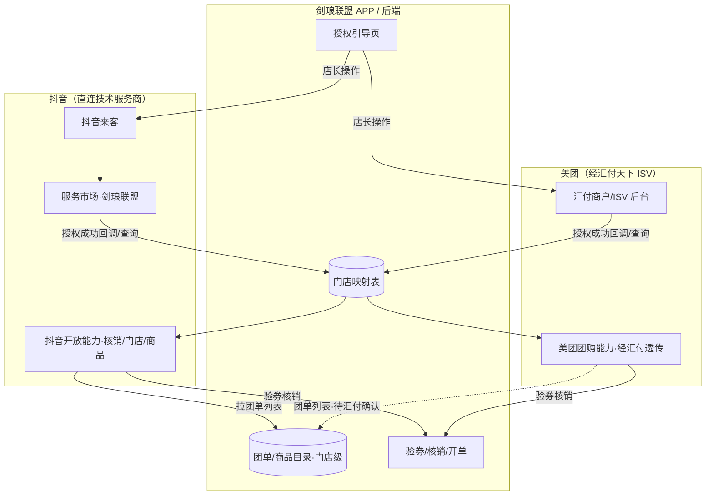
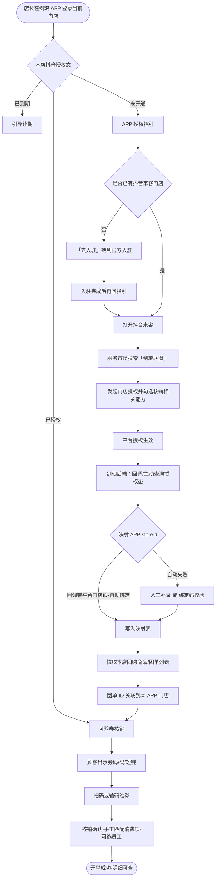
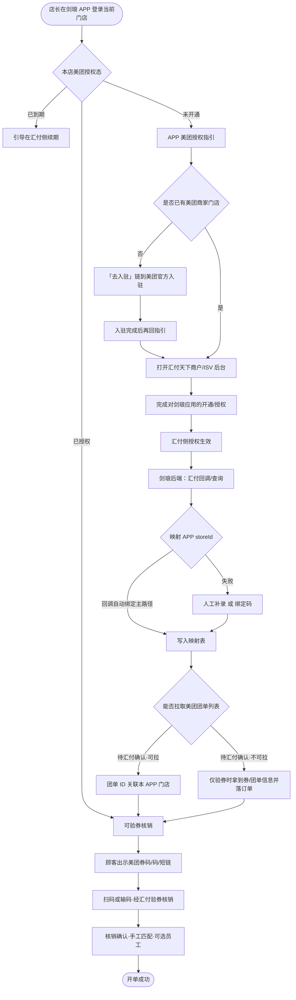
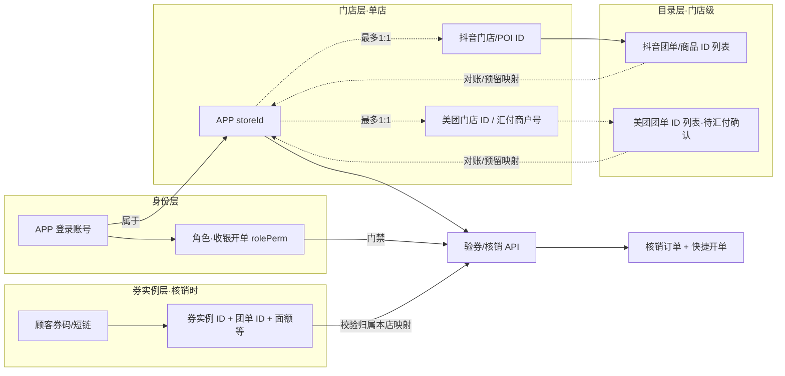

# PRD：团购核销（单店 · 商户端）

| 字段 | 内容 |
|------|------|
| 文档版本 | v1.4 |
| 日期 | 2026-09-09 |
| 交互原型（唯一可视依据） | 同目录 `index.html` |
| 画布 | 390 × 844 |
| 目的 | 供前端 / 后端 / 测试及 AI 工具落地「团购核销」；**只需本文 + 交互原型** |

---

## 怎么读这份 PRD

正文按模块编排。**不用通读全文**，按角色跳章即可。

| # | 模块 | 前端 | 后端 | 测试 | 说明 |
|---|------|:----:|:----:|:----:|------|
| 1 | 背景 / 目标 / 范围 / 能力映射 | ✓ | ✓ | ✓ | 本期变更叙事、防范围蔓延 |
| 2 | 用户场景与成功标准 | ✓ | 了解 | ✓ | 测「业务对不对」 |
| 3 | 信息架构与页面清单 | ✓ | 了解 | ✓ | 做哪些页、哪些层 |
| 4 | 状态机 | ✓ | **必看** | **必看** | 权限、双平台授权、匹配、核销、撤销 |
| 5 | 交互细则 / 异常流 | ✓ | 了解 | ✓ | 输入规则、校验、toast、门禁 |
| 6 | 功能规格 | ✓ | 了解 | ✓ | 逐屏字段与跳转（含锚点 id） |
| 7 | 数据模型与接口约定 | ✓ | **必看** | ✓ | 会话字段 + 能力清单；路径【待联调确认】 |
| 8 | 业务规则 | ✓ | **必看** | ✓ | 匹配/业绩/权限/撤销/双平台口径 |
| 9 | 文案清单与权限 | ✓ | 部分 | ✓ | 文案；收银开单权限（rolePerm）/ 门店授权 |
| 10 | 验收 P0 + 造数场景 | 了解 | 了解 | **必看** | Given→When→Then |
| 11 | 非功能（极简） | ✓ | ✓ | ✓ | |
| 12 | 交付物 | ✓ | — | ✓ | 仅 PRD + 原型 |
| 13 | 接入架构 / 授权闭环 / 门店·券 ID 映射 | ✓ | **必看** | ✓ | 抖音直连 vs 美团经汇付；流程图 + 联调清单 |

**先读这几条（贯穿全文）**

1. **产品名「团购核销」**：覆盖抖音与美团双平台完整核销；优惠券 Tab 仍为占位。文案随当前平台动态：抖音侧「抖音 / 抖音团购」；美团侧「美团 / 美团团购」。
2. **单店模式**：本期无总部/多分店；**无「业绩归属配置」页**（已删）。核销、授权、订单均按当前登录门店。**映射约束**：1 个 APP 门店账号 ↔ 最多 1 个抖音门店 + 1 个美团（汇付）门店。
3. **APP 首页仅为演示占位，并非真实 APP 首页**。原型用占位首页承载扫码按钮，便于演示主链路；**真实产品入口以线上 APP 首页扫码核销入口为准**。占位首页提供 **2 个核销入口**：顶部右侧扫码图标（与线上一致）+ 宫格**「验券」**（功能入口，替换原仅展示的「抖音核销」格）；两者进入同一 `scan` 链路，门禁一致。详见模块 1 / 3 / 6.1。
4. **双平台同屏链路**：抖音与美团共用同一屏幕链（扫码→输码→结果→确认→成功/失败→明细→详情→撤销→匹配/员工）；仅平台文案、种子订单与演示数据不同。**扫码页无平台 Tab**：扫码后**自动识别券类型**（抖音团购券 / 美团团购券 / 系统优惠券），识别为系统优惠券进入**系统券占位页**；输码与明细 Tab 为 **优惠券（占位）/ 抖音 / 美团**。
5. **授权分平台、相互独立**：抖音走「抖音来客授权」（`authDouyin` / `owner-auth`）；美团经**汇付天下 ISV**（`authMeituan` / `owner-auth-mt` 正式四步指引）。验券/核销动作按**当前平台**校验对应授权态。产品授权态为 **未开通 / 已授权 / 已到期**。
6. **业绩归属一律默认空**：核销确认页点击选择服务员工；**不选也可确认核销**，按「未选服务员工」生成订单，**该单不计业绩**。成功页「操作人」= 当前登录账号，**与业绩归属解耦**。未选时「未选」与箭头均为错误红 `#F32F41`；已选为信息蓝。
7. **团购券无事先价目映射**：验券后默认「未匹配」；核销时手工「选择消费项」（项目/产品分组多选）。同一会话内按券名记忆匹配；标签在「未匹配」↔「已匹配」间切换。多项时展示文案「多项匹配按门店原价占比分摊计算业绩」（**不展示具体百分比**）。单匹配时「匹配项目」标签与项目名垂直居中对齐，「修改」同行居中；未匹配 CTA 亦垂直居中。
8. **账号无核销权限**：`rolePerm` **对应 APP「角色权限 · 收银开单」**；该权限关闭则不可扫码核销。拦截全部核销入口（扫码 / 输码 / 主链路导航 / 重新扫码 / 手动输码等）→「无核销权限」页；验券、核销等动作时仍做兜底拦截。原型演示条文案为「收银开单权限 / 已开启 / 已关闭」。
9. **内部开单字段**：UI 支付方式随平台显示「抖音团购」或「美团团购」；内部写入 `orderType=快捷开单`、`payType=团购`。
10. **优惠券 Tab**：仅占位视觉，**本期不做完整核销**。
11. **撤销与已退款**：核销后 **1 小时内**可撤；超时不可撤；顾客退款后内部状态 `refund`，详情可展示「已退款」。**核销明细列表永不展示 `status=refund` 订单**；筛选芯片**无「已退款」**；种子 `o4` 可内部保留但不进列表。幂等「已核销」弹窗可查看原单。
12. **员工选择**：开单式卡片翻转（点客/散客 → 大/中/小工），可多选；照片头像。
13. **核销成功页会员选填**：卡片内联「手机号 / 称呼 / 性别」三行选填（**无**独立 `phoneMask`）；点「完成」时：手机号有值须 11 位；**称呼与性别都已填**则自动注册会员（称呼 1 字时男→`X先生`、女→`X小姐`）；只填手机号或缺称呼/性别不注册，可直接离开。
14. **演示条**：复用现有演示条；新增美团演示订单与系统券示例。扫码演示改为**券类型先行**（抖音团购券 / 美团团购券 / 系统优惠券），点击即模拟扫码并**自动识别**；系统优惠券识别后进入系统券占位页；扫码结果场景（识别失败 / 已用过 / 价目未匹配 / 价目已匹配 / 多匹配）在所选券类型下演示（券类型=系统优惠券时相关场景置灰）。
15. **账号管理入口**：演示首页点**门店名**进入「账号管理」；「团购核销」行右侧抖音/美团分两行热区，展示授权态（去开通 / 已授权 / 已到期），点击进入对应授权指引。
16. **未开通弹窗**：当前平台授权非 `ok` 时扫码/验券 → **居中弹窗**（非 toast）；「去开通」进对应授权指引，「取消」关闭留在当前页。
17. **异常态**：原整页异常（相机无权限、断网整页、超时、无核销权限、验券失败、核销失败）改为**居中弹窗**，保留原功能按钮；**既有 toast / 既有弹窗（如离线进扫码提示、已核销幂等）不改动**。
18. **接入身份（v1.4）**：抖音由我方作为**技术服务商直连**（来客服务市场「剑琅联盟」）；美团经**汇付天下 ISV**接入。APP **不做内嵌式官方 SDK**；授权在平台/汇付侧完成，APP 仅引导 + 后端对接。权限以**平台/汇付授权生效为准**，我方**不做二次业务审核**（只同步状态与落库映射）。详见图与规则见**模块 13**。
19. **授权态（v1.4）**：产品与原型演示条均为 **未开通 / 已授权 / 已到期**（已去掉「待确认」）。

交互行为与文案以 **`index.html` 当前表现** 为准；**接入 / 映射 / 授权产品态以模块 13 为准**。

---

# 模块 1　背景 / 目标 / 范围 / 能力映射
> 读者：前端 ✓ · 后端 ✓ · 测试 ✓

## 1.1 背景

门店需在商户端完成团购券（抖音 / 美团）的验券与核销，并自动开单、支持短时撤销与明细查询。线下与评审确认：

- 产品更名为 **「团购核销」**，抖音与美团双平台完整核销；优惠券仍占位；
- 本期按 **单店** 交付，不做总部/多分店与「业绩归属配置」页；
- 团购券与门店价目 **无事先映射**，需在核销时手工选择消费项，并支持会话记忆；
- 业绩归属与操作人解耦：归属可空（不计业绩），操作人固定为登录账号；
- 抖音来客授权与美团授权**相互独立**；美团授权指引本期占位；
- **扫码页去平台 Tab**，扫码后自动识别券类型（抖音/美团/系统券；系统券→占位页）；美团流程页面头部标识不再出现抖音 logo，随平台动态切换，美团标识复用 Tab 美团样式；
- **核销明细美团标签**替换为 Figma 597-104 提供的黄底白字「美团」标签资源（`assets/icons/meituan-tag.svg`），抖音标签维持现有深色文案样式；
- 需覆盖账号无「收银开单」权限、门店未授权/到期、断网、相机权限、已核销幂等等异常；
- 原型首页仅为演示占位，真实入口对齐线上扫码核销。

## 1.2 目标

| 目标 | 说明 |
|------|------|
| 扫码 / 输码验券 | 识别或输入券码后验券，进入结果与确认；支持抖音/美团 |
| 手工匹配消费项 | 无事先映射；项目/产品多选；会话记忆；未匹配也可核销 |
| 业绩归属可选 | 默认空；选员工可计业绩；不选不计业绩；未选红/已选蓝 |
| 确认核销开单 | 成功后自动开单；内部 orderType/payType 约定见 8 |
| 核销明细与撤销 | 列表/详情；1h 内可撤；列表不展示已退款；详情可达已退款 |
| 双平台授权门禁 | 抖音来客 + 美团独立授权（美团指引占位）；按当前平台拦动作 |
| 权限门禁 | 无「收银开单」权限（rolePerm）进页即拦 |
| 异常可达 | 相机无权限、断网、超时、验券失败、核销失败、幂等已核销 |
| 范围可控 | 优惠券仅占位；单店；无业绩归属配置页；美团授权正式页后续 |

## 1.3 本期做（In）

- 演示占位首页：顶部扫码入口进入核销主链路（**非真实 APP 首页**）
- 扫码核销（扫码自动识别券类型：抖音 / 美团 / 系统券→占位）、输码验券（优惠券占位 / 抖音可用 / 美团可用）
- 美团与抖音**同一屏幕链**：验券结果 → 核销确认 →（可选）选择消费项 / 选择服务员工 → 核销成功 / 失败 → 明细 → 详情 → 撤销 → 匹配/员工
- 平台动态文案：支付方式 / 平台标识等随当前平台切换（抖音团购 ↔ 美团团购）
- 选择消费项：项目/产品分组多选；会话按券名记忆；标签未匹配/已匹配；多项分摊提示文案；确认页单匹配垂直居中对齐
- 选择服务员工：卡片翻转（点客/散客 → 小工/中工/大工），多选，照片头像；默认未选可核销；未选红提示
- 核销成功：操作人=登录账号；成功页内联选填手机号/称呼/性别；称呼+性别齐全时自动注册会员（写入线上会员列表）
- 核销明细（优惠券占位 + 抖音列表 + 美团列表 + 筛选；**列表不展示 refund**；筛选无「已退款」）→ 订单详情 → 撤销（1h）→ 撤销成功
- 抖音授权指引（none/ok/expired）；美团授权指引（汇付四步，独立于来客）
- 相机无权限、断网/超时/无权限模板、验券失败、已核销幂等弹窗等异常页/层
- 演示条复用 + 美团演示订单；扫码演示尊重当前平台
- 内部开单：`orderType=快捷开单`，`payType=团购`；UI 支付方式「抖音团购」或「美团团购」

## 1.4 本期不做（Out）

- 真实 APP 首页信息架构与其它业务入口改造（原型首页仅为演示占位）
- 总部 / 多分店切换、「业绩归属配置」页
- 优惠券核销完整流程（Tab 仅视觉占位）
- 美团授权**正式**指引页菜单级截图细路径（本期四步示意已落地；汇付后台精确菜单【待商务材料】）
- 次卡 / 其它平台券（非抖音/美团团购）
- 团购券与价目的事先自动映射配置（本期仅手工匹配 + 会话记忆）
- 支付收银改造、会员体系全面改造（成功页选填自动注册沿用线上会员列表；不做独立会员中心改造）
- 撤销失败中间页（确认撤销后直接成功；无单独失败页）
- 明细列表展示 / 筛选「已退款」（内部 seed 可保留，列表永不露出）

## 1.5 旧 → 新能力映射

| 旧体系能力（语义） | 新体系如何表现 |
|--------------------|----------------|
| 线下/口头核销 | 商户端扫码/输码 → 验券 → 确认核销 → 自动开单 |
| 仅抖音产品名 | 产品「团购核销」；抖音 + 美团双平台完整链路 |
| 券与价目事先绑定 | **无事先映射**；确认页「选择消费项」手工多选 + 会话记忆 |
| 业绩强制选员工 | 默认空；可不选；未选则该单不计业绩；未选红提示 |
| 操作人=业绩人 | 操作人=登录账号；业绩归属独立字段 |
| 无授权引导 | 抖音来客授权状态机 + 指引页；美团独立授权（占位）；动作时拦截 |
| 无权限仍可进扫码 | `rolePerm`=收银开单关闭 → 全部核销入口拦截 → 无核销权限页；动作兜底 |
| 已核销重复扫 | 幂等弹窗，可查看原单 |
| 误核销无法回退 | 1 小时内可撤销；超时不可撤；已退款态（内部 `refund`，列表不展示） |
| 美团同页核销 | 美团完整核销（与抖音同链）；优惠券 Tab 仍占位 |

映射不足时以原型字段与行为为准。

---

# 模块 2　用户场景与成功标准
> 读者：前端 ✓ · 后端 了解 · 测试 ✓

## 2.1 角色

| 角色 | 说明 |
|------|------|
| 店员 | 日常扫码/输码核销（需开启「收银开单」权限） |
| 店长 | 核销 + 门店授权协同（抖音来客 / 美团授权） |
| 店主 | 门店授权与权限发放 |

本期权限差异：**账号是否开启 APP「角色权限 · 收银开单」**（会话字段 `rolePerm`）与 **当前平台门店是否已授权**（抖音 `auth` / 美团 `authMeituan`）分开判定，见模块 4 / 8 / 9。店员日常核销依赖收银开单权限。

## 2.2 核心场景

| 场景 | 用户期望 | 成功标准 |
|------|----------|----------|
| 有权扫码主链路（抖音） | 扫码验券并核销开单 | 扫码→结果→确认→成功；生成开单；支付方式 UI「抖音团购」 |
| 有权扫码主链路（美团） | 同链核销美团券 | 扫码选美团 Tab → 同主链路；支付方式 UI「美团团购」 |
| 输码验券 | 无相机或扫码失败时手输 | 输码（抖音/美团）→验券→同主链路；优惠券 Tab 占位 |
| 未匹配可核销 | 券未对手动价目也能核销 | 标签「未匹配」；可确认；按券面额开单 |
| 多匹配 / 记忆匹配 | 组合券选多项；下次同券名自动带出 | 多项提示分摊文案；记忆后标签「已匹配」 |
| 归属空可核销 | 赶时间不选员工 | 默认「未选」红字+红箭头；确认成功；该单不计业绩；操作人仍显示登录账号 |
| 无收银开单权限 | 权限关闭账号无法核销 | 任何核销入口 → 无核销权限页（副文说明未开启收银开单） |
| 未授权 / 到期（抖音） | 引导完成来客授权 | 动作拦截 → `owner-auth`；状态展示正确 |
| 未授权（美团） | 引导美团/汇付授权 | 动作拦截 → `owner-auth-mt` |
| 已核销幂等 | 重复扫不重复开单 | dup 弹窗；可看原单 |
| 1h 撤销 | 误核销可撤 | 详情可撤 → 撤销成功；状态已撤销 |
| 超时不可撤 | 超 1h 不可撤 | 按钮禁用；提示超时/客服指引 |
| 明细无已退款 | 列表不打扰日常对账 | 列表永不出现 refund；筛选无「已退款」芯片 |
| 成功页会员选填 | 可选填手机号/称呼/性别 | 手机号有值须 11 位；称呼+性别齐全则自动注册会员；否则可直接完成离开 |

---

# 模块 3　信息架构与页面清单
> 读者：前端 ✓ · 后端 了解 · 测试 ✓

> **说明**：`home` 为 **演示占位首页**，不是真实 APP 首页。正式产品入口以线上首页扫码核销为准；原型用占位页承载扫码按钮演示。

```
团购核销（单店 · 抖音/美团）
 ├─ home 演示首页（占位）          <!-- #home -->
 │    ├─ 顶部扫码图标 → scan（与线上一致）
 │    ├─ 宫格「验券」 → scan（功能入口；门禁与扫码一致）
 │    └─ 门店名 → account 账号管理
 ├─ account 账号管理               <!-- #account -->
 │    └─ 团购核销 · 抖音/美团行 → owner-auth / owner-auth-mt
 ├─ scan 扫码核销                  <!-- #scan -->
 │    ├─ 扫码自动识别券类型（抖音 / 美团 / 系统券）
 │    ├─ 验券订单 → orders
 │    └─ 输入券号 → input
 ├─ coupon-ph 系统优惠券占位（扫码识别为系统券） <!-- #coupon-ph -->
 ├─ input 输码验券                 <!-- #input -->
 │    └─ Tab：优惠券(占位) / 抖音 / 美团
 ├─ result 验券结果                <!-- #result -->
 │    └─ 去核销 → confirm（文案随平台）
 ├─ confirm 核销确认               <!-- #confirm -->
 │    ├─ 选择消费项 → match-pick
 │    └─ 业绩归属 → empMask
 ├─ match-pick 选择消费项          <!-- #match-pick -->
 ├─ success 核销成功               <!-- #success -->
 │    └─ 卡片内联：手机号 / 称呼 / 性别（选填；无 phoneMask）
 ├─ fail 核销失败                  <!-- #fail -->
 ├─ orders 核销明细                <!-- #orders -->
 │    ├─ Tab：优惠券(占位) / 抖音 / 美团
 │    └─ 筛选 → filterMask（无「已退款」）
 ├─ detail 订单详情                <!-- #detail -->
 │    └─ 撤销 → revokeMask → revoke-ok
 ├─ revoke-ok 撤销成功             <!-- #revoke-ok -->
 ├─ owner-auth 抖音来客授权指引    <!-- #owner-auth -->
 ├─ owner-auth-mt 美团授权指引（汇付）   <!-- #owner-auth-mt -->
 ├─ cam-denied 相机无权限          <!-- #cam-denied -->
 ├─ tpl-offline / tpl-timeout / tpl-noperm
 ├─ verify-fail 验券失败           <!-- #verify-fail -->
 └─ 弹层
      ├─ offlineMask / dupMask / empMask
      ├─ filterMask / revokeMask
      └─ loadingMask
```

### 3.0 页面流（示意）



| 页面/层 | 锚点 id | 导航标题（原型） | 说明 |
|---------|---------|------------------|------|
| 演示首页（占位） | `home` | — | **非真实 APP 首页**；两个核销入口：顶部扫码图标 + 宫格「验券」 |
| 扫码核销 | `scan` | 扫码 | 相机取景 + 扫码自动识别券类型 + 输入券号 + 验券订单 |
| 系统优惠券（占位） | `coupon-ph` | 系统优惠券 | 扫码识别为系统券的占位落点 |
| 输码验券 | `input` | 输入券号 | 优惠券占位；抖音/美团可用 |
| 验券结果 | `result` | 验券结果 | 券信息 + 匹配标签；平台文案动态 |
| 核销确认 | `confirm` | 确认核销 | 匹配/金额/归属/支付方式（随平台） |
| 选择消费项 | `match-pick` | 选择消费项 | 项目/产品多选 |
| 核销成功 | `success` | 核销成功 | 操作人 + 内联会员选填（手机号/称呼/性别） |
| 核销失败 | `fail` | 核销失败 | 确认后平台失败 |
| 核销明细 | `orders` | 核销明细 | 抖音/美团列表 + 筛选；**不展示 refund** |
| 订单详情 | `detail` | 核销详情 | 撤销入口；可达已退款态 |
| 撤销成功 | `revoke-ok` | 撤销结果 | |
| 抖音来客授权 | `owner-auth` | 抖音来客授权 | 四步指引 + 状态 |
| 美团授权（汇付） | `owner-auth-mt` | 美团授权 | 四步指引（汇付 ISV）+ 状态 |
| 相机无权限 | `cam-denied` | 无法使用相机 | |
| 断网模板 | `tpl-offline` | — | |
| 超时模板 | `tpl-timeout` | — | |
| 无核销权限 | `tpl-noperm` | — | 未开启「收银开单」统一落点 |
| 验券失败 | `verify-fail` | — | 验券阶段失败 |
| 选择服务员工 | `empMask` | 选择服务员工 | 翻转多选 |
| 其它弹层 | offline/dup/filter/revoke/loading | — | 见 6.17（无 phoneMask） |

---

# 模块 4　状态机
> 读者：前端 ✓ · 后端 **必看** · 测试 **必看**

## 4.1 账号核销权限 `rolePerm`（= APP「角色权限 · 收银开单」）

> **映射**：会话字段 `rolePerm` **对应** 线上 APP「角色权限 · 收银开单」。该权限关闭则不可扫码核销（入口全拦逻辑不变）。原型左侧演示条标签为「收银开单权限」，开关文案「已开启 / 已关闭」。

| 状态 | 含义 | 行为 |
|------|------|------|
| `true` | 收银开单已开启 | 可进入扫码/输码及后续主链路 |
| `false` | 收银开单已关闭 | **全部核销入口** → `tpl-noperm`；验券/核销动作兜底拦截 |

拦截范围包括：首页扫码、扫码页、输码页、结果/确认/成功等主链路导航、重新扫码、手动输码、左侧演示导航进入消费链路等。

`tpl-noperm` 副文示意：「当前账号未开启「收银开单」权限，无法扫码核销…」

## 4.2 当前平台 `platform`

| 值 | 含义 | UI 文案要点 |
|----|------|-------------|
| `douyin` | 抖音团购 | 「抖音」「抖音团购」；授权走 `auth` → `owner-auth` |
| `meituan` | 美团团购 | 「美团」「美团团购」；授权走 `authMeituan` → `owner-auth-mt`（汇付） |
| （优惠券 Tab） | 占位 | 不进入完整验券/核销 |

扫码页无平台 Tab：扫码后**自动识别券类型**并更新 `platform`（识别为系统券进入占位页，不改 `platform`）；输码页、明细页切换平台 Tab 亦更新 `platform`。结果/确认/成功等页文案、头部标识与授权门禁随 `platform` 切换。

## 4.3 门店授权（分平台）

> **产品与原型（v1.4）**：`none` 未开通 / `ok` 已授权 / `expired` 已到期。接入身份与闭环见模块 13。

### 4.3.1 抖音来客 `auth`

| 状态 | 含义 | UI 标签（示意） | 动作（验券/核销，当前平台=抖音） |
|------|------|-----------------|----------------------------------|
| `none` | 未开通 | 去开通 / 未开通 | 拦截 → **居中弹窗**「尚未开通抖音团购核销」；「去开通」→ `owner-auth` |
| `ok` | 已授权 | 已授权 | 允许（仍须门店映射可用，见模块 13） |
| `expired` | 已到期 | 已到期 | 拦截 → 引导续期（弹窗/指引） |

### 4.3.2 美团授权 `authMeituan`（独立于来客；经汇付）

| 状态 | 含义 | 行为（当前平台=美团） |
|------|------|------------------------|
| `none` / `expired` | 未开通 / 已到期 | 拦截 → **居中弹窗**；「去开通」→ `owner-auth-mt`（汇付四步指引） |
| `ok` | 已授权 | 允许验券/核销 |

- **美团授权与抖音来客授权相互独立**；一侧 `ok` 不影响另一侧。
- `owner-auth-mt` 为汇付 ISV 四步正式指引（菜单细路径【待汇付材料】）。
- **进页**（仅看 `rolePerm`）与 **动作**（`rolePerm` + 当前平台对应授权 `===ok` + 门店映射）分层。

## 4.4 匹配状态 `mismatched` / `selectedMatchIds`

```
验券成功
  ├─ 会话无该券名记忆 → mismatched=true，标签「未匹配」，selectedMatchIds=[]
  └─ 会话有记忆 → 回填 ids，mismatched=false，标签「已匹配」
手工选择消费项并确定
  → 写入 matchMemory[券名]，mismatched=false，标签「已匹配」
清空/未选确定
  → 可回到未匹配（以原型确定逻辑为准）
```

- **未匹配也可确认核销**：按券面额开单；提示「未匹配价目时，将按券面额开单；业绩归属未选则该单不计业绩。」
- **多项**（`selectedMatchIds.length > 1`）：展示「多项匹配按门店原价占比分摊计算业绩」，不展示百分比。

## 4.5 业绩归属 `selectedEmpIds` / 员工角色

| 状态 | 含义 | 确认页 UI |
|------|------|-----------|
| 空（默认） | 未选服务员工；可核销；**该单不计业绩** | 「未选」文案 + 箭头均为错误红 `#F32F41` |
| 已选 ≥1 | 含点客/散客 + 大/中/小工；可计业绩（分摊规则见 8） | 摘要文案 + 箭头为信息蓝 |

- 成功页「操作人」取 `opName`（登录账号），**不随业绩归属变化**。

## 4.6 核销订单状态（明细/详情）

| status | 列表 | 详情展示 | 撤销 |
|--------|------|----------|------|
| `ok` 且 `canRevoke` | 展示「已核销」 | 已核销 | 可点「撤销核销」 |
| `ok` 且超时 | 展示「已核销」 | 已核销 | 按钮「已超时不可撤销」 |
| `revoked` | 展示「已撤销」 | 已撤销 | 不可再撤 |
| `refund` | **永不出现在列表** | **已退款**（若经其它入口到达详情） | 不可撤；按钮文案「已退款」；示意业绩已回滚 |

撤销窗口：**核销成功后 1 小时内**。

筛选芯片：全部 / 已核销 / 已撤销（**无「已退款」**）。种子订单 `o4`（`refund`）可内部保留，列表过滤掉。

## 4.7 网络 / 相机演示态

| 字段 | 影响 |
|------|------|
| `offline` | 进扫码可弹 offlineMask；验券/核销动作可进 tpl-offline |
| `camDenied` | 进扫码 → cam-denied |

---

# 模块 5　交互细则 / 异常流
> 读者：前端 ✓ · 后端 了解 · 测试 ✓

## 5.1 入口与门禁

| 动作 | 校验顺序 |
|------|----------|
| 进入扫码/输码/主链路 | `rolePerm` → 否：`tpl-noperm` |
| 进入扫码（相机） | 上一步通过后：`camDenied` → `cam-denied`；`offline` → `offlineMask` |
| 验券 / 确认核销（抖音） | `rolePerm` → 否：`tpl-noperm`；`auth!==ok` → `owner-auth` + toast；`offline` → `tpl-offline` |
| 验券 / 确认核销（美团） | `rolePerm` → 否：`tpl-noperm`；`authMeituan!==ok` → `owner-auth-mt` + toast；`offline` → `tpl-offline` |

## 5.2 输码规则

| 规则 | 说明 |
|------|------|
| 空券码点验券 | toast「请输入券码」 |
| 合法非空 | 走验券 loading → 结果或失败/幂等（当前平台） |
| 优惠券 Tab | 占位，不触发完整验券 |
| 演示关键字（**仅原型演示，不算产品规则**） | 含 `used`/`已核销` → 幂等弹窗；`fail`/`无效` → 验券失败；`mismatch`/`未匹配` → 未匹配结果 |

## 5.3 成功页会员选填（内联；无 phoneMask）

成功页卡片内联三行选填：**手机号**、**称呼**、**性别**（男/女分段控件）。**已删除**独立 `phoneMask` sheet。

| 规则 | 说明 |
|------|------|
| 全部选填 | 可不填直接点「完成」离开 |
| 手机号有值 | 须匹配 `1` 开头 11 位；否则 toast「请输入 11 位手机号」且**不离开** |
| 称呼 + 性别都已填 | 点「完成」时**自动注册会员**（写入线上会员列表）；原型 toast「已注册为会员：XXX」示意 |
| 称呼展示名 | 仅 1 个字：男→`X先生`，女→`X小姐`；≥2 字原样 |
| 只填手机号 / 缺称呼或性别 | **不注册**；校验通过后可直接完成离开 |
| 「继续核销」 | 不触发完成态注册逻辑（以原型为准：仅「完成」走注册校验） |

## 5.4 Loading

| 场景 | 文案（示意） |
|------|----------------|
| 验券 | 正在验券… |
| 核销 | 正在核销… |
| 撤销 | 正在撤销… |

## 5.5 Toast / 反馈（须与原型一致）

| 条件 | 提示 |
|------|------|
| 空券码验券 | 请输入券码 |
| 扫码识别失败（演示） | 识别失败（并可脉冲「输入券号」） |
| 门店未授权动作（抖音） | 门店尚未完成授权 |
| 门店授权到期动作（抖音） | 门店授权已到期 |
| 美团未授权动作 | 示意引导至美团授权占位（以原型为准） |
| 复制券码/单号 | 已复制 |
| 选员工完成 | 已选择：{姓名}（示意） |
| 匹配确定 | 已匹配项目（示意） |
| 筛选应用 | 已应用筛选 / 已显示全部 |
| 超时点撤销 | 已超时，请联系客服 |
| 手机号格式错（完成时） | 请输入 11 位手机号 |
| 自动注册会员 | 已注册为会员：{展示名} |
| 演示：收银开单权限 | 演示：收银开单权限已开启 / 已关闭 |

## 5.6 弹层交互

- 遮罩点击可关闭（loading 除外，按原型）。
- `dupMask`：已核销说明 +「查看原单」→ 订单详情。
- `revokeMask`：二次确认后 loading → 撤销成功（无撤销失败页）。
- `empMask`：关闭保留已选；重进不重置（同会话）。
- `filterMask`：重置/应用；状态芯片**无「已退款」**；应用后刷新列表角标点。
- **无 `phoneMask`**：会员选填已内联至成功页。

## 5.7 扫码结果演示条（**非正式规格**）

原型左侧演示条仅供评审，**不算产品正式规则**。**扫码页顶部无平台 Tab**；演示条第一行选**券类型**（抖音团购券 / 美团团购券 / 系统优惠券），**点击即模拟扫码自动识别**：抖音 / 美团券进入对应平台验券结果；**系统优惠券**进入「系统优惠券 · 占位」页。第二行在所选券类型下演示结果场景：

| 按钮 | 行为（示意） |
|------|----------------|
| 识别失败 | 扫码页反馈识别失败 |
| 这张券已用过 | 幂等已核销弹窗 |
| 价目未匹配 | 验券结果标签「未匹配」 |
| **价目已匹配** | 预写默认券单项 `p21` 匹配记忆；结果/确认页标签「已匹配」（券名可随平台 seed） |
| 多匹配演示 | 多项匹配示意 |

券类型为「系统优惠券」时，价目已匹配 / 价目未匹配 / 多匹配不可用（置灰）。

**已删除**「扫码成功」演示按钮（与「价目未匹配」等路径重复）；另有美团演示订单种子供明细/详情演示。

---

# 模块 6　功能规格
> 读者：前端 ✓ · 后端 了解 · 测试 ✓

下列字段、按钮、跳转均须与原型一致。小节标题旁注释为 **稳定锚点 id**，供 HTML/`data-flow` 同步。

## 6.1 演示首页（占位） <!-- #home -->

> **本页仅为演示占位，并非真实 APP 首页。** 真实产品入口以线上 APP 首页扫码核销入口为准；原型用本页承载演示主链路。

- 门店名示意「悦颜美肌 · 旗舰店」；**点击门店名 → `account` 账号管理**。
- **核销入口（共 2 个，均经门禁进入 `scan`）**：
  - 顶部右侧扫码图标：与线上一致的正式演示入口。
  - 宫格「验券」（#FE2C55 红底「验」字块）：功能入口图标；点击与扫码图标同一处理。
- 底部 Tab、经营概览、其它宫格均为占位视觉，不承载本期业务。

## 6.1b 账号管理 <!-- #account -->

- 按线上账号管理结构还原（账号资料 / 其他 / 退出登录）；除「团购核销」外其它行**占位无跳转**。
- 「团购核销」右侧两行热区：
  - 抖音：logo +「抖音」+ 状态文案 + › → `owner-auth`
  - 美团：标识 +「美团」+ 状态文案 + › → `owner-auth-mt`
- 状态文案：`none`→「去开通」(橙 #FDA446)；`ok`→「已授权」(对齐 `#3AB883`)；`expired`→「已到期」(对齐 `#A9A9A9`)。左侧授权演示条切换后本页同步。

## 6.2 扫码核销 <!-- #scan -->

- 标题「扫码」；右侧「验券订单」→ `orders`。**无平台 Tab**。
- 取景框 + 提示：「将券码放入框内，扫码后自动识别券类型」。
- 底部「输入券号」→ `input`（须过 `rolePerm`；可带入当前平台）。
- 扫码后**自动识别券类型**：抖音团购券 → 抖音验券结果；美团团购券 → 美团验券结果（结果/确认等页头部标识随平台切换，美团不再出现抖音 logo）；**系统优惠券 → 「系统优惠券 · 占位」页**。
- 识别成功闪层「识别成功（可带券类型）」后进入验券 loading → `result`（或失败/幂等）；验券前按当前平台校验对应授权。
- 相机无权限 → `cam-denied`；离线进扫码可弹 `offlineMask`。
- 左侧「券类型 + 扫码结果演示」见 5.7（非正式规格）。

## 6.3 输码验券 <!-- #input -->

- 标题「输入券号」。
- Tab：**优惠券（占位）** / **抖音（可用）** / **美团（可用）**。
- 抖音 / 美团面板：券码输入 +「立即验券」（文案与后续链路随平台）。
- 优惠券：占位空态/视觉，不进入完整验券。
- 空码拦截见 5.2；成功 → `result`；失败 → `verify-fail` 或 `dupMask`。

## 6.4 验券结果 <!-- #result -->

- 头部平台标识随当前平台：「抖音团购」（抖音 logo）或「美团团购」（美团标识，复用 Tab 美团样式）；美团侧不再出现抖音 logo。
- 券名 + 标签「未匹配」/「已匹配」；面额；适用门店；有效期；脱敏券码；平台标签（抖音深色「抖音」文案标签 / 美团 Figma 597-104 黄底白字「美团」标签资源）。
- 「重新扫码」→ `scan`（过权限门禁）；「去核销」→ `confirm`。

## 6.5 核销确认 <!-- #confirm -->

- 「待核销券」卡头部标识随当前平台（抖音 logo / 美团标识复用 Tab 样式）；券名 + 匹配标签；面额；脱敏券码。
- **匹配项目**（布局）：
  - 未选：CTA「选择消费项」→ `match-pick`；**与标签行垂直居中对齐**；
  - 单匹配：左侧「匹配项目」标签与右侧项目名**垂直居中**；「修改」与项目名**同行垂直居中**；
  - 多项：列出消费项 +「修改」；展示「多项匹配按门店原价占比分摊计算业绩」（无百分比）。
- **开单金额**：默认券面额（演示）。
- **业绩归属**：
  - 默认「未选 ▸」→ `empMask`；**「未选」与箭头均为错误红 `#F32F41`**；
  - 已选回填摘要（如「点客·大工」多人顿号连接）；摘要与箭头为**信息蓝**。
- **支付方式**：UI 随平台「抖音团购」或「美团团购」（内部字段见 7/8）。
- 未匹配提示条（未匹配时显示）：「未匹配价目时，将按券面额开单；业绩归属未选则该单不计业绩。」
- 「取消」返回；「确认核销」→ loading → `success`（失败则 `fail`）；须过**当前平台**授权门禁。

## 6.6 选择消费项 <!-- #match-pick -->

- 标题「选择消费项」。
- Tab：项目 / 产品；左侧分组（全部及分类）；列表多选；「已选 N 项」；「清空」。
- 「取消」/ 返回不写入；「确定」写入会话 `selectedMatchIds` + `matchMemory[券名]`，标签改「已匹配」，回 `confirm`。
- 价目数据接门店项目/产品；演示数据见 seed。

## 6.7 选择服务员工 <!-- #empMask -->

- 弹层标题「选择服务员工」（与开单一致的卡片翻转交互）。
- 员工网格：**照片头像** + 姓名 + 职位。
- **两步翻转**：点卡片 → 「点客 / 散客」→ 「小工 / 中工 / 大工」；可多选；已选勾选角标；可清空单人。
- 完成/关遮罩保留选择；回填确认页「业绩归属」（已选后改信息蓝）。
- **允许不选直接核销**。

## 6.8 核销成功 <!-- #success -->

- 成功态文案：「已自动生成开单，可在验券订单中查看明细」。
- 券信息：券码/平台单号（可复制）/ 核销时间 / **操作人**（登录账号，与业绩归属解耦）；平台文案随当前平台。
- **会员选填卡片**（内联，无独立 sheet）：
  - 手机号（选填）输入；
  - 称呼（选填）输入；
  - 性别（选填）男/女分段控件。
- 「继续核销」→ `scan`。
- 「完成」：先按 5.3 校验/可选注册会员，通过后 → `home`（占位首页）。

## 6.9 核销失败 <!-- #fail -->

确认核销后平台失败。类型与主按钮（示意）：

| 类型 | 标题 | 主按钮去向 |
|------|------|------------|
| invalid | 券状态异常 | 重新扫码 |
| used | 券已核销 | 查看订单 |
| store | 非本店可用券 | 重新扫码 |
| perm | 无核销权限 | 授权指引（抖音→`owner-auth` / 美团→`owner-auth-mt`） |
| network | 网络超时 | 重试核销（回 confirm） |

副按钮常驻「手动输码」→ `input`。

## 6.10 核销明细 <!-- #orders -->

- 标题「核销明细」；筛选图标 → `filterMask`。
- Tab：优惠券（占位空态）/ 抖音（列表）/ 美团（列表）。
- 卡片：名称、金额、时间、操作人、平台标签、状态（**仅**已核销/已撤销；**不展示已退款**）。平台标签：抖音订单为深色「抖音」文案标签；**美团订单为 Figma 597-104 黄底白字「美团」标签资源**（`assets/icons/meituan-tag.svg`）。
- **列表过滤**：`status=refund` 永不渲染（含种子 `o4` 内部保留也不进列表）。
- 点卡片 → `detail`；空态「暂无核销信息」。

## 6.11 订单详情与撤销 <!-- #detail -->

- 字段：名称、金额、状态、券码、平台单号、核销时间、操作人、开单号、撤销时限提示；平台文案随订单平台。
- 券码/平台单号可复制。
- 若经其它入口（如幂等「查看原单」）到达 `refund` 单：**详情可展示「已退款」**。
- **撤销**：
  - 1h 内：`revokeMask` → 确认 → loading → `revoke-ok`；
  - 超时：按钮禁用「已超时不可撤销」；可展示客服指引卡；
  - 已撤销 / 已退款：按钮禁用对应文案（已退款态按钮文案「已退款」）。

## 6.12 撤销成功 <!-- #revoke-ok -->

- 「撤销成功」；说明：对应开单已冲销，员工业绩已回滚，撤销流水已保留。
- 「返回核销明细」→ `orders`。

## 6.13 授权指引

### 6.13.1 抖音来客授权 <!-- #owner-auth -->

- 标题「抖音来客授权」。
- 四步：打开来客 → 服务市场/授权管理 → 勾选核销相关能力 → 回剑琅确认状态。
- 当前门店授权状态卡：门店名、状态标签、到期日（随 `auth` 变化）。
- 提示：在抖音来客完成门店授权后，方可在本店核销抖音团购券。
- **仅服务抖音平台动作拦截**；与美团授权无关。

### 6.13.2 美团授权（汇付天下 ISV） <!-- #owner-auth-mt -->

- 标题「美团授权」。
- 四步：确认美团商家门店 → 打开汇付天下商户/ISV 后台 → 开通并授权剑琅联盟 → 回剑琅确认状态（同步非人工审）。
- 提示：美团经汇付接入；菜单细路径以汇付正式文档为准。
- 附加：「还没有美团门店？去入驻」「打开汇付授权说明（示意）」——原型 toast 示意外链。
- 当前门店状态卡：门店名、接入通道「汇付天下 ISV」、状态标签、到期日（随 `authMeituan`）。
- 抖音侧动作**不**进入本页；本页仅承接美团验券/核销门禁。

## 6.14 相机无权限 <!-- #cam-denied -->

- **居中弹窗**（非整页）：「未获得相机权限」；按钮「去系统设置」（示意 toast）/「输入券号」。
- 既有进扫码时的离线提示弹窗（`offlineMask`）保持不变。

## 6.15 断网/超时/无权限 <!-- #tpl-offline #tpl-timeout #tpl-noperm -->

| 锚点 | 形态 | 用途 |
|------|------|------|
| `tpl-offline` | **居中弹窗** | 断网；「输入券号」/「我已联网，重试」 |
| `tpl-timeout` | **居中弹窗** | 超时；「重试」关闭弹窗 |
| `tpl-noperm` | **居中弹窗** | 无核销权限；「查看授权指引」/「返回首页」 |

## 6.16 验券失败 / 核销失败

- 验券失败、核销失败原整页改为**居中弹窗**，保留原主/次按钮逻辑（重新扫码、手动输码、查看订单等）。
- **不改动**既有 toast，以及已是弹窗的 `dupMask`（已核销幂等）、进扫码离线提示等。

文案与按钮以原型为准。

## 6.16 验券失败 <!-- #verify-fail -->

验券阶段（尚未核销开单）失败。类型示意：券无效或已过期 / 券已核销 / 非本店可用券 / 网络超时。  
「已核销」主按钮可「查看订单」；其它默认「重新扫码」。

## 6.17 弹层汇总

| 锚点 id | 名称 | 要点 |
|---------|------|------|
| `offlineMask` | 离线提示 | 可仍进入扫码（示意）或取消 |
| `dupMask` | 已核销幂等 | 说明不重复开单；查看原单 → detail |
| `empMask` | 选择服务员工 | 见 6.7 |
| `filterMask` | 筛选 | 状态：全部/已核销/已撤销（**无「已退款」**）；时间：全部/今日；重置/应用 |
| — | （已删）`phoneMask` | 会员选填改内联成功页，见 6.8 |
| `revokeMask` | 撤销确认 | 确认后直接成功链路 |
| `loadingMask` | 加载中 | 验券/核销/撤销文案 |

---

# 模块 7　数据模型与接口约定
> 读者：前端 ✓ · 后端 **必看** · 测试 ✓

**原则：路径与字段名标注【待联调确认】；语义以本文与原型为准。**

## 7.1 原型会话字段（前端状态，对齐实现）

| 字段 | 说明 |
|------|------|
| `offline` | 是否离线演示 |
| `camDenied` | 相机是否拒绝 |
| `platform` | `douyin` \| `meituan`（当前验券/核销平台） |
| `auth` | 抖音来客：`none` \| `ok` \| `expired` |
| `authMeituan` | 美团授权：`none` \| `ok` \| `expired`（独立于 `auth`；经汇付） |
| `rolePerm` | 是否开启 APP「角色权限 · 收银开单」；关闭则不可扫码核销 |
| `selectedEmpId` / `selectedEmpIds` | 业绩归属员工；默认空 |
| `staffRoles` / `staffDesignated` | 工位（大/中/小工）与点客/散客 |
| `opName` | 当前登录账号名（成功页操作人） |
| `selectedProdId` / `selectedMatchIds` | 匹配消费项 |
| `matchMemory` | `{ [券名]: [{id,kind,name,price}, ...] }` 会话记忆 |
| `orderType` | 内部固定 `快捷开单` |
| `payType` | 内部固定 `团购` |
| `couponName` / `couponPrice` / `couponCode` | 当前券 |
| `mismatched` | 是否未匹配 |
| `phone` | 成功页选填手机号 |
| `nickname` | 成功页选填称呼 |
| `gender` | `male` \| `female` \| `null` |
| `registeredMembers` | 演示/会话：成功页自动注册的会员列表（正式写入线上会员列表） |

## 7.2 能力清单（路径【待联调确认】）

| 能力 | 说明 | 路径 |
|------|------|------|
| 验券准备 | 查询对应平台门店授权、账号核销权限、相机权限前置 | 【待联调确认】 |
| 验券 | 扫码/输码提交券码（带平台）；返回券信息或失败码；已核销返回幂等 | 【待联调确认】 |
| 核销 | 提交券码 + 平台 + 匹配消费项（可空）+ 服务员工（可空）+ 开单字段；成功生成快捷开单 | 【待联调确认】 |
| 撤销 | 核销后 1h 内撤销；冲销开单与业绩；超时拒绝 | 【待联调确认】 |
| 抖音授权查询 | 查询/刷新门店来客授权状态与到期日；驱动映射 | 见模块 13.6【待联调确认】 |
| 美团授权查询 | 经汇付查询/刷新美团门店授权（独立通道） | 见模块 13.6【待联调确认】 |
| 门店映射绑定 | 回调自动绑定 / 人工补录 / 绑定码 | 见模块 13.3【待联调确认】 |
| 团单目录同步 | 抖音可拉；美团待汇付确认 | 见模块 13.3.2【待联调确认】 |
| 核销明细 | 列表筛选（状态/时间/平台）；**列表排除 refund**；详情 | 【待联调确认】 |
| 价目 | 门店项目/产品分组列表（供匹配多选） | 沿用线上价目【待联调确认】 |
| 员工 | 在职员工头像/姓名/职位 | 沿用线上员工【待联调确认】 |
| 会员注册（轻量） | 成功页「完成」时：称呼+性别齐全则写入线上会员列表（含手机号可空） | 沿用线上会员【待联调确认】 |

## 7.3 核销开单字段约定

| UI 展示 | 内部字段 |
|---------|----------|
| 支付方式「抖音团购」或「美团团购」 | `payType = 团购` |
| （无单独 UI） | `orderType = 快捷开单` |
| 开单金额 | 默认券面额；未匹配同面额 |
| 服务员工 | 可空；空则不计业绩 |
| 操作人 | 登录账号；写入流水展示 |
| 平台 | 订单记录平台来源（抖音/美团） |

## 7.4 时序（示意）

```
进入核销入口
  → 无 rolePerm → tpl-noperm
  → 有权限 → 扫码/输码（选平台）
验券
  → 抖音且 auth 非 ok → owner-auth
  → 美团且 authMeituan 非 ok → owner-auth-mt（汇付指引）
  → 成功 → result（套用 matchMemory）→ confirm
  → 已核销 → dupMask（可看原单）
  → 其它失败 → verify-fail
确认核销
  → 可选 match-pick / empMask
  → 提交（员工可空、匹配可空）→ success / fail
成功页内联选填；「完成」时校验手机号并可选自动注册会员
明细（过滤 refund）→ 详情 →（1h 内）撤销 → revoke-ok
```

---

# 模块 8　业务规则
> 读者：前端 ✓ · 后端 **必看** · 测试 ✓

1. **产品名「团购核销」**：抖音 + 美团完整核销；优惠券 Tab 占位。
2. **单店**：无总部/分店切换；无业绩归属配置页。
3. **演示首页占位**：非正式产品首页；正式入口=线上扫码核销。占位页提供顶部扫码图标与宫格「验券」两个演示入口，两者共用 `scan` 链路与权限/授权门禁（见 §6.1）。
4. **双平台同链**：美团与抖音共用同一屏幕链；仅文案、seed、演示数据不同；扫码页无平台 Tab，扫码自动识别券类型（输码/明细 Tab 分平台）。
5. **平台动态文案**：当前平台为抖音时用「抖音 / 抖音团购」；美团时用「美团 / 美团团购」。
6. **授权独立**：抖音来客（`auth`/`owner-auth`）与美团经汇付（`authMeituan`/`owner-auth-mt`）互不影响。
7. **无事先价目映射**：验券不自动绑价目；仅手工匹配 + 会话记忆。
8. **未匹配可核销**：按券面额开单；标签「未匹配」。
9. **已匹配**：至少一项消费项；标签「已匹配」；多项显示分摊提示文案，**不展示百分比**；业绩按门店原价占比分摊（算法服务端实现，UI 不透出比例）。
10. **确认页布局**：单匹配时「匹配项目」与项目名、修改垂直居中；未匹配 CTA 垂直居中。
11. **记忆匹配**：同会话同券名再次验券自动回填上次选择。
12. **业绩归属默认空**；可不选；未选 → 订单生成但 **不计业绩**；未选红 `#F32F41`，已选信息蓝。
13. **操作人 ≠ 业绩归属**：操作人=登录账号。
14. **员工选择**：点客/散客 → 小工/中工/大工；多选；照片头像。
15. **内部开单**：`orderType=快捷开单`，`payType=团购`；UI 支付方式随平台「抖音团购」或「美团团购」。
16. **rolePerm=false**（收银开单已关闭）：拦截全部核销入口 + 动作兜底 → `tpl-noperm`。
17. **平台授权非 ok**：拦验券/核销动作 → 抖音 `owner-auth` / 美团 `owner-auth-mt`。
18. **撤销窗口 1 小时**；超时不可撤；**已退款**态（内部 `refund`）不可撤且业绩已回滚示意；详情文案「已退款」；**列表永不展示 refund**；筛选无「已退款」芯片。
19. **幂等已核销**：不重复开单；弹窗可看原单。
20. **优惠券 Tab**：仅占位，本期不做完整核销。
21. **成功页会员选填**：手机号/称呼/性别均选填；手机号有值须 11 位；称呼+性别齐全才自动注册会员（1 字称呼按性别补先生/小姐）；否则不注册可离开。无 `phoneMask`。
22. **输码演示关键字**（used/fail/mismatch 等）及扫码结果演示条：**仅原型演示，不算产品规则**；演示尊重当前平台；含美团演示订单。
23. **范围边界**：其它收银/会员能力沿用线上；冲突以原型界面修正 PRD。

---

# 模块 9　文案清单与权限
> 读者：前端 ✓ · 后端 部分 · 测试 ✓

## 9.1 文案清单（须与原型一致）

**导航/按钮**：扫码、验券订单、输入券号、立即验券、重新扫码、去核销、选择消费项、修改、取消、确认核销、确定、清空、继续核销、完成、筛选、重置、应用、撤销核销、返回核销明细、查看原单、手动输码、查看订单、查看授权指引、重试核销、项目、产品、优惠券、抖音、美团、点客、散客、大工、中工、小工、男、女。

**标签/状态**：未匹配、已匹配、已核销、已撤销、已退款（**仅详情等非列表场景**）、未开通、已授权、已到期、抖音、美团、抖音团购、美团团购。

**关键提示**：将券码放入框内，扫码后自动识别券类型；多项匹配按门店原价占比分摊计算业绩；未匹配价目时，将按券面额开单；业绩归属未选则该单不计业绩；已自动生成开单，可在验券订单中查看明细；对应开单已冲销，员工业绩已回滚，撤销流水已保留；在抖音来客完成门店授权后，方可在本店核销抖音团购券；美团授权占位提示（以原型为准）；当前账号未开启「收银开单」权限，无法扫码核销…

**占位符**：请输入券码；请输入手机号；如：王 / 王芳（称呼）。

**成功页字段标签**：手机号（选填）、称呼（选填）、性别（选填）。

**Toast**：见 5.5。

**失败标题**：券状态异常、券已核销、非本店可用券、无核销权限、网络超时、券无效或已过期、未获得相机权限 等（以原型 FAIL_MAP / VFAIL_MAP 为准）。

## 9.2 权限

| 维度 | 规则 |
|------|------|
| 账号核销权限 `rolePerm` | **映射 APP「角色权限 · 收银开单」**；关闭：全部入口 → 无核销权限页；动作兜底。演示条：「收银开单权限 / 已开启 / 已关闭」 |
| 抖音门店授权 `auth` | 仅 `ok` 可验券/核销（平台=抖音）；否则引导 `owner-auth` |
| 美团门店授权 `authMeituan` | 仅 `ok` 可验券/核销（平台=美团）；否则引导 `owner-auth-mt`（汇付）；**独立于** `authDouyin` |
| 店员/店长/店主 | 角色展示沿用线上；是否开启「收银开单」由账号角色权限配置决定 |

---

# 模块 10　验收 P0 + 造数场景
> 读者：测试 **必看**

## 10.1 造数

| 场景 | 说明 |
|------|------|
| 收银开单开/关 | `rolePerm` true/false（对应 APP 收银开单） |
| 抖音授权三态 | auth：none / ok / expired |
| 美团授权三态 | authMeituan：none / ok / expired（汇付指引可演示） |
| 平台切换 | 抖音 / 美团 seed 券与订单 |
| 未匹配券 | 无记忆的新券名 |
| 多匹配券 | 可选手动多项；或演示 multi |
| 记忆匹配 | 同券名二次验券 |
| 可撤订单 | 核销后 <1h |
| 超时订单 | 核销后 ≥1h |
| 已撤销 | 列表与详情态 |
| 已退款 seed | 内部 `o4`=`refund`；**列表不可见**；详情若直达可展示「已退款」 |
| 员工 | ≥3 人，含头像，可点客/散客与三工位 |
| 价目 | 项目+产品至少各 1 分组 |
| 价目已匹配演示 | 默认券名 + 单项 `p21` 记忆（随当前平台） |
| 美团演示订单 | 明细美团 Tab 可见若干非 refund 订单 |
| 成功页会员 | 可造：仅手机号 / 称呼+性别 / 全空 |

正式环境自备等价数据；演示关键字造数不进产品规则。

## 10.2 Given → When → Then（P0）

**有权扫码主链路（抖音）**
1. **Given** 有核销权限且抖音门店已授权、联网、相机可用，**When** 从演示首页点扫码（顶部图标 / 宫格「验券」）并扫码（自动识别为抖音团购券），**Then** 进入验券结果，可「去核销」→ 确认 →「确认核销」→ 核销成功，并生成开单（支付方式 UI 为「抖音团购」）。

**有权扫码主链路（美团）**
2. **Given** 有核销权限且美团授权 ok、联网、相机可用，**When** 扫码自动识别为美团团购券并完成验券核销，**Then** 走与抖音相同屏幕链，支付方式 UI 为「美团团购」；结果/确认页头部标识为美团标识（复用 Tab 美团样式），不再出现抖音 logo。

**无收银开单权限拦截**
3. **Given** `rolePerm=false`（收银开单已关闭），**When** 点首页扫码图标 / 宫格「验券」/ 输码 / 主链路导航 / 重新扫码 / 手动输码，**Then** 均进入「无核销权限」页（副文含未开启「收银开单」），不进入扫码或核销。
4. **Given** 无权限，**When** 试图触发验券或核销动作，**Then** 兜底仍落到无核销权限页。

**未授权（分平台）**
5. **Given** 有核销权限但 `auth=none|expired` 且当前平台=抖音，**When** 点立即验券或确认核销，**Then** 居中弹窗引导开通并进入 `owner-auth`。
6. **Given** 有核销权限但 `authMeituan` 非 ok 且当前平台=美团，**When** 点立即验券或确认核销，**Then** 进入 `owner-auth-mt` 汇付四步指引（不进入抖音来客页）。

**未匹配可核销**
7. **Given** 验券成功且无匹配记忆，**When** 查看结果/确认页，**Then** 标签「未匹配」；不选消费项也可「确认核销」成功；开单金额按券面额；未匹配 CTA 垂直居中。

**多匹配 / 单匹配布局**
8. **Given** 确认页，**When** 选择 ≥2 个消费项确定，**Then** 标签「已匹配」，展示「多项匹配按门店原价占比分摊计算业绩」，且不出现具体百分比数字。
9. **Given** 确认页仅 1 个匹配项，**When** 查看匹配行，**Then**「匹配项目」标签与项目名垂直居中，「修改」同行居中。

**记忆匹配**
10. **Given** 某券名已手工匹配并确定，**When** 同会话再次验得同名券，**Then** 自动回填匹配项，标签「已匹配」。

**归属空可核销 + 红提示**
11. **Given** 确认页业绩归属为「未选」，**When** 查看该行，**Then**「未选」与箭头均为 `#F32F41`；确认核销成功后订单生成、该单不计业绩；成功页「操作人」仍为当前登录账号。
12. **Given** 已选服务员工，**When** 查看业绩归属行，**Then** 摘要与箭头为信息蓝。

**已核销幂等**
13. **Given** 券已核销，**When** 再次扫码/输码验券，**Then** 弹出已核销说明（不重复开单），可「查看原单」进入原订单详情。

**1h 撤销**
14. **Given** 订单在 1 小时内且状态已核销，**When** 详情点「撤销核销」并确认，**Then** 进入撤销成功；明细状态为已撤销。

**超时不可撤**
15. **Given** 订单超过 1 小时，**When** 查看详情，**Then** 撤销按钮为「已超时不可撤销」或等效禁用，无法完成撤销。

**输码关键字演示（非产品规则）**
16. **Given** 输码页抖音或美团 Tab（原型演示），**When** 输入含 `used`/`已核销`、`fail`/`无效`、`mismatch`/`未匹配` 的内容，**Then** 分别触发幂等弹窗、验券失败、未匹配结果——**仅用于原型演示，正式产品不以关键字作为业务规则**。

**员工翻转**
17. **Given** 选择服务员工弹层，**When** 点员工卡片，**Then** 翻转点客/散客 → 再选小/中/大工；可多选；头像为照片；回填确认页。

**优惠券占位 / 美团可用**
18. **Given** 输码或明细 Tab（或扫码自动识别为系统优惠券），**When** 查看，**Then** 仅占位视觉 / 进入「系统优惠券 · 占位」页，不进入完整核销。
19. **Given** 输码或明细 Tab，**When** 点美团，**Then** 进入美团可用列表/验券面板（非占位）。

**列表不展示已退款**
20. **Given** 存在内部 seed `o4`（`refund`）及正常订单，**When** 打开核销明细（抖音/美团 Tab）与筛选，**Then** 列表无已退款卡片；筛选芯片无「已退款」；仅见已核销/已撤销等。
21. **Given** 经其它入口进入 `refund` 订单详情，**When** 查看详情，**Then** 状态展示「已退款」；撤销按钮禁用文案「已退款」。

**成功页会员选填**
22. **Given** 核销成功页，手机号填非 11 位合法号，**When** 点「完成」，**Then** toast「请输入 11 位手机号」且仍停留成功页。
23. **Given** 称呼与性别都已填（如称呼「王」、性别女），**When** 点「完成」，**Then** 自动注册会员（展示名「王小姐」），toast「已注册为会员：王小姐」，并离开至首页；写入线上会员列表（原型写入会话列表示意）。
24. **Given** 仅填手机号或缺少称呼/性别，**When** 点「完成」，**Then** 不注册会员，可直接离开。

**价目已匹配演示（非正式）**
25. **Given** 原型演示条券类型为抖音或美团，**When** 点「价目已匹配」，**Then** 默认券写入单项 `p21` 记忆，结果/确认页标签「已匹配」，平台文案与券类型一致——**仅演示，非产品规则**。

**平台标识与美团标签**
26. **Given** 美团验券/核销流程（扫码自动识别为美团券），**When** 查看结果页头部、「待核销券」卡头部，**Then** 显示美团标识（复用 Tab 美团样式），不出现抖音 logo；支付方式 UI「美团团购」。
27. **Given** 核销明细美团 Tab，**When** 查看订单卡片平台标签，**Then** 美团订单标签为 Figma 597-104 黄底白字「美团」标签资源（`assets/icons/meituan-tag.svg`）；抖音订单保持深色「抖音」文案标签。
28. **Given** 演示条券类型=系统优惠券并模拟扫码，**When** 识别，**Then** 进入「系统优惠券 · 占位」页；此时价目已匹配/价目未匹配/多匹配演示置灰——**仅演示，非产品规则**。

---

# 模块 11　非功能（极简）
> 读者：前端 ✓ · 后端 ✓ · 测试 ✓

- 画布与动效对齐原型 390 × 844。
- 原型为静态单页，状态内存模拟；刷新重置（含 matchMemory）。
- 埋点：无专表；若现网统一规范另案。
- 员工/价目/订单为演示资源；正式接入真实数据源。
- 本期仅单店；双平台（抖音/美团）+ 优惠券占位。
- 交付只需 PRD + 交互原型。

---

# 模块 12　交付物

| 交付 | 说明 |
|------|------|
| 本文 `PRD-团购核销.md` | 开发与测试 / AI 准稿（含模块 13 接入与授权闭环） |
| `PRD-团购核销.html` | PRD 自包含 HTML 预览（含 `?embed=1` 嵌入模式） |
| 交互原型 `index.html` | 唯一可视依据；桌面壳右侧可同步滚动 PRD；左侧导航「PRD 预览」可打开独立页 |

开发与测试只需 **PRD + 原型**。冲突时以原型界面为准修正 PRD；**接入身份、门店映射、券/团单 ID 规则以模块 13 为准**（可高于原型演示态）。

> 原型左侧「演示条」（网络/相机/**收银开单权限**切换、券类型：抖音团购券 / 美团团购券 / 系统优惠券——点击即模拟扫码自动识别；扫码结果演示：识别失败 / 已用过 / 价目未匹配 / **价目已匹配** / 多匹配；**无**「扫码成功」；含美团演示订单与系统券占位）仅供评审演示，**不作为产品正式规格**；正式规则以本文状态机与业务规则为准。

---

# 模块 13　接入架构 / 授权闭环 / 门店·券 ID 映射
> 读者：前端 ✓ · 后端 **必看** · 测试 ✓  
> 依据：2026-09-09 产品确认（Q1–Q15）

## 13.0 确认结论摘要

| 主题 | 结论 |
|------|------|
| 产出 | PRD 文字（含流程图）+ **技术联调清单** |
| SDK | **不做**抖音/美团内嵌官方 SDK；授权在平台 App/网页或汇付后台完成；剑琅 APP 仅引导页 + 后端 API |
| 抖音身份 | 我方 = 抖音来客**技术服务商**；商户在「来客 → 服务市场」找「剑琅联盟」发起门店授权 |
| 美团身份 | 经**汇付天下 ISV**；商户主要在**汇付商户/ISV 后台**完成开通授权，再回 APP 看状态 |
| 权限生效 | **平台/汇付授权成功即「已授权」**；我方只同步状态，**不做二次审核** |
| 门店绑定 | **主路径：授权回调自动绑定** APP `storeId` ↔ 平台门店 ID；失败则 **人工补录** 或 **门店专属绑定码** |
| 组织 | 严格单店：1 APP 门店 ↔ ≤1 抖音门店 + ≤1 美团门店 |
| 团单/商品 ID | **抖音**：授权后可主动拉取团单/商品列表并落库；**美团**：能否拉取 **待与汇付确认** |
| 关联目的 | 后台对账/运营 + 为将来「券↔价目事先映射」预留；**本期核销仍手工匹配消费项** |
| 关联粒度 | **门店级**（`storeId` ↔ 平台门店 ID ↔ 团单目录）；不做团单强制绑价目 |
| 闭环叙事 | 抖音偏「引导→（可入驻）→来客找应用→授权→同步映射→拉数→核销」；美团偏「引导→汇付授权→回调自动映射→（可选拉数）→核销」 |
| 入驻 | 默认引导已有门店授权；**未入驻**时 APP 提供「去入驻」分支（链到官方，不代注册） |
| 验券凭证 | 顾客券码 / 二维码 / 短链；服务端向平台或汇付验券 |
| 授权产品态 | **未开通 / 已授权 / 已到期**（原型已同步去掉待确认） |
| 图示 | **业务总览图** + **研发映射图** 两套 |

> **与「我们审核」表述的对齐**：用户旅程可写「回剑琅确认状态」，语义为**状态同步与映射落库成功**，不是运营人工审批门禁（对齐「平台授权即生效」）。

---

## 13.1 接入架构总览



| 平台 | 我方角色 | 商户完成授权的主场所 | APP 内嵌官方 SDK |
|------|----------|----------------------|------------------|
| 抖音 | 技术服务商（直连） | 抖音来客 · 服务市场 | **否** |
| 美团 | 汇付天下 ISV 下游应用 | 汇付商户 / ISV 后台 | **否** |

---

## 13.2 业务总览图：获得核销权限 → 映射 → 核销（闭环）

### 13.2.1 抖音闭环（直连技术服务商）



**抖音店长可读步骤**

1. 在剑琅 APP 进入「账号管理 → 团购核销 → 抖音」看状态。  
2. 未开通：按指引打开**抖音来客**；若无来客门店，先走「去入驻」。  
3. 在服务市场找到**剑琅联盟**，发起授权并勾选门店信息 / 团购核销 / 对账等最小集。  
4. 平台授权成功后，回 APP 刷新为**已授权**（我方同步，非人工审）。  
5. 后台自动（或失败后人工）完成「APP 门店 ↔ 抖音门店」绑定，并拉取团单目录。  
6. 店员扫码/输码验券 → 确认核销 → 开单。

### 13.2.2 美团闭环（经汇付天下 ISV）



**美团店长可读步骤**

1. APP「团购核销 → 美团」看状态。  
2. 未开通：指引进入**汇付天下商户/ISV 后台**完成授权（非 APP 内嵌 SDK）。  
3. 无美团门店时先「去入驻」官方，再回汇付授权。  
4. 授权生效后 APP 显示已授权；回调优先自动绑定门店，失败则人工/绑定码。  
5. 团单目录是否可预拉：**与汇付确认前**按「验券时取数」兜底，确认可拉后再补目录同步。  
6. 验券核销链路与抖音同屏，支付方式展示「美团团购」。

---

## 13.3 研发映射图：账号 · 门店 · 团单/券 ID



### 13.3.1 门店映射表（逻辑字段，名【待联调确认】）

| 字段 | 说明 |
|------|------|
| `app_store_id` | 剑琅 APP 门店主键 |
| `plat` | `douyin` \| `meituan` |
| `plat_store_id` | 平台门店唯一 ID（抖音 POI/来客门店 ID；美团侧以汇付回传为准） |
| `huifu_merchant_id` | 美团通道可选：汇付商户号 |
| `auth_status` | `none` \| `ok` \| `expired`（产品三态） |
| `auth_expire_at` | 到期时间 |
| `bind_source` | `callback` \| `manual` \| `bind_code` |
| `updated_at` | 最后同步时间 |

**绑定优先级**

1. **授权回调**携带平台门店 ID → 与发起授权时的 `app_store_id`（或绑定码）校验后写入。  
2. 回调缺 ID / 冲突 → **人工在后台补录**平台门店 ID。  
3. 或 APP 展示**门店专属绑定码**，商户在来客/汇付授权流程中填入，回调校验后绑定。  
4. 同一 `plat` 下禁止两个 APP 门店抢同一 `plat_store_id`；本店已绑定时重复授权视为续期/刷新。

### 13.3.2 团单/商品目录（门店级）

| 平台 | 授权后能否拉目录 | 落库关联 | 本期核销是否依赖目录 |
|------|------------------|----------|----------------------|
| 抖音 | **可以**主动拉取 | `app_store_id` + `plat` + `deal_id` / `product_id` + 名称/状态等 | **不依赖**；验券以顾客码为准；目录用于对账与将来价目映射预留 |
| 美团 | **待与汇付天下确认** | 可拉则同抖音；不可拉则不做预拉目录 | **不依赖**；验券经汇付，响应内带券/团单信息写入订单即可 |

### 13.3.3 券实例 ID（核销时）

- 顾客出示的是**券码 / 二维码 / 短链**，不是「只选团单 ID 无码核销」。  
- 验券响应应含：券实例 ID、所属团单/商品 ID、面额、有效期、适用门店等【字段名待联调】。  
- 服务端用映射表校验「该券所属平台门店 = 当前 APP 门店已绑定门店」；不通过则失败（无权限/非本店券等）。  
- 核销成功后券实例 ID、团单 ID 写入核销订单，便于对账；**不在本期要求**团单 ID 事先绑定 APP 价目项。

---

## 13.4 三态授权与门禁（产品目标）

| 状态 | 含义 | 验券/核销 |
|------|------|-----------|
| 未开通 `none` | 从未授权或已解除 | 拦截 → 引导开通 |
| 已授权 `ok` | 平台/汇付授权有效且门店映射可用 | 允许（仍须 `rolePerm`） |
| 已到期 `expired` | 授权过期 | 拦截 → 引导续期 |

- 抖音与美团状态**相互独立**。  
- 「映射未完成」时：即使平台侧已授权，APP 可保持未开通或展示「绑定中/去完善绑定」——**推荐**：授权态=已授权，但验券前强校验映射存在，缺失则引导补绑定（人工/绑定码）。具体文案【待产品补一句】。  
- 原型与产品均为三态；**正式规格以本表为准**。

---

## 13.5 端到端时序（研发）

### 13.5.1 抖音授权与拉数

```
店长(APP) → 打开来客指引
店长(来客) → 服务市场授权剑琅联盟
抖音 → 授权成功回调/票据 → 剑琅后端
剑琅后端 → 校验 → upsert 门店映射(auth=ok)
剑琅后端 → 拉取团单/商品列表 → upsert 目录(store 级)
店长(APP) → 刷新授权状态=已授权
店员 → 扫码/输码 → 验券 API(券码+storeId)
剑琅后端 → 抖音验券 → 校验映射门店 → 返回券信息
店员 → 确认核销 → 开单(payType=团购, UI=抖音团购)
```

### 13.5.2 美团（汇付）授权与验券

```
店长(APP) → 打开汇付授权指引
店长(汇付后台) → 完成对剑琅的开通/授权
汇付 → 回调/查询结果 → 剑琅后端
剑琅后端 → upsert 门店映射(auth=ok)
剑琅后端 → 【待汇付确认】拉团单列表？ → 可则落目录 / 否则跳过
店员 → 扫码/输码 → 验券 API → 经汇付调美团能力
剑琅后端 → 校验映射 → 返回券信息 → 核销开单(UI=美团团购)
```

---

## 13.6 技术联调清单

### 13.6.1 抖音（直连）

| # | 项 | 状态 | 备注 |
|---|----|------|------|
| D1 | 服务市场应用名「剑琅联盟」、授权能力最小集（门店信息/团购核销/对账） | 【待联调确认】 | 与开放平台权限点对齐 |
| D2 | 授权成功/解除/到期回调或主动查询 | 【待联调确认】 | 驱动 `auth_status` |
| D3 | 回调中的门店唯一 ID 字段 | 【待联调确认】 | 自动绑定主路径 |
| D4 | 绑定码或 state 参数是否支持 | 【待联调确认】 | 回调失败时的 C 路径 |
| D5 | 门店团购商品/团单列表拉取 | 【待联调确认】 | 产品确认：**可拉** |
| D6 | 验券、核销、撤销、已核销幂等 | 【待联调确认】 | 输入为券码/短链 |
| D7 | 验券响应：券实例 ID、团单 ID、适用门店 | 【待联调确认】 | 用于本店校验与落单 |
| D8 | Token/刷新与授权到期提醒 | 【待联调确认】 | 驱动已到期 |

### 13.6.2 美团（汇付天下 ISV）

| # | 项 | 状态 | 备注 |
|---|----|------|------|
| H1 | 汇付侧应用/商户开通流程与商户操作文档 | 【待商务/联调确认】 | 指引页正式文案依赖此项 |
| H2 | 授权成功回调字段（商户号、美团门店 ID 等） | 【待联调确认】 | 自动绑定主路径 |
| H3 | 绑定码/商户备注回传是否可用 | 【待联调确认】 | 降级路径 |
| H4 | **授权后能否拉取门店团单/商品列表与 ID** | **【待与汇付确认】** | 阻塞目录预拉方案 |
| H5 | 验券/核销/撤销 API 路径与错误码 | 【待联调确认】 | 经汇付透传 |
| H6 | 验券响应是否含团单 ID、券实例 ID | 【待联调确认】 | 无预拉时的唯一来源 |
| H7 | 授权有效期与续期 | 【待联调确认】 | |

### 13.6.3 剑琅后端（共通）

| # | 项 | 状态 | 备注 |
|---|----|------|------|
| J1 | 门店映射表唯一约束与冲突处理 | 【待实现】 | 单店 1:1 |
| J2 | 验券前：`rolePerm` + 平台 `auth=ok` + 映射存在 | 【待实现】 | |
| J3 | 团单目录同步任务（抖音必做；美团视 H4） | 【待实现】 | 不对核销强依赖 |
| J4 | 核销订单落库平台单号/券实例/团单 ID | 【待实现】 | 对账 |
| J5 | 管理后台：人工补录平台门店 ID | 【待实现】 | 降级路径 A |
| J6 | APP：未入驻「去入驻」外链配置 | 【待产品补链接】 | 抖音来客/美团开店 |

### 13.6.4 仍需外部确认的开放问题

1. **美团经汇付后，授权门店是否可主动拉取团单/商品 ID 列表？**（影响目录同步，不影响「码核销」主路径）  
2. 汇付商户后台的**准确菜单路径与截图**（用于替换美团授权占位页）  
3. 映射缺失但平台已授权时的 **APP 文案**（见 13.4）  
4. 绑定码的**展示位置**（授权指引页 / 账号管理 / 仅后台）  
5. 汇付后台菜单级截图到位后，细化美团授权第 2–3 步文案（四步骨架已落地）

---

## 13.7 与现行核销 UI 规则的关系（不冲突）

| 规则 | 说明 |
|------|------|
| 无事先价目映射 | 团单目录落库 ≠ 自动绑消费项；确认页仍手工「选择消费项」 |
| 双平台同屏链路 | 仅接入与授权场所不同；扫码→结果→确认→成功一致 |
| 单店 | 与映射 1:1 一致 |
| 不做内嵌 SDK | 授权指引为跳转/外链说明，不是 SDK 容器 |
