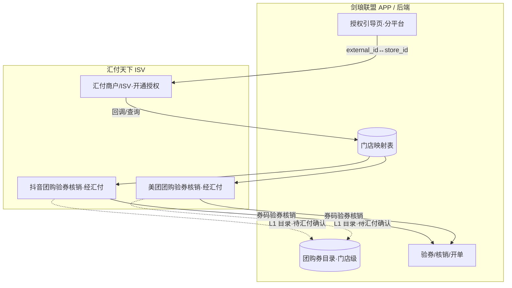
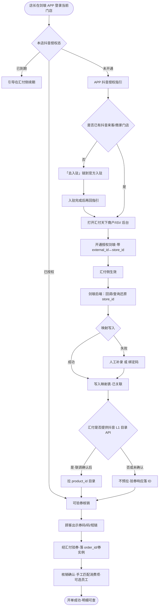
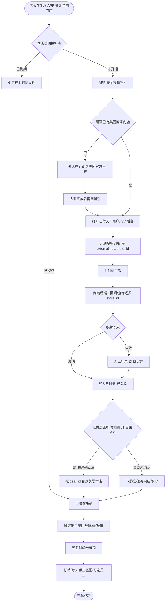
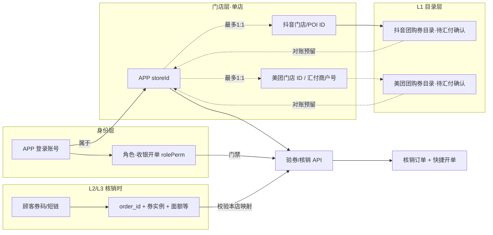

# PRD：团购核销（单店 · 商户端）

| 字段 | 内容 |
|------|------|
| 文档版本 | v1.6.14 |
| 日期 | 2026-09-12 |
| 交互原型（唯一可视依据） | 同目录 `index.html` |
| 画布 | 390 × 844 |
| 目的 | 供前端 / 后端 / 测试及 AI 工具落地「团购核销」；**只需本文 + 交互原型** |

---

## 怎么读这份 PRD

正文按模块编排。**不用通读全文**，按角色跳章即可。

| # | 模块 | 前端 | 后端 | 测试 | 说明 |
|---|------|:----:|:----:|:----:|------|
| 1 | 背景 / 目标 / 范围 / 能力映射 | ✓ | ✓ | ✓ | 本期变更叙事、防范围蔓延 |
| 2 | 用户场景与成功标准 | ✓ | 了解 | ✓ | 测「业务对不对」 |
| 3 | 信息架构与页面清单 | ✓ | 了解 | ✓ | 做哪些页、哪些层 |
| 4 | 状态机 | ✓ | **必看** | **必看** | 权限、双平台授权、匹配、核销、撤销 |
| 5 | 交互细则 / 异常流 | ✓ | 了解 | ✓ | 输入规则、校验、toast、门禁 |
| 6 | 功能规格 | ✓ | 了解 | ✓ | 逐屏字段与跳转（含锚点 id） |
| 7 | 数据模型与接口约定 | ✓ | **必看** | ✓ | 会话字段 + 能力清单；路径【待联调确认】 |
| 8 | 业务规则 | ✓ | **必看** | ✓ | 匹配/业绩/权限/撤销/双平台口径 |
| 9 | 文案清单与权限 | ✓ | 部分 | ✓ | 文案；收银开单权限（rolePerm）/ 门店授权 |
| 10 | 验收 P0 + 造数场景 | 了解 | 了解 | **必看** | Given→When→Then |
| 11 | 非功能（极简） | ✓ | ✓ | ✓ | |
| 12 | 交付物 | ✓ | — | ✓ | 仅 PRD + 原型 |
| 13 | 接入架构 / 授权闭环 / 门店·券 ID 映射 | ✓ | **必看** | ✓ | 抖音/美团均经汇付天下 ISV；流程图 + 联调清单 |

**先读这几条（贯穿全文）**

1. **产品名「团购核销」**：覆盖抖音与美团双平台**团购券 / 次卡**完整核销。**系统优惠券**支持核销，走线上 APP 既有能力（原型示意）。**代金券**本期不支持。输码/明细 Tab 仍含优惠券示意 / 抖音 / 美团。
2. **单店模式**：本期无总部/多分店 APP 登录切换；**无「业绩归属配置」页**（已删）。核销、授权、订单均按**当前登录门店**。**绑定（v1.6.0）**：一个平台授权账号可绑定**多家**平台门店（多选）；绑 0 家则该平台未开通。**团购券管理（v1.6.1）**：同账号已绑多店时，团购券列表按门店 TAB 分开展示与配置（目录可因店而异）；仅绑 1 家时不显示 TAB。
3. **APP 首页仅为演示占位，并非真实 APP 首页**。原型用占位首页承载扫码按钮，便于演示主链路；**真实产品入口以线上 APP 首页扫码核销入口为准**。占位首页提供 **2 个核销入口**：顶部右侧扫码图标（与线上一致）+ 宫格**「验券」**（功能入口，替换原仅展示的「抖音核销」格）；两者进入同一 `scan` 链路，门禁一致。详见模块 1 / 3 / 6.1。
4. **双平台同屏链路**：抖音与美团共用同一屏幕链（扫码→输码→结果→确认→成功/失败→明细→详情→撤销→匹配/员工）；仅平台文案、种子订单与演示数据不同。**扫码页无平台 Tab**：扫码后**自动识别券类型**（抖音团购券 / 美团团购券 / 系统优惠券 / 代金券 / 次卡）：团购券与**次卡**进验券主流程；系统优惠券进**线上能力示意页**；**代金券** → **不支持弹窗**。输码与明细 Tab 为 **优惠券（示意）/ 抖音 / 美团**。
5. **授权分平台、相互独立**：抖音与美团**均经汇付天下 ISV**（后端）；商户在 APP 内完成**三步开通**（店铺认证 → 平台授权 → 门店绑定），导航 **A 抖音开通 / B 美团开通**（共用 `auth-open`，按平台分态）。**已开通** = 认证完成 + 授权有效 + ≥1 门店绑定。账号行展示：**未开通 / 已开通 / 已到期**。
6. **核销门禁（v1.6.0）**：验券/核销须 **rolePerm** 且当前平台 **已开通**；未开通/到期弹窗「去开通/去续期」→ A/B；已授权未绑定 →「请完善门店绑定」→ A/B（**无绑定码**）。
7. **废旧能力（v1.6.0）**：删除汇付四步外链指引 UI、`dy-auth-grant`、门店绑定码 K1；汇付仍为后端通道，用户**不**进斗拱后台完成开通。
8. **店铺认证 / 多店 / 过期 / 兜底（v1.6.0）**：认证共享、授权与绑定分平台；最小认证页；多选绑定（可 0 家）；过期重授或换号清绑定、同号重授保留；无法跳转官方页时复制链接，「我已完成授权」仅查询。
9. **业绩归属一律默认空**：核销确认页点击选择服务员工；**不选也可确认核销**，按「未选服务员工」生成订单，**该单不计业绩**。成功页「操作人」= 当前登录账号，**与业绩归属解耦**。未选时「未选」与箭头均为错误红 `#F32F41`；已选为信息蓝。
10. **团购券无事先价目映射**：验券后可无消费项（内部 `mismatched`）；核销时手工「选择消费项」。**确认页 / 默认配置字段标签**：团购券为「核销项目」，**次卡为「单次核销」**。多项分摊 tip 仍展示。单匹配时标签与项目名垂直居中；未选时 CTA 垂直居中。**结果/确认页不展示「已匹配 / 未匹配」标签**。
11. **账号无核销权限**：`rolePerm` **对应 APP「角色权限 · 收银开单」**；该权限关闭则不可扫码核销。拦截全部核销入口（扫码 / 输码 / 主链路导航 / 重新扫码 / 手动输码等）→「无核销权限」页；验券、核销等动作时仍做兜底拦截。原型演示条文案为「收银开单权限 / 已开启 / 已关闭」。
12. **内部开单字段**：UI 支付方式随平台显示「抖音」或「美团」（**对齐线上支付方式称呼**）；内部写入 `orderType=快捷开单`、`payType=团购`。
12b. **流水消费项名（v1.6.3 → v1.6.8）**：门店流水（1a+）/ 核销明细**列表**主标题显示**核销团购券名**；标题左侧「团」标区分团购单；48×48 仍为平台方标。**详情**卡片标题为团购券名；列表字段「核销项目」（次卡为「单次核销」）展示匹配消费项，未匹配→「快捷开单」。全局文案「快速消费」已更名为「快捷开单」。
12c. **1a+ Tab / 头像（v1.6.3）**：顶部筛选 Tab 五等分一屏看全（对齐 Figma 665:1011，选中 `#FF7A28` 底条）；顾客头像用统一插画资源。
13. **优惠券 Tab**：系统优惠券沿用线上 APP；团购主链路支持**团购券 + 次卡**；**代金券不支持**。
14. **撤销与已退款**：核销后 **1 小时内**可撤；超时不可撤；顾客退款后内部状态 `refund`，详情可展示「已退款」。**核销明细列表永不展示 `status=refund` 订单**；筛选芯片**无「已退款」**；种子 `o4` 可内部保留但不进列表。幂等「已核销」弹窗可查看原单。
15. **员工选择**：开单式卡片翻转（点客/散客 → 大/中/小工），可多选；照片头像。**员工业绩的点客/散客与确认页「消费顾客」完全解耦**。
16. **确认页消费顾客（v1.6.2 → v1.6.8）**：确认核销页「消费顾客」卡。默认根态双卡「散客｜会员」；点散客形变为紧凑四卡（男/女 + 返回/加入）；点会员进仅真实会员列表，摘要卡可重新选择或返回根态；未选会员时「确认核销」禁用；加入会员无称呼时自动名「尾号」+手机后四位。成功页仅一行顾客摘要。
17. **确认 tip icon（v1.6.2）**：确认页所有 tip（含美团次卡批量授权提示、未匹配价目提示）左侧加信息 icon。
18. **演示条**：券类型先行（抖音团购券 / 美团团购券 / 系统优惠券 / **代金券** / **抖音次卡** / **美团次卡**），点击即模拟扫码；次卡分别绑定对应平台 L1 次卡目录项。开通演示条（A/B 旁）可切未开通 / 审核中 / 1/3 / 2/3 / 已开通 / 已过期 / 授权兜底。
19. **账号管理入口**：演示首页点**门店名**进入「账号管理」；「团购核销」行右侧抖音/美团分两行热区，展示 **去开通 / 已开通 / 已到期**，点击进入对应 **A/B 开通页**（`auth-open`）。
20. **未开通弹窗**：当前平台未开通时扫码/验券 → **居中弹窗**（非 toast）；「去开通」进 A/B，「取消」关闭留在当前页。
21. **异常态**：原整页异常（相机无权限、断网整页、超时、无核销权限、验券失败、核销失败）改为**居中弹窗**，保留原功能按钮；**既有 toast / 既有弹窗（如离线进扫码提示、已核销幂等）不改动**。
22. **接入身份（v1.6.0）**：**抖音/美团均经汇付天下 ISV**（非抖音直连）。**用户侧开通在 APP 内三步完成**；汇付 API 为后端联调对象（见模块 13）。门店绑定在 APP 多选完成（废绑定码 K1）。ID 分 L1 目录 / L2 订单 / L3 券实例。L1 目录能力**待汇付确认**；原型双平台均有 seed 目录示意。本期不做汇付分账抽佣。
23. **团购设置（v1.5.1+ / v1.6.1 / v1.6.5）**：工作台入口 → 双平台卡片（**已开通**显示「共 N 项」，N 为已绑门店目录 L1 **按店累加**，同券多店各计 1；演示 3 店抖音约 4+3+2=9）→ L1 列表（**多店 TAB**）→ 默认配置按「门店 + L1」存储。非已开通 → A/B；详见 6.13.6。开通页已开通主按钮另见 6.13.1。
24. **品牌方标 vs 订单标签（v1.5.1）**：全站抖音/美团**品牌方标**统一为 Figma SVG；核销明细等处的**黄底白字「美团」标签**仍用 `meituan-tag.svg`。
25. **匹配标签移除（v1.5.3）**：验券结果 / 确认核销页**不再展示**「已匹配 / 未匹配」标签。
26. **券类型范围（v1.5.8）**：主链路支持**团购套餐券 + 平台标准次卡**；扣次与「单次核销」项数量解耦；**代金券**仍不支持；系统优惠券走线上能力。
27. **筛选无重置（v1.5.3）**：核销明细 `filterMask` **无「重置」**，仅取消 / 确定。
28. **1C/1D/1E 返回层级（v1.5.4）**：1C→工作台、1D→1C、1E→1D。
29. **支付方式称呼（v1.5.5）**：确认核销页「支付方式」随平台显示 **「抖音」/「美团」**；**平台标识**仍为「抖音团购」/「美团团购」。
30. **1C 卡片标题（v1.5.6）**：团购设置双平台卡片标题「抖音团购」/「美团团购」；开通页标题「抖音开通」/「美团开通」。
31. **核销项目 / 次卡 / 流水作废 / 流水商品图（v1.5.7+）**：字段「匹配项目」→「核销项目」；次卡可核销；撤销后流水作废；流水商品图 48×48。成功页选填已由 v1.6.2 消费顾客流程替代。
32. **次卡对齐平台规则（v1.5.8）**：独立「本次核销次数」（默认 1）；结果/确认展示总次数+剩余次数；开单金额=单次结算价×本次次数；美团多扣授权提示（示意）；按次撤销恢复次数。
33. **次卡目录与配置闭环（v1.5.9）**：L1 列表抖音/美团各造 1 张次卡（列表末尾）；淡蓝「次卡」标签；默认配置只读售价/总次数/单次结算价。
34. **次卡选择消费项与团购对齐**：次卡「选择消费项」有数量步进器（1–99）；确认/配置页字段标签为「单次核销」（团购券仍为「核销项目」）；平台扣次仍仅看「本次核销」。
35. **平台开通三步（v1.6.0）**：全面替换旧四步汇付指引；验收见模块 10 / 13。
36. **多店团购券 TAB + 演示数据统一（v1.6.1）**：绑定可选门店与首页/适用门店统一为「悦颜美肌 · 中山路/人民路/高新」；演示默认双平台绑 3 家；各店 L1 券种可不同；`dealDefaults` 按门店分桶；核销预填取**当前登录门店**配置。门店 TAB 样式对齐输码验券；全名 +「 · 」换行；3 项不横滑。
37. **消费顾客 + 流水命名（v1.6.2/v1.6.3）**：见上文 12b / 12c / 16 / 17。
38. **选择顾客 UI + 确认页顾客卡（v1.6.4）**：选择顾客页对齐 Figma 58:111（搜索+取消、字母索引、VIP/最近消费）；确认页点卡片自动滚动；性别马卡龙蓝/粉。
39. **开通页进团购券 +「共 N 项」累加（v1.6.5）**：已开通主按钮「去设置团购券」→ 直达当前平台 `tg-deals`（非 `tg-set`）；返回回开通页。工作台/无权限「去团购设置」仍进 `tg-set`。「共 N 项」= 已绑门店目录券数**累加**（非去重）。
40. **消费顾客卡片形变（v1.6.6）**：根态「散客｜会员」白卡 → 散客展开四卡 / 加入会员大卡 / 已选会员摘要卡；圆角 12；FLIP+spring 弹性动效；`prefers-reduced-motion` 降为淡入淡出。详见 5.3 / 6.5b。
41. **消费顾客视觉迭代（v1.6.7）**：展开区改为紧凑双列（左男|女约 62%，右返回/加入扁卡纵向，总高约 84px）；根态双卡高约 60px、去掉「点击选择」；无灰底，白卡描边 `#E8E8E8`+轻阴影；返回/加会员用专用图标；会员摘要卡保留「重新选择」，并增加返回可回根态双卡。
42. **尾号命名 + 详情核销项目（v1.6.8）**：加入会员无称呼时自动名「尾号」+手机后四位（废弃团购顾客0N/`tgCustomerSeq`）；返回图标改 Figma `749:225`；核销详情标题=团购券名，新增字段「核销项目」（次卡「单次核销」）。
43. **加入会员草稿保留（v1.6.9）**：加入会员大卡内切换性别**不得**清空手机号/称呼；UI 同步前先落草稿再回填。
44. **加入会员动效边界（v1.6.10）**：点「＋」进入 / 点「×」退出仍走舞台形变；加入大卡本体内点击（性别、输入、空白等）**不得**触发整卡弹性/`is-pop`/按压缩放；仅「×」按钮自身可有按压反馈。
45. **主链路交互重构（v1.6.11）**：扫码→输码为底部 sheet 上滑（轻回弹，无强挤压）+ 返回下滑收起；团购设置平台卡 FLIP 扩至列表（未开通仅进授权）；`tg-deals` 券卡内联展开默认配置（废弃整页 `tg-config` 导航）；门店/明细 Tab 切卡 stagger；核销明细卡内展开详情并可在展开区撤销。动效偏 iOS spring（约 280–400ms）；`prefers-reduced-motion` 降为淡入/即时。桌面画框与真机一致。
46. **交互打磨（v1.6.12）**：输码 sheet **不覆盖**顶部状态栏；核销明细展开区去掉「状态」字段并修复底部按钮样式；平台卡先内容渐隐再以纯白卡扩展；券卡展开去掉与顶部重复的默认配置卡头（次卡仅保留总次数/单次结算价 kv）、隐藏配置摘要、展开后仅保留「已配置」下一条划线；修复 tip info 图标。
47. **次卡明细字段 + 团购设置页转（v1.6.13）**：次卡核销明细展开/详情展示 **总次数 / 核销次数 / 剩余次数**；团购设置→团购券列表改为右侧滑入、返回右侧滑出（废弃 FLIP 白卡扩展）。
48. **页转与消费顾客必选（v1.6.14）**：扫码→输码改为整页自顶部移入移出（无弹性）；手机预览团购券水平推页对齐状态栏高度变量（无假状态栏时为 0）；确认核销时未选消费顾客不再默认男散客，拦截并对「散客｜会员」双卡做 iOS 式抖动；选择消费项整页自下方移入移出（确认页与团购设置共用）。

交互行为与文案以 **`index.html` 当前表现** 为准；**接入 / 映射 / 授权产品态以模块 13 为准**。

---

# 模块 1　背景 / 目标 / 范围 / 能力映射
> 读者：前端 ✓ · 后端 ✓ · 测试 ✓

## 1.1 背景

门店需在商户端完成团购券（抖音 / 美团）的验券与核销，并自动开单、支持短时撤销与明细查询。线下与评审确认：

- 产品更名为 **「团购核销」**，抖音与美团双平台**团购券 / 次卡**完整核销；**系统优惠券**走线上 APP 既有能力；**代金券**提示不支持；
- 本期按 **单店** 交付，不做总部/多分店与「业绩归属配置」页；
- 团购券与门店价目 **无事先映射**，需在核销时手工选择消费项，并支持会话记忆；**不展示匹配状态标签**；
- 业绩归属与操作人解耦：归属可空（不计业绩），操作人固定为登录账号；
- 抖音与美团授权**相互独立**；**双平台均经汇付天下 ISV**（APP 内三步开通页）；
- **扫码页去平台 Tab**，扫码后自动识别券类型（团购券 / 次卡 / 系统优惠券 / 代金券）；美团流程页面头部标识不再出现抖音 logo，随平台动态切换；
- **品牌方标**统一 Figma SVG（`douyin-logo.svg` / `meituan-logo.svg`）；**核销明细美团标签**仍为黄底白字 `meituan-tag.svg`，抖音标签维持深色文案样式；
- 需覆盖账号无「收银开单」权限、门店未授权/到期、断网、相机权限、已核销幂等等异常；
- 原型首页仅为演示占位，真实入口对齐线上扫码核销。

## 1.2 目标

| 目标 | 说明 |
|------|------|
| 扫码 / 输码验券 | 识别或输入券码后验券，进入结果与确认；支持抖音/美团 |
| 手工匹配消费项 | 无事先映射；项目/产品多选；会话记忆；未匹配也可核销 |
| 业绩归属可选 | 默认空；选员工可计业绩；不选不计业绩；未选红/已选蓝 |
| 确认核销开单 | 成功后自动开单；内部 orderType/payType 约定见 8 |
| 核销明细与撤销 | 列表/详情；1h 内可撤；列表不展示已退款；详情可达已退款 |
| 双平台授权门禁 | 抖音 + 美团均经汇付 ISV（独立指引页）；按当前平台拦动作 |
| 权限门禁 | 无「收银开单」权限（rolePerm）进页即拦 |
| 异常可达 | 相机无权限、断网、超时、验券失败、核销失败、幂等已核销 |
| 范围可控 | 系统券走线上能力示意；代金券不支持；单店；无业绩归属配置页；目录待汇付确认 |

## 1.3 本期做（In）

- 演示占位首页：顶部扫码入口进入核销主链路（**非真实 APP 首页**）
- 扫码核销（自动识别：团购券 / 次卡 / 系统优惠券示意 / 代金券不支持）、输码验券（优惠券示意 / 抖音可用 / 美团可用）
- 美团与抖音**同一屏幕链**：验券结果 → 核销确认 →（可选）选择消费项 / 选择服务员工 → 核销成功 / 失败 → 明细 → 详情 → 撤销 → 匹配/员工
- 平台动态文案：**支付方式**「抖音 ↔ 美团」（对齐线上）；**平台标识**「抖音团购 ↔ 美团团购」等随当前平台切换
- 选择消费项：项目/产品分组多选；会话按券名记忆；**无「已匹配/未匹配」标签**；多项分摊提示文案；确认页单匹配垂直居中对齐
- 选择服务员工：卡片翻转（点客/散客 → 小工/中工/大工），多选，照片头像；默认未选可核销；未选红提示
- 核销成功：操作人=登录账号；成功页展示消费顾客摘要（会员名或男/女散客）；无选填表单
- 核销明细（优惠券示意 + 抖音列表 + 美团列表 + 筛选；**列表主标题为团购券名**；**列表不展示 refund**；筛选无「已退款」、**无重置**）→ 订单详情（标题=券名 +「核销项目」+ 消费顾客）→ 撤销（1h）→ 撤销成功
- 抖音开通 / 美团开通（APP 内三步，共用 auth-open）
- 相机无权限、断网/超时/无权限模板、验券失败、已核销幂等弹窗等异常页/层
- 内部开单：`orderType=快捷开单`，`payType=团购`；UI 支付方式「抖音」或「美团」
- 确认页「消费顾客」与员工业绩点客/散客解耦；可在确认时建档会员
- 演示条复用 + 美团演示订单；扫码演示尊重当前平台
- 内部开单：`orderType=快捷开单`，`payType=团购`；UI 支付方式「抖音」或「美团」

## 1.4 本期不做（Out）

- 真实 APP 首页信息架构与其它业务入口改造（原型首页仅为演示占位）
- 总部 / 多分店切换、「业绩归属配置」页
- 团购核销主链路内重做系统优惠券完整 UI（沿用线上 APP）；代金券核销
- 汇付后台菜单级材料（用户不进后台开通；后端联调用）【待商务材料】
- **其它平台券**（非抖音/美团）
- **次卡平台侧能力（本期不做）**：未使用次数随时退 / 过期自动退（平台强制，本店只读）；达人佣金按次结算；C 端「总次数/剩余」以外的省钱对比与关联单次团购种草；预付卡备案资质上传（来客/开店宝侧）；美团「打包多张独立团购券」伪次卡
- 团购券与价目的事先自动映射配置（本期仅手工匹配 + 会话记忆）
- 支付收银改造、会员体系全面改造（确认页建档沿用线上会员列表；不做独立会员中心改造）
- 撤销失败中间页（确认撤销后直接成功；无单独失败页）
- 明细列表展示 / 筛选「已退款」（内部 seed 可保留，列表永不露出）
- 美团批量核销的**真实授权校验**（本期仅文案提示店员确认顾客已授权）

## 1.5 旧 → 新能力映射

| 旧体系能力（语义） | 新体系如何表现 |
|--------------------|----------------|
| 线下/口头核销 | 商户端扫码/输码 → 验券 → 确认核销 → 自动开单 |
| 仅抖音产品名 | 产品「团购核销」；抖音 + 美团双平台完整链路 |
| 券与价目事先绑定 | **无事先映射**；确认页「选择消费项」手工多选 + 会话记忆 |
| 业绩强制选员工 | 默认空；可不选；未选则该单不计业绩；未选红提示 |
| 操作人=业绩人 | 操作人=登录账号；业绩归属独立字段 |
| 无授权引导 | 抖音/美团均经汇付 ISV 授权状态机 + 独立指引页；动作时拦截 |
| 无权限仍可进扫码 | `rolePerm`=收银开单关闭 → 全部核销入口拦截 → 无核销权限页；动作兜底 |
| 已核销重复扫 | 幂等弹窗，可查看原单 |
| 误核销无法回退 | 1 小时内可撤销；超时不可撤；已退款态（内部 `refund`，列表不展示） |
| 美团同页核销 | 美团完整核销（与抖音同链）；系统券走线上能力；次卡可核销；代金券不支持 |

映射不足时以原型字段与行为为准。

---

# 模块 2　用户场景与成功标准
> 读者：前端 ✓ · 后端 了解 · 测试 ✓

## 2.1 角色

| 角色 | 说明 |
|------|------|
| 店员 | 日常扫码/输码核销（需开启「收银开单」权限） |
| 店长 | 核销 + 门店授权协同（抖音/美团均经汇付） |
| 店主 | 门店授权与权限发放 |

本期权限差异：**账号是否开启 APP「角色权限 · 收银开单」**（会话字段 `rolePerm`）与 **当前平台是否已开通**（抖音 `auth` / 美团 `authMeituan`）分开判定，见模块 4 / 8 / 9。店员日常核销依赖收银开单权限。

## 2.2 核心场景

| 场景 | 用户期望 | 成功标准 |
|------|----------|----------|
| 有权扫码主链路（抖音） | 扫码验券并核销开单 | 扫码→结果→确认→成功；生成开单；支付方式 UI「抖音」 |
| 有权扫码主链路（美团） | 同链核销美团券 | 扫码选美团 Tab → 同主链路；支付方式 UI「美团」 |
| 输码验券 | 无相机或扫码失败时手输 | 输码（抖音/美团）→验券→同主链路；优惠券 Tab 为线上能力示意 |
| 未匹配可核销 | 券未选手动价目也能核销 | **无匹配状态标签**；可确认；按券面额开单 |
| 多匹配 / 记忆匹配 | 组合券选多项；下次同券名自动带出 | 多项提示分摊文案；记忆后自动回填（**无标签**） |
| 归属空可核销 | 赶时间不选员工 | 默认「未选」红字+红箭头；确认成功；该单不计业绩；操作人仍显示登录账号 |
| 无收银开单权限 | 权限关闭账号无法核销 | 任何核销入口 → 无核销权限页（副文说明未开启收银开单） |
| 未授权 / 到期（抖音） | 引导完成汇付授权 | 动作拦截 → `auth-open`；状态展示正确 |
| 未授权（美团） | 引导美团/汇付授权 | 动作拦截 → `auth-open` |
| 已核销幂等 | 重复扫不重复开单 | dup 弹窗；可看原单 |
| 1h 撤销 | 误核销可撤 | 详情可撤 → 撤销成功；状态已撤销 |
| 超时不可撤 | 超 1h 不可撤 | 按钮禁用；提示超时/客服指引 |
| 明细无已退款 | 列表不打扰日常对账 | 列表永不出现 refund；筛选无「已退款」芯片 |
| 确认页消费顾客 | 卡片形变：根态散客｜会员 → 四卡 / 加入会员大卡 / 会员摘要 | **必须选择**后才可确认核销；根态未选时拦截并抖动双卡，**不**默认男散客；加入会员：手机号或称呼任一即可建档；称呼空→「尾号」+手机后四位；手机号须 11 位 |
| 流水消费项名 | 列表显示核销团购券名；详情标题=券名 +「核销项目」字段 | 1a+/核销明细列表均用券名；「团」标区分；详情次卡标签为「单次核销」 |
| 成功页顾客摘要 | 一行消费顾客，无表单 | 展示会员名或男/女散客 |

---

# 模块 3　信息架构与页面清单
> 读者：前端 ✓ · 后端 了解 · 测试 ✓

> **说明**：`home` 为 **演示占位首页**，不是真实 APP 首页。正式产品入口以线上首页扫码核销为准；原型用占位页承载扫码按钮演示。

```
团购核销（单店 · 抖音/美团）
 ├─ home 演示首页（占位）          <!-- #home -->
 │    ├─ 顶部扫码图标 → scan（与线上一致）
 │    ├─ 宫格「验券」 → scan（功能入口；门禁与扫码一致）
 │    └─ 门店名 → account 账号管理
 ├─ account 账号管理               <!-- #account -->
 │    └─ 团购核销 · 抖音/美团行 → auth-open（分平台）
 ├─ scan 扫码核销                  <!-- #scan -->
 │    ├─ 扫码自动识别券类型（抖音 / 美团 / 系统券）
 │    ├─ 验券订单 → orders
 │    └─ 输入券号 → input
 ├─ coupon-ph 系统优惠券（线上 APP 既有核销 · 示意） <!-- #coupon-ph -->
 ├─ input 输码验券                 <!-- #input -->
 │    ├─ 自扫码进入：底部 sheet 上滑（轻回弹）
 │    └─ Tab：优惠券(示意) / 抖音 / 美团
 ├─ result 验券结果                <!-- #result -->
 │    └─ 去核销 → confirm（文案随平台）
 ├─ confirm 核销确认               <!-- #confirm -->
 │    ├─ 选择消费项 → match-pick
 │    ├─ 业绩归属 → empMask
 │    └─ 消费顾客 → pick-member（会员路径）
 ├─ pick-member 选择顾客           <!-- #pick-member -->
 │    └─ 仅真实会员列表（无散客快捷入口）→ 回 confirm
 ├─ match-pick 选择消费项          <!-- #match-pick -->
 ├─ success 核销成功               <!-- #success -->
 │    └─ 消费顾客摘要一行（无选填表单）
 ├─ fail 核销失败                  <!-- #fail -->
 ├─ orders 核销明细                <!-- #orders -->
 │    ├─ Tab：优惠券(示意) / 抖音 / 美团（切 Tab stagger）
 │    ├─ 列表主标题：核销团购券名（左「团」标）
 │    ├─ 点卡内联展开详情 / 展开区撤销
 │    └─ 筛选 → filterMask（无「已退款」）
 ├─ detail 订单详情                <!-- #detail -->
 │    ├─ 深链/演示；日常以列表展开为主
 │    ├─ 标题：团购券名；消费项字段「核销项目」+ 消费顾客
 │    └─ 撤销 → revokeMask → revoke-ok
 ├─ revoke-ok 撤销成功             <!-- #revoke-ok -->
 ├─ auth-open 平台开通三步（A/B）       <!-- #auth-open -->
 ├─ cam-denied 相机无权限          <!-- #cam-denied -->
 ├─ tpl-offline / tpl-timeout / tpl-noperm
 ├─ verify-fail 验券失败           <!-- #verify-fail -->
 └─ 弹层
      ├─ offlineMask / dupMask / empMask
      ├─ filterMask / revokeMask
      └─ loadingMask
```

### 3.0 页面流（示意）


| 页面/层 | 锚点 id | 导航标题（原型） | 说明 |
|---------|---------|------------------|------|
| 演示首页（占位） | `home` | — | **非真实 APP 首页**；两个核销入口：顶部扫码图标 + 宫格「验券」 |
| 扫码核销 | `scan` | 扫码 | 相机取景 + 扫码自动识别券类型 + 输入券号 + 验券订单 |
| 系统优惠券（示意） | `coupon-ph` | 系统优惠券 | 扫码识别为系统券；沿用线上 APP 核销能力示意 |
| 输码验券 | `input` | 输入券号 | 优惠券示意（线上能力）；抖音/美团可用 |
| 验券结果 | `result` | 验券结果 | 券信息（**无匹配状态标签**）；平台文案动态 |
| 核销确认 | `confirm` | 确认核销 | 匹配/金额/归属/支付方式 + 消费顾客 |
| 选择消费项 | `match-pick` | 选择消费项 | 项目/产品多选 + 数量 1–99 |
| 选择顾客 | `pick-member` | 选择顾客 | 仅真实会员列表 |
| 核销成功 | `success` | 核销成功 | 操作人 + 消费顾客摘要 |
| 核销失败 | `fail` | 核销失败 | 确认后平台失败 |
| 核销明细 | `orders` | 核销明细 | 抖音/美团列表 + 筛选；**不展示 refund** |
| 订单详情 | `detail` | 核销详情 | 撤销入口；可达已退款态 |
| 撤销成功 | `revoke-ok` | 撤销结果 | |
| 抖音开通 | `auth-open` | 抖音开通 | 三步：认证→授权→绑定 |
| 美团开通 | `auth-open` | 美团开通 | 同上（分平台状态） |
| 相机无权限 | `cam-denied` | 无法使用相机 | |
| 断网模板 | `tpl-offline` | — | |
| 超时模板 | `tpl-timeout` | — | |
| 无核销权限 | `tpl-noperm` | — | 未开启「收银开单」统一落点 |
| 验券失败 | `verify-fail` | — | 验券阶段失败 |
| 选择服务员工 | `empMask` | 选择服务员工 | 翻转多选 |
| 其它弹层 | offline/dup/filter/revoke/loading | — | 见 6.17（无 phoneMask） |

---

# 模块 4　状态机
> 读者：前端 ✓ · 后端 **必看** · 测试 **必看**

## 4.1 账号核销权限 `rolePerm`（= APP「角色权限 · 收银开单」）

> **映射**：会话字段 `rolePerm` **对应** 线上 APP「角色权限 · 收银开单」。该权限关闭则不可扫码核销（入口全拦逻辑不变）。原型左侧演示条标签为「收银开单权限」，开关文案「已开启 / 已关闭」。

| 状态 | 含义 | 行为 |
|------|------|------|
| `true` | 收银开单已开启 | 可进入扫码/输码及后续主链路 |
| `false` | 收银开单已关闭 | **全部核销入口** → `tpl-noperm`；验券/核销动作兜底拦截 |

拦截范围包括：首页扫码、扫码页、输码页、结果/确认/成功等主链路导航、重新扫码、手动输码、左侧演示导航进入消费链路等。

`tpl-noperm` 副文示意：「当前账号未开启「收银开单」权限，无法扫码核销…」

## 4.2 当前平台 `platform`

| 值 | 含义 | UI 文案要点 |
|----|------|-------------|
| `douyin` | 抖音团购 | 「抖音」「抖音团购」；开通走 `auth-open`（抖音） |
| `meituan` | 美团团购 | 「美团」「美团团购」；开通走 `auth-open`（美团） |
| （优惠券 Tab） | 示意 | 沿用线上 APP 系统优惠券核销；不在本原型展开完整 UI |

扫码页无平台 Tab：扫码后**自动识别券类型**并更新 `platform`（系统券→示意页不改 `platform`；次卡→进主流程；代金券→不支持弹窗）；输码页、明细页切换平台 Tab 亦更新 `platform`。结果/确认/成功等页文案、头部标识与授权门禁随 `platform` 切换。

## 4.3 平台开通（分平台 · v1.6.0）

> **已开通** = 店铺认证完成 + 当前平台授权有效 + ≥1 门店绑定。展示：**未开通 / 已开通 / 已到期**。门禁用 `AuthOpen.isPlatformReady`。

### 4.3.1 抖音开通

| 态 | 含义 | 验券/核销 |
|----|------|-----------|
| 未开通 | 认证未过 / 未授权 / 未绑定 | 拦截 → `auth-open` |
| 已开通 | 三步齐备 | 允许 |
| 已到期 | 授权过期 | 拦截 → 去续期 |

### 4.3.2 美团开通

同 4.3.1；状态由 AuthOpen 同步到 `authMeituan` / `mapMeituan`。

## 4.4 匹配状态 `mismatched` / `selectedMatchIds`

```
验券成功
  ├─ 会话无该券名记忆 → mismatched=true，无 UI 标签，selectedMatchIds=[]
  └─ 会话有记忆 → 回填 ids，mismatched=false，无 UI 标签
手工选择消费项并确定
  → 写入 matchMemory[券名]，mismatched=false
清空/未选确定
  → 可回到未匹配内部态（以原型确定逻辑为准）
```

- **未匹配也可确认核销**：按券面额开单；提示「未匹配价目时，将按券面额开单；业绩归属未选则该单不计业绩。」（**不展示匹配状态标签**）
- **多项**（`selectedMatchIds.length > 1`）：展示「多项匹配按门店原价占比分摊计算业绩」，不展示百分比。

## 4.5 业绩归属 `selectedEmpIds` / 员工角色

| 状态 | 含义 | 确认页 UI |
|------|------|-----------|
| 空（默认） | 未选服务员工；可核销；**该单不计业绩** | 「未选」文案 + 箭头均为错误红 `#F32F41` |
| 已选 ≥1 | 含点客/散客 + 大/中/小工；可计业绩（分摊规则见 8） | 摘要文案 + 箭头为信息蓝 |

- 成功页「操作人」取 `opName`（登录账号），**不随业绩归属变化**。

## 4.6 核销订单状态（明细/详情）

| status | 列表 | 详情展示 | 撤销 |
|--------|------|----------|------|
| `ok` 且 `canRevoke` | 展示「已核销」 | 已核销 | 可点「撤销核销」 |
| `ok` 且超时 | 展示「已核销」 | 已核销 | 按钮「已超时不可撤销」 |
| `revoked` | 展示「已撤销」 | 已撤销 | 不可再撤 |
| `refund` | **永不出现在列表** | **已退款**（若经其它入口到达详情） | 不可撤；按钮文案「已退款」；示意业绩已回滚 |

撤销窗口：**核销成功后 1 小时内**。

筛选芯片：全部 / 已核销 / 已撤销（**无「已退款」**）。种子订单 `o4`（`refund`）可内部保留，列表过滤掉。

## 4.7 网络 / 相机演示态

| 字段 | 影响 |
|------|------|
| `offline` | 进扫码可弹 offlineMask；验券/核销动作可进 tpl-offline |
| `camDenied` | 进扫码 → cam-denied |

---

# 模块 5　交互细则 / 异常流
> 读者：前端 ✓ · 后端 了解 · 测试 ✓

## 5.1 入口与门禁

| 动作 | 校验顺序 |
|------|----------|
| 进入扫码/输码/主链路 | `rolePerm` → 否：`tpl-noperm` |
| 进入扫码（相机） | 上一步通过后：`camDenied` → `cam-denied`；`offline` → `offlineMask` |
| 验券 / 确认核销（抖音） | `rolePerm` → 否：`tpl-noperm`；未开通 → authNeedMask → `auth-open`；`offline` → `tpl-offline` |
| 验券 / 确认核销（美团） | `rolePerm` → 否：`tpl-noperm`；`authMeituan!==ok` → `auth-open` + toast；`offline` → `tpl-offline` |

## 5.2 输码规则

| 规则 | 说明 |
|------|------|
| 空券码点验券 | toast「请输入券码」 |
| 合法非空 | 走验券 loading → 结果或失败/幂等（当前平台） |
| 优惠券 Tab | 示意线上系统券核销；不在本原型展开完整 UI |
| 演示关键字（**仅原型演示，不算产品规则**） | 含 `used`/`已核销` → 幂等弹窗；`fail`/`无效` → 验券失败；`mismatch`/`未匹配` → 未匹配结果 |

## 5.3 确认页消费顾客（v1.6.10）

确认核销页「消费顾客」卡；与员工业绩「点客/散客」**完全解耦**。成功页**无**选填表单（已删）。交互改为**卡片形变**（不再使用一级/二级分段控件）。

| 规则 | 说明 |
|------|------|
| 根态 | 左右两张可点白卡：「散客」「会员」（高约 60px，无副文案）；描边 `#E8E8E8` + 轻阴影；区域**无**灰底填充 |
| 必选（v1.6.14） | 根态**未点选**时**不可**确认核销，**不**默认「男散客」；点确认 → toast「请选择消费顾客」+「散客｜会员」双卡 iOS 式左右抖动 |
| 点「散客」 | 形变为四卡：左约 62% 并排「男散客｜女散客」，右纵向两枚扁卡「返回」「加入会员」（总高约 84px，右侧**非**强制正方形）；默认选中**男散客**（马卡龙蓝）；女散客为马卡龙粉；二者单选；**进入此态即视为已选择消费顾客** |
| 点返回 | 形变回根态双卡（清除已选，再次确认需重选） |
| 点加入 | 形变为一张「加入会员」大卡（手机号 / 称呼 / 性别）；右上角 × 取消返回上一态（四卡）。**卡内点击不触发整卡弹性**；仅 × 回退形变 + × 自身按压 |
| 点「会员」 | 进入 `pick-member`；选中后回确认页，该区形变为一张会员摘要卡（头像 40 + 姓名 + 手机，高约 72px），可「重新选择」；摘要卡左侧返回图标清空会员并回根态双卡；取消且未选会员则回根态 |
| 会员未选 | 「确认核销」按钮灰掉不可点 |
| 图标 | 返回 `assets/icons/cust-back.svg`（Figma `749:225`，色 `#555`，约 20px）；加会员 `assets/icons/cust-add-member.svg` |
| 加入会员建档 | **手机号或称呼任一有值**即可建档；称呼空且有手机 → 姓名「尾号」+后四位（例 `尾号5678`）；仅称呼 → 单字先生/小姐或原称呼；**已废弃**「团购顾客0N」/`tgCustomerSeq`；手机号有值须 11 位，非法 → toast「请输入 11 位手机号」 |
| 加入会员但仅性别 | 不建档，仍记「男散客」/「女散客」（取加入表单性别） |
| 草稿 | 形变切换时保留加入会员草稿；**切换性别不清空**手机号/称呼；新券重置为根态 |
| 成功页 | 仅一行「消费顾客」摘要（会员名或散客文案） |
| 动效 | 圆角 12；约 280–340ms；缩放 + `cubic-bezier(0.34, 1.56, 0.64, 1)` 弹性；`prefers-reduced-motion` → 仅淡入淡出 |

## 5.4 Loading

| 场景 | 文案（示意） |
|------|----------------|
| 验券 | 正在验券… |
| 核销 | 正在核销… |
| 撤销 | 正在撤销… |

## 5.5 Toast / 反馈（须与原型一致）

| 条件 | 提示 |
|------|------|
| 空券码验券 | 请输入券码 |
| 扫码识别失败（演示） | 识别失败（并可脉冲「输入券号」） |
| 门店未授权动作（抖音） | 门店尚未完成授权 |
| 门店授权到期动作（抖音） | 门店授权已到期 |
| 美团未授权动作 | 示意引导至美团授权（汇付指引，以原型为准） |
| 复制券码/单号 | 已复制 |
| 选员工完成 | 已选择：{姓名}（示意） |
| 匹配确定 | 已选核销项目（示意） |
| 筛选应用 | 已应用筛选 / 已显示全部 |
| 超时点撤销 | 已超时，请联系客服 |
| 手机号格式错（完成时） | 请输入 11 位手机号 |
| 自动注册会员 | 已注册为会员：{展示名} |
| 演示：收银开单权限 | 演示：收银开单权限已开启 / 已关闭 |

## 5.6 弹层交互

- 遮罩点击可关闭（loading 除外，按原型）。
- `dupMask`：已核销说明 +「查看原单」→ 订单详情。
- `revokeMask`：二次确认后 loading → 撤销成功（无撤销失败页）。
- `empMask`：关闭保留已选；重进不重置（同会话）。
- `filterMask`：仅应用（**无重置**）；状态芯片**无「已退款」**；应用后刷新列表角标点。
- **无 `phoneMask`**：建档已迁至确认页「消费顾客」；成功页无选填表单。

## 5.7 扫码结果演示条（**非正式规格**）

原型左侧演示条仅供评审，**不算产品正式规则**。**扫码页顶部无平台 Tab**；演示条第一行选**券类型**（抖音团购券 / 美团团购券 / 系统优惠券 / 代金券 / 次卡），**点击即模拟扫码自动识别**：抖音 / 美团团购券进入对应平台验券结果；**次卡**进入主流程（展示剩余次数）；**系统优惠券**进入线上能力示意页；**代金券**弹出不支持说明。第二行在所选券类型下演示结果场景：

| 按钮 | 行为（示意） |
|------|----------------|
| 识别失败 | 扫码页反馈识别失败 |
| 这张券已用过 | 幂等已核销弹窗 |
| 价目未匹配 | 无匹配记忆的验券结果（**无「未匹配」标签**） |
| **价目已匹配** | 预写默认券单项 `p21` 匹配记忆；结果/确认页**无「已匹配」标签**（券名可随平台 seed） |
| 多匹配演示 | 多项匹配示意 |

非团购券类型时，价目已匹配 / 价目未匹配 / 多匹配不可用（置灰）。

**已删除**「扫码成功」演示按钮（与「价目未匹配」等路径重复）；另有美团演示订单种子供明细/详情演示。

---

# 模块 6　功能规格
> 读者：前端 ✓ · 后端 了解 · 测试 ✓

下列字段、按钮、跳转均须与原型一致。小节标题旁注释为 **稳定锚点 id**，供 HTML/`data-flow` 同步。

## 6.1 演示首页（占位） <!-- #home -->

> **本页仅为演示占位，并非真实 APP 首页。** 真实产品入口以线上 APP 首页扫码核销入口为准；原型用本页承载演示主链路。

- 门店名示意「悦颜美肌 · 中山路店」（与开通绑定门店同源；演示登录门店）；**点击门店名 → `account` 账号管理**。
- **核销入口（共 2 个，均经门禁进入 `scan`）**：
  - 顶部右侧扫码图标：与线上一致的正式演示入口。
  - 宫格「验券」（#FE2C55 红底「验」字块）：功能入口图标；点击与扫码图标同一处理。
- 底部 Tab、经营概览、其它宫格均为占位视觉，不承载本期业务。

## 6.1b 账号管理 <!-- #account -->

- 按线上账号管理结构还原（账号资料 / 其他 / 退出登录）；除「团购核销」外其它行**占位无跳转**。
- 「团购核销」右侧两行热区：
  - 抖音：logo +「抖音」+ 状态文案 + › → `auth-open`
  - 美团：标识 +「美团」+ 状态文案 + › → `auth-open`
- 状态文案：`none`→「去开通」；已开通→「已开通」；`expired`→「已到期」。左侧开通状态演示条切换后本页同步。

## 6.2 扫码核销 <!-- #scan -->

- 标题「扫码」；右侧「验券订单」→ `orders`。**无平台 Tab**。
- 取景框 + 提示：「将券码放入框内，扫码后自动识别券类型」。
- 底部「输入券号」→ `input`（须过 `rolePerm`；可带入当前平台）：自扫码进入时整页自**顶部移入**（常规平移、**无弹性**）；返回自**顶部移出**回扫码；不覆盖状态栏（手机预览无假状态栏时全高）。
- 扫码后**自动识别券类型**：抖音团购券 → 抖音验券结果；美团团购券 → 美团验券结果（结果/确认等页头部标识随平台切换，美团不再出现抖音 logo）；**次卡 → 验券主流程（剩余次数）**；**系统优惠券 → 线上 APP 核销示意页**；**代金券 → `unsupportedCouponMask` 通俗不支持提示**。
- 识别成功闪层「识别成功（可带券类型）」后进入验券 loading → `result`（或失败/幂等）；验券前按当前平台校验对应授权。
- 相机无权限 → `cam-denied`；离线进扫码可弹 `offlineMask`。
- 左侧「券类型 + 扫码结果演示」见 5.7（非正式规格）。

## 6.3 输码验券 <!-- #input -->

- 标题「输入券号」（页面标题，非「数码验券」）。
- Tab：**优惠券（示意）** / **抖音（可用）** / **美团（可用）**。
- 抖音 / 美团面板：券码输入 +「立即验券」（文案与后续链路随平台）。
- 优惠券：示意线上 APP 系统优惠券核销能力，不在本原型展开完整 UI。
- 空码拦截见 5.2；成功 → `result`；失败 → `verify-fail` 或 `dupMask`。
- **呈现（v1.6.14）**：自扫码「输入券号」进入时整页自顶部覆盖移入（无弹性）；其它入口仍可整页进入。

## 6.4 验券结果 <!-- #result -->

- 头部平台标识随当前平台：「抖音团购」（抖音 logo）或「美团团购」（美团标识，复用 Tab 美团样式）；美团侧不再出现抖音 logo。
- 券名（**不展示**「未匹配」/「已匹配」标签）；面额；适用门店；有效期；脱敏券码；平台标签（抖音深色「抖音」文案标签 / 美团 Figma 597-104 黄底白字「美团」标签资源）。
- 「重新扫码」→ `scan`（过权限门禁）；「去核销」→ `confirm`。

## 6.5 核销确认 <!-- #confirm -->

- 「待核销券」卡头部标识随当前平台（抖音 logo / 美团标识复用 Tab 样式）；券名；面额；脱敏券码。
- **核销项目**（布局；原「匹配项目」）：
  - 未选：CTA「选择消费项」→ `match-pick`；**与标签行垂直居中对齐**；
  - 单匹配：左侧「核销项目」标签与右侧项目名**垂直居中**；「修改」与项目名**同行垂直居中**；
  - 多项：列出消费项 +「修改」；展示「多项匹配按门店原价占比分摊计算业绩」（无百分比）。
- **开单金额**：团购券默认券面额；**次卡** = 单次结算价 × 本次核销次数。
- **业绩归属**：
  - 默认「未选 ▸」→ `empMask`；**「未选」与箭头均为错误红 `#F32F41`**；
  - 已选回填摘要（如「点客·大工」多人顿号连接）；摘要与箭头为**信息蓝**；
  - **点客/散客仅服务业绩，与下方消费顾客解耦**。
- **支付方式**：UI 随平台「抖音」或「美团」（**对齐线上称呼**；内部字段见 7/8）。
- **消费顾客**卡（v1.6.6）：见 **5.3**；卡片形变；会员 → `pick-member`。
- **次卡字段**（见 **6.5.1**）：总次数 / 剩余次数 / 本次核销次数；美团多扣提示。
- **Tip（均带左侧信息 icon）**：
  - 未匹配：「未匹配价目时，将按券面额开单；业绩归属未选则该单不计业绩。」
  - 美团次卡本次>1：批量授权提示。
- 「取消」返回；「确认核销」→ loading → `success`（失败则 `fail`）；须过**当前平台**授权门禁；会员模式未选会员时按钮禁用。

## 6.5b 选择顾客 <!-- #pick-member -->

- 对齐 Figma `58:111`：**无**顶栏标题；顶行为圆角搜索框（占位「输入顾客姓名/手机号/编号/备注」）+ 右侧「取消」（返回确认页）。
- 列表：字母灰条分组；行内圆形插画头像、姓名、VIP 深底金标 + 权益数、手机号右对齐、副文「最近消费：…」。
- 右侧 A–Z/# 浅橙索引可点跳转对应字母分组。
- **仅真实会员**（无「男散客/女散客」快捷入口）；选中后回 `confirm` 摘要，可重新选择。

### 确认页消费顾客交互补充（v1.6.7 · 卡片形变）

**状态机**

```
root（散客｜会员）
  ├─ 散客 → guest（男｜女 + 返回｜加入）
  │            ├─ 返回 → root
  │            └─ 加入 → join（加入会员大卡）→ × → guest
  └─ 会员 → pick-member → member（摘要卡）
                 ├─ 重新选择 → pick-member
                 ├─ 返回图标 → root（清空已选）
                 └─ 取消未选 → root
```

**布局与视觉（v1.6.7）**

- 消费顾客卡**无灰底**；白卡统一 `border: 1px solid #E8E8E8` + 轻阴影，圆角 12
- 根态双卡高约 60px；展开区总高约 84px（右栏两枚扁卡纵向，非正方形）
- 会员摘要卡保持约 72px / 头像 40

**动效要点（偏 iOS）**

- 舞台切换：旧舞台 `scale(0.92)` + 淡出，新舞台 `scale(0.88→1)` + spring 淡入（~340ms）
- 新舞台内卡片交错 `is-pop`（~35ms 阶梯）增强弹性层次
- 卡片按下 `scale(0.96)`
- 男选中 `#B8D4F0 / #3A6EA5`；女选中 `#F5C6D0 / #C45A7A`
- 点卡片内控件时，内容区自动滚动使「消费顾客」卡完整可见
- `prefers-reduced-motion: reduce` 时关闭弹性，仅短淡入淡出

## 6.5.1 次卡规则（平台标准次卡 · v1.5.8）

> 仅覆盖抖音来客「次卡」、美团开店宝「次卡套餐」等**平台标准次卡**（一单一码、内部记次数）。**不覆盖**「打包多张独立团购券」伪次卡。

| 项 | 规则 |
|----|------|
| 识别 | 演示条「抖音次卡 / 美团次卡」或扫码识别 → 绑定对应 L1 次卡 → 主流程 |
| 展示 | 结果页、确认页：**总次数**、**剩余次数**；确认页另有 **本次核销** 次数步进器（默认 1，上限=剩余） |
| 扣次 | **与「单次核销」项数量解耦**；以「本次核销次数」为准；不足则 `timesInsufficientMask` 拦截 |
| 单次核销 | 确认页 / 默认配置字段标签为「**单次核销**」（团购券仍称「核销项目」）；「选择消费项」**有数量步进器 1–99**，与团购券一致 |
| 开单金额 | **单次结算价 × 本次核销次数**（演示：总价÷总次数得单价） |
| 确认页「面额」行 | 次卡时标签改为「单次结算价」 |
| 美团多扣 | 本次核销 > 1 时展示提示：「美团次卡一次扣多次需顾客在订单页授权批量核销，请先确认顾客已授权。」（示意，不接真校验） |
| 抖音多扣 | 允许店员直接改次数（对齐到店可一次扣多次） |
| 成功页 | 展示本次核销次数、扣后剩余次数；金额为按次开单金额 |
| 核销明细 / 详情（v1.6.13） | 次卡订单展开与整页详情展示 **总次数**、**核销次数**（本单扣次）、**剩余次数**（扣后；撤销恢复后更新） |
| 撤销 | 撤销本次核销记录 → **恢复对应次数**；本店开单冲销；订单流水作废（同 v1.5.7） |
| 结算/退款 | 平台按次结算、未使用可退等见 1.4「本期不做」；本店不做退款入口 |

## 6.6 选择消费项 <!-- #match-pick -->

- 标题「选择消费项」。
- **呈现（v1.6.14）**：自确认页或团购设置内联配置打开时，整页自**下方移入**；返回 / 取消 / 确定后自**下方移出**（常规平移、无弹性）。
- Tab：项目 / 产品；左侧分组（全部及分类）；列表多选；「已选 N 项」；「清空」。
- **每项已选后带数量步进器 1–99**（默认 1）；写入会话时带数量。
- **步进器布局**：选中卡片内为横排——左侧勾选+名称/副文，右侧步进器；步进器相对左侧内容区**垂直居中对齐**。
- 「取消」/ 返回不写入；「确定」写入会话 `selectedMatchIds`（及数量）+ `matchMemory[券名]`，回 `confirm` 或团购设置展开卡（**不改匹配状态标签**，因已无标签）。
- 自团购设置进入时：写入 `dealDefaults[storeId][L1].matches: [{ id, qty }]`（按门店分桶；仅匹配，无业绩）。
- 价目数据接门店项目/产品；演示数据见 seed。

## 6.7 选择服务员工 <!-- #empMask -->

- 弹层标题「选择服务员工」（与开单一致的卡片翻转交互）。
- 员工网格：**照片头像** + 姓名 + 职位。
- **两步翻转**：点卡片 → 「点客 / 散客」→ 「小工 / 中工 / 大工」；可多选；已选勾选角标；可清空单人。
- 完成/关遮罩保留选择；回填确认页「业绩归属」（已选后改信息蓝）。
- **允许不选直接核销**。

## 6.8 核销成功 <!-- #success -->

- 成功态文案：「已自动生成开单，可在验券订单中查看明细」。
- 券信息：券码/平台单号（可复制）/ 核销时间 / **操作人**（登录账号，与业绩归属解耦）/ **消费顾客**（摘要一行）；平台文案随当前平台。
- **已删除**原「选填」卡片与放弃填写弹窗；建档仅在确认页完成。
- 「继续核销」→ `scan`；「完成」→ `home`（占位首页）。

## 6.9 核销失败 <!-- #fail -->

确认核销后平台失败。类型与主按钮（示意）：

| 类型 | 标题 | 主按钮去向 |
|------|------|------------|
| invalid | 券状态异常 | 重新扫码 |
| used | 券已核销 | 查看订单 |
| store | 非本店可用券 | 重新扫码 |
| perm | 无核销权限 | 去团购设置（→ `tg-set`） |
| network | 网络超时 | 重试核销（回 confirm） |

副按钮常驻「手动输码」→ `input`。

## 6.10 核销明细 <!-- #orders -->

- 标题「核销明细」；筛选图标 → `filterMask`。
- Tab：优惠券（示意）/ 抖音（列表）/ 美团（列表）。切换平台 Tab 时列表卡 **stagger 滑入**（约 20ms/卡，总时长 ≤320ms，ease-out）；切换前收起已展开卡。
- 卡片：名称、金额、时间、操作人、平台标签、状态（**仅**已核销/已撤销；**不展示已退款**）。平台标签：抖音订单为深色「抖音」文案标签；**美团订单为 Figma 597-104 黄底白字「美团」标签资源**（`assets/icons/meituan-tag.svg`）。
- **列表过滤**：`status=refund` 永不渲染（含种子 `o4` 内部保留也不进列表）。
- **点卡片（v1.6.11 / v1.6.12 / v1.6.13）**：在列表内展开详情（核销项目/单次核销、券码、平台单号、消费顾客、开单号、撤销时限；**不含「状态」**——顶部 tags 已展示）；**次卡**另展示 **总次数 / 核销次数 / 剩余次数**；展开区底部「收起 / 撤销核销」按钮样式与主按钮体系统一；展开区内可撤销（走既有 `revokeMask` → `revoke-ok`）。幂等「查看原单」等深链仍可进整页 `detail`。
- 空态「暂无核销信息」。

## 6.11 订单详情与撤销 <!-- #detail -->

- 顶栏标题「核销详情」（深链 / 演示入口；日常自明细以卡内展开为主）。
- **卡片标题**：团购券名（`couponName`；缺省回退原 `name` /「团购核销」）。
- 字段：金额、状态、券码、平台单号、核销时间、操作人、消费顾客、**核销项目**（次卡标签为「单次核销」；值为匹配消费项名，多项顿号连接，无匹配→「快捷开单」）、**次卡另含总次数 / 核销次数 / 剩余次数**、开单号、撤销时限提示；平台文案随订单平台。
- 券码/平台单号可复制。
- 若经其它入口（如幂等「查看原单」）到达 `refund` 单：**详情可展示「已退款」**。
- **撤销**：
  - 1h 内：`revokeMask` → 确认 → loading → `revoke-ok`（列表展开区与整页详情共用）；
  - 超时：按钮禁用「已超时不可撤销」；可展示客服指引卡；
  - 已撤销 / 已退款：按钮禁用对应文案（已退款态按钮文案「已退款」）。

## 6.12 撤销成功 <!-- #revoke-ok -->

- 「撤销成功」；说明：对应开单已冲销，员工业绩已回滚，撤销流水已保留。
- 「返回核销明细」→ `orders`。

## 6.13 平台开通（三步 · v1.6.0） <!-- #auth-open -->

> 导航 **A 抖音开通 / B 美团开通** 共用屏幕 `auth-open`（`AuthOpen` 模块），按当前平台分态。**废**旧汇付四步外链指引、`dy-auth-grant`、绑定码 K1。汇付文档参考：https://paas.huifu.com/docs/guide/#/ythsk/kqhx/kqhx （API 路径【待联调确认】）。

### 6.13.1 开通主页（分平台）

- 标题：「抖音开通」/「美团开通」。
- 状态标签：**已开通** / **未开通** / **未开通（授权已过期）**（胶囊态：未开通灰底白字、已开通绿底白字）。
- **未开通**：进度 0–3/3：① 店铺认证 ② 平台授权（抖音来客授权 / 美团授权）③ 绑定门店；列表右侧操作为「去认证 / 去授权 / 去绑定」+ SVG 箭头。
- **已开通**：授权账号、已绑定门店（可管理）、「取消授权」、主按钮「**去设置团购券**」（含设置 SVG 图标）→ 直达当前平台 `tg-deals`；返回层级回到本开通页（不经 `tg-set`）。工作台「团购设置」入口不变。
- **已开通判定**：店铺认证 approved + 当前平台授权有效（未过期）+ 绑定门店数 ≥ 1。
- **绑定 sheet**（叠在开通主页上）：标题「绑定××门店」、副文「可多选」、圆形勾选、确认绑定。
- **取消授权弹窗**（叠在已开通页上）：「取消授权？」「取消后将无法使用团购核销。」/ 暂不取消 / 确认取消。
- **视觉稿源（v1.6.x）**：Figma「AO-平台开通·12屏」；登录/授权确认/兜底页若稿未更新则暂沿用原型既有页。

### 6.13.2 店铺认证（共享）

- 最小承接页：提交 → 审核中 / 审核未通过（原因）/ 已完成；正式环境跳转既有认证能力。
- 认证通过后双平台可继续第 2 步；认证与授权/绑定状态分治（认证共享）。

### 6.13.3 平台授权（官方示意 + 兜底）

- 主路径：APP 内平台登录/授权确认示意页；「确认授权」成功；「暂不授权」toast 返回不改态。
- 兜底：复制授权链接到电脑浏览器；「我已完成授权」= 查询；失败 toast、状态不变。
- 过期：CTA「重新授权」；重授后绑定按 D13（过期/换号清绑定，同号保留）。

### 6.13.4 门店绑定

- 授权后多选平台门店；允许 0 家 → 回退未开通（2/3）。**无绑定码**。
- 演示可选门店（与整站一致）：`悦颜美肌 · 中山路店` / `人民路店` / `高新店`（id：`store_zs` / `store_rm` / `store_gx`）。默认演示双平台均绑 **3 家**。
- 文案分平台。后端落库字段【待联调确认】。

### 6.13.5 门禁与入口

| 场景 | 行为 |
|------|------|
| 验券/核销且未开通或过期 | `authNeedMask` → 去开通/去续期 → `auth-open` |
| 授权有效但未绑定 | `mapNeedMask`（无绑定码）→ 去绑定 → `auth-open` |
| 账号管理 / 团购设置非已开通 | 对应平台 `auth-open` |
| 无收银开单权限 | `tpl-noperm`；「去团购设置」→ `tg-set`（可见双平台开通入口） |

### 6.13.6 团购设置 <!-- #tg-set -->

入口：工作台「团购设置」→ 双平台卡片。工作台「订单流水」→ 门店流水示意（商品图 48×48）。

**返回层级**：1C→工作台、1D→1C；默认配置为 1D 卡内展开（取消/保存收起，不再进独立 1E 页）。

**首页卡片**：已开通「共 N 项」（N = 当前平台**已绑门店**目录 L1 **按店累加**合计，同券多店各计 1；演示绑 3 店时抖音/美团均为 4+3+2=**9**）；未开通「去开通」；已到期「授权已到期，去续期」。点击：非已开通 → `auth-open`（**不**做页转）；已开通 → `tg-deals` **从右侧滑入**（约 320ms）；自列表返回 1C 时 `tg-deals` **向右侧滑出**（约 280ms）。`prefers-reduced-motion` 时即时切换。

**团购券列表门店 TAB（v1.6.1 · `tg-deals`）**：
- 数据源：当前平台 AuthOpen 已绑定门店。
- **≥2 家**：标题栏下展示横向门店 TAB；切换前若有未保存展开则先丢弃收起；切换后列表 **stagger 滑入**（约 20ms/卡，总 ≤320ms）；返回仍落在该 TAB。
- **仅 1 家**：不显示 TAB，直接展示该店列表。
- **样式**：与「输码验券」平台 TAB 同款（`.plat-tabs` / `.plat-tab`：均分、选中底栏品牌色下划线）；**展示全名**；字号不缩小；含「 · 」时按分隔符智能换行（如「悦颜美肌」/「中山路店」）；**3 项一屏看全、不横滑**。
- 各店目录可不同（演示：中山路全量；人民路少 1；高新少 2）。配置状态按店独立。

**列表与默认配置（v1.6.11 / v1.6.12）**：点券卡在列表内展开。展开区**不重复**列表已有券头信息；仅保留核销项目/单次核销编辑 + 取消/保存（间距 16px）。**次卡**另在展开区以简洁 kv 展示总次数、单次结算价。展开后隐藏顶部配置摘要；划线仅保留「已配置」标签下方一条。取消＝丢弃未保存并收起；保存＝写入 `dealDefaults` 并收起；切换其它卡＝丢弃未保存。展开后若卡片下半超出可视区则滚动使卡垂直居中。整页 `tg-config` 导航已废弃（宿主仅作内联挂载）。核销预填优先取**当前登录门店**下该 L1 的默认匹配。撤销后流水作废规则同 v1.5.7。

## 6.14 相机无权限 <!-- #cam-denied -->

- **居中弹窗**（非整页）：「未获得相机权限」；按钮「去系统设置」（示意 toast）/「输入券号」。
- 既有进扫码时的离线提示弹窗（`offlineMask`）保持不变。

## 6.15 断网/超时/无权限 <!-- #tpl-offline #tpl-timeout #tpl-noperm -->

| 锚点 | 形态 | 用途 |
|------|------|------|
| `tpl-offline` | **居中弹窗** | 断网；「输入券号」/「我已联网，重试」 |
| `tpl-timeout` | **居中弹窗** | 超时；「重试」关闭弹窗 |
| `tpl-noperm` | **居中弹窗** | 无核销权限；「去团购设置」/「返回首页」 |

## 6.16 验券失败 / 核销失败

- 验券失败、核销失败原整页改为**居中弹窗**，保留原主/次按钮逻辑（重新扫码、手动输码、查看订单等）。
- **不改动**既有 toast，以及已是弹窗的 `dupMask`（已核销幂等）、进扫码离线提示等。

文案与按钮以原型为准。

## 6.16 验券失败 <!-- #verify-fail -->

验券阶段（尚未核销开单）失败。类型示意：券无效或已过期 / 券已核销 / 非本店可用券 / 网络超时。  
「已核销」主按钮可「查看订单」；其它默认「重新扫码」。

## 6.17 弹层汇总

| 锚点 id | 名称 | 要点 |
|---------|------|------|
| `offlineMask` | 离线提示 | 可仍进入扫码（示意）或取消 |
| `dupMask` | 已核销幂等 | 说明不重复开单；查看原单 → detail |
| `empMask` | 选择服务员工 | 见 6.7 |
| `unsupportedCouponMask` | 不支持券类型 | 代金券通俗说明；单按钮「我知道了」 |
| `filterMask` | 筛选 | 状态：全部/已核销/已撤销（**无「已退款」**）；时间：全部/今日；取消/确定（**无重置**） |
| — | （已删）`phoneMask` / 成功页选填 | 建档改确认页消费顾客，见 5.3 / 6.5 |
| `revokeMask` | 撤销确认 | 确认后直接成功链路 |
| `loadingMask` | 加载中 | 验券/核销/撤销文案 |

---

# 模块 7　数据模型与接口约定
> 读者：前端 ✓ · 后端 **必看** · 测试 ✓

**原则：路径与字段名标注【待联调确认】；语义以本文与原型为准。**

## 7.1 原型会话字段（前端状态，对齐实现）

| 字段 | 说明 |
|------|------|
| `offline` | 是否离线演示 |
| `camDenied` | 相机是否拒绝 |
| `platform` | `douyin` \| `meituan`（当前验券/核销平台） |
| `auth` | 抖音授权（经汇付）：`none` \| `ok` \| `expired` |
| `authMeituan` | 美团授权（经汇付）：`none` \| `ok` \| `expired`（独立于 `auth`） |
| `rolePerm` | 是否开启 APP「角色权限 · 收银开单」；关闭则不可扫码核销 |
| `selectedEmpId` / `selectedEmpIds` | 业绩归属员工（**仅确认页**）；默认空 |
| `staffRoles` / `staffDesignated` | 工位（大/中/小工）与点客/散客 |
| `opName` | 当前登录账号名（成功页操作人） |
| `selectedProdId` / `selectedMatchIds` | 匹配消费项 |
| `dealDefaults` | `{ [storeId]: { [L1Id]: { matches: [{ id, qty }] } } }` 按门店分桶的团购设置默认匹配（数量 1–99） |
| `tgStoreId` | 团购券列表当前门店 TAB |
| `loginStoreId` / `loginStoreName` | 当前登录门店（演示默认中山路；与绑定列表同源） |
| `boundStoresDy` / `boundStoresMt` | 各平台已绑门店 `{ id, name }[]`（由 AuthOpen 同步） |
| `matchMemory` | `{ [券名]: [{id,kind,name,price,qty?}, ...] }` 会话记忆 |
| `orderType` | 内部固定 `快捷开单` |
| `payType` | 内部固定 `团购` |
| `couponName` / `couponPrice` / `couponCode` | 当前券 |
| `mismatched` | 是否未匹配 |
| `customerMode` | `member` \| `guest`（确认页消费顾客） |
| `guestJoin` | `yes` \| `no` |
| `customerChosen` | `boolean`：根态是否已点选散客/会员（未选不可核销） |
| `custPhase` | `root` \| `guest` \| `join` \| `member`（消费顾客 UI 形变阶段） |
| `guestGender` / `joinGender` | `male` \| `female` |
| `joinPhone` / `joinNick` | 散客加入会员草稿 |
| `selectedMember` | 已选会员摘要 |
| `lastCustomerLabel` | 成功页/订单消费顾客展示名 |
| `registeredMembers` | 演示：确认核销时新建会员 |

## 7.2 能力清单（路径【待联调确认】）

| 能力 | 说明 | 路径 |
|------|------|------|
| 验券准备 | 查询对应平台门店授权、账号核销权限、相机权限前置 | 【待联调确认】 |
| 验券 | 扫码/输码提交券码（带平台）；返回券信息或失败码；已核销返回幂等 | 【待联调确认】 |
| 核销 | 提交券码 + 平台 + 匹配消费项（可空）+ 服务员工（可空）+ 开单字段；成功生成快捷开单 | 【待联调确认】 |
| 撤销 | 核销后 1h 内撤销；冲销开单与业绩；超时拒绝 | 【待联调确认】 |
| 抖音授权查询 | 经汇付查询/刷新抖音门店授权状态与到期日；驱动映射 | 见模块 13.6【待联调确认】 |
| 美团授权查询 | 经汇付查询/刷新美团门店授权（独立通道） | 见模块 13.6【待联调确认】 |
| 门店映射绑定 | 回调自动绑定 / 人工补录 / APP 内多选绑定 | 见模块 13.3【待联调确认】 |
| 团购券目录同步 | 双平台 L1 能力待汇付确认；原型双端 seed | 见模块 13.3.2【待联调确认】 |
| 核销明细 | 列表筛选（状态/时间/平台）；**列表排除 refund**；详情 | 【待联调确认】 |
| 价目 | 门店项目/产品分组列表（供匹配多选） | 沿用线上价目【待联调确认】 |
| 员工 | 在职员工头像/姓名/职位 | 沿用线上员工【待联调确认】 |
| 会员注册（轻量） | 成功页「完成」时：称呼+性别齐全则写入线上会员列表（含手机号可空） | 沿用线上会员【待联调确认】 |

## 7.3 核销开单字段约定

| UI 展示 | 内部字段 |
|---------|----------|
| 支付方式「抖音」或「美团」 | `payType = 团购` |
| （无单独 UI） | `orderType = 快捷开单` |
| 开单金额 | 默认券面额；未匹配同面额 |
| 服务员工 | 可空；空则不计业绩 |
| 操作人 | 登录账号；写入流水展示 |
| 平台 | 订单记录平台来源（抖音/美团） |

## 7.4 时序（示意）

```
进入核销入口
  → 无 rolePerm → tpl-noperm
  → 有权限 → 扫码/输码（选平台）
验券
  → 当前平台未开通 → auth-open
  → 授权有效未绑定 → mapNeedMask → auth-open
  → 成功 → result（套用 matchMemory）→ confirm
  → 已核销 → dupMask（可看原单）
  → 其它失败 → verify-fail
确认核销
  → 可选 match-pick / empMask / pick-member
  → 消费顾客校验（会员须已选）→ 提交 → success / fail
成功页展示消费顾客摘要；「完成 / 继续核销」直接离开
明细（列表标题=团购券名；过滤 refund）→ 详情（标题=券名 +「核销项目」）→（1h 内）撤销 → revoke-ok
```

---

# 模块 8　业务规则
> 读者：前端 ✓ · 后端 **必看** · 测试 ✓

1. **产品名「团购核销」**：抖音 + 美团团购券 / 次卡完整核销；系统优惠券走线上能力；代金券不支持。
2. **单店**：无总部/分店切换；无业绩归属配置页。
3. **演示首页占位**：非正式产品首页；正式入口=线上扫码核销。占位页提供顶部扫码图标与宫格「验券」两个演示入口，两者共用 `scan` 链路与权限/授权门禁（见 §6.1）。
4. **双平台同链**：美团与抖音共用同一屏幕链；仅文案、seed、演示数据不同；扫码页无平台 Tab，扫码自动识别券类型（输码/明细 Tab 分平台）。
5. **平台动态文案**：当前平台为抖音时用「抖音 / 抖音团购」；美团时用「美团 / 美团团购」。
6. **授权独立**：抖音与美团均经汇付后端，开通态互不影响（共用认证）。
7. **无事先价目映射**：验券不自动绑价目；仅手工匹配 + 会话记忆；团购设置可预填默认匹配（含数量）。
8. **未匹配可核销**：按券面额开单；**无「未匹配」标签**。
9. **已匹配（内部态）**：至少一项消费项（可带 qty）；**无「已匹配」标签**；多项显示分摊提示文案，**不展示百分比**；业绩按门店原价占比分摊（算法服务端实现，UI 不透出比例）。
10. **确认页布局**：单匹配时「核销项目」与项目名、修改垂直居中；未选消费项 CTA 垂直居中。
11. **记忆匹配**：同会话同券名再次验券自动回填上次选择。
12. **业绩归属默认空**；**仅确认页手工选择**（团购设置不配归属）；可不选；未选 → 订单生成但 **不计业绩**；未选红 `#F32F41`，已选信息蓝。
13. **操作人 ≠ 业绩归属**：操作人=登录账号。
14. **员工选择**：点客/散客 → 小工/中工/大工；多选；照片头像。
15. **内部开单**：`orderType=快捷开单`，`payType=团购`；UI 支付方式随平台「抖音」或「美团」。
16. **rolePerm=false**（收银开单已关闭）：拦截全部核销入口 + 动作兜底 → `tpl-noperm`。
17. **平台授权非 ok**：拦验券/核销动作 → `auth-open`（仅已开通可核销）。
18. **撤销窗口 1 小时**；超时不可撤；**已退款**态（内部 `refund`）不可撤且业绩已回滚示意；详情文案「已退款」；**列表永不展示 refund**；筛选无「已退款」芯片。
19. **幂等已核销**：不重复开单；弹窗可看原单。
20. **优惠券 Tab**：系统优惠券沿用线上 APP；次卡走团购主链路；代金券不支持。
21. **确认页消费顾客**：根态散客｜会员**必选**；未选确认时拦截并抖动双卡，**不**默认男散客；加入会员手机号或称呼任一建档；无称呼→「尾号」+后四位；手机号 11 位；成功页仅摘要。
22. **流水命名**：列表显示核销团购券名；详情标题=券名，字段「核销项目」（次卡「单次核销」）为匹配项或「快捷开单」。
23. **1a+ 视觉**：Tab 五等分不横滑；统一顾客头像；消费项左「团」标。
24. **输码演示关键字**（used/fail/mismatch 等）及扫码结果演示条：**仅原型演示，不算产品规则**；演示尊重当前平台；含美团演示订单。
25. **团购设置**：双平台阴影卡片 + Figma 品牌方标；已开通「共 N 项」（已绑门店目录**按店累加**，非去重）；已开通卡进 `tg-deals` 为**右侧水平滑入**（`--status-bar-h` 对齐，手机预览无假状态栏时为 0）、返回**右侧滑出**；多店时顶 TAB + 切 Tab stagger；列表阴影券卡**内联展开**默认配置；`dealDefaults[storeId][L1].matches:[{id,qty}]`；核销预填取登录门店桶。开通页「去设置团购券」直达 `tg-deals`，返回开通页。
26. **核销明细**：Tab stagger；点卡内联展开详情（无「状态」字段）；**次卡**含总次数/核销次数/剩余次数；展开区可撤销。
27. **扫码→输码**：整页自顶部移入移出（无弹性）；不覆盖状态栏。
28. **选择消费项**：整页自下方移入移出（确认页与团购设置共用）。
29. **品牌资源**：方标 `douyin-logo.svg` / `meituan-logo.svg`；订单黄底「美团」标签仍为 `meituan-tag.svg`。
30. **范围边界**：其它收银/会员能力沿用线上；冲突以原型界面修正 PRD。
---

# 模块 9　文案清单与权限
> 读者：前端 ✓ · 后端 部分 · 测试 ✓

## 9.1 文案清单（须与原型一致）

**导航/按钮**：扫码、验券订单、输入券号、立即验券、重新扫码、去核销、选择消费项、修改、取消、确认核销、选择会员、重新选择、加入会员、不加入、确定、清空、继续核销、完成、筛选、应用、撤销核销、返回核销明细、查看原单、手动输码、查看订单、去团购设置、去设置团购券、重试核销、我知道了、项目、产品、优惠券、抖音、美团、点客、散客、大工、中工、小工、男、女、会员。

**标签/状态**：已核销、已撤销、已退款（**仅详情等非列表场景**）、未开通、已开通、已到期、抖音、美团、抖音团购、美团团购。（**已去除**验券流「未匹配 / 已匹配」标签）

**确认页消费顾客**：根态散客｜会员；散客四卡（男女+返回+加入）；加入会员大卡；会员摘要卡（重新选择 + 返回根态）。

**成功页字段**：消费顾客摘要一行；无选填表单。

**流水命名**：列表主标题为核销团购券名；详情标题为券名，字段「核销项目」（次卡「单次核销」）为匹配项或「快捷开单」。1a+ 消费项左「团」标。

**关键提示**：将券码放入框内，扫码后自动识别券类型；多项匹配按门店原价占比分摊计算业绩；未匹配价目时，将按券面额开单；业绩归属未选则该单不计业绩；暂不支持核销代金券（当前只能核销团购套餐券与次卡，请换一张团购券再试）；已自动生成开单，可在验券订单中查看明细；对应开单已冲销，员工业绩已回滚，撤销流水已保留；经汇付完成门店授权后，方可在本店核销对应平台团购券；当前账号未开启「收银开单」权限，无法扫码核销…

**占位符**：请输入券码；请输入手机号；如：王 / 王芳（称呼）。

**Toast**：见 5.5。

**失败标题**：券状态异常、券已核销、非本店可用券、无核销权限、网络超时、券无效或已过期、未获得相机权限 等（以原型 FAIL_MAP / VFAIL_MAP 为准）。

## 9.2 权限

| 维度 | 规则 |
|------|------|
| 账号核销权限 `rolePerm` | **映射 APP「角色权限 · 收银开单」**；关闭：全部入口 → 无核销权限页；动作兜底。演示条：「收银开单权限 / 已开启 / 已关闭」 |
| 抖音开通 | 仅已开通可验券/核销（平台=抖音）；否则引导 `auth-open` |
| 美团开通 | 仅已开通可验券/核销（平台=美团）；否则引导 `auth-open`；**独立于**抖音 |
| 店员/店长/店主 | 角色展示沿用线上；是否开启「收银开单」由账号角色权限配置决定 |

---

# 模块 10　验收 P0 + 造数场景
> 读者：测试 **必看**

## 10.1 造数

| 场景 | 说明 |
|------|------|
| 收银开单开/关 | `rolePerm` true/false（对应 APP 收银开单） |
| 抖音授权三态 | auth：none / ok / expired |
| 美团授权三态 | authMeituan：none / ok / expired（汇付指引可演示） |
| 平台切换 | 抖音 / 美团 seed 券与订单 |
| 未匹配券 | 无记忆的新券名 |
| 多匹配券 | 可选手动多项；或演示 multi |
| 记忆匹配 | 同券名二次验券 |
| 可撤订单 | 核销后 <1h |
| 超时订单 | 核销后 ≥1h |
| 已撤销 | 列表与详情态 |
| 已退款 seed | 内部 `o4`=`refund`；**列表不可见**；详情若直达可展示「已退款」 |
| 员工 | ≥3 人，含头像，可点客/散客与三工位 |
| 价目 | 项目+产品至少各 1 分组 |
| 价目已匹配演示 | 默认券名 + 单项 `p21` 记忆（随当前平台） |
| 美团演示订单 | 明细美团 Tab 可见若干非 refund 订单 |
| 成功页会员 | 可造：仅手机号 / 称呼+性别 / 全空 |

正式环境自备等价数据；演示关键字造数不进产品规则。

## 10.2 Given → When → Then（P0）

**有权扫码主链路（抖音）**
1. **Given** 有核销权限且抖音门店已授权、联网、相机可用，**When** 从演示首页点扫码（顶部图标 / 宫格「验券」）并扫码（自动识别为抖音团购券），**Then** 进入验券结果，可「去核销」→ 确认 →「确认核销」→ 核销成功，并生成开单（支付方式 UI 为「抖音」）。

**有权扫码主链路（美团）**
2. **Given** 有核销权限且美团授权 ok、联网、相机可用，**When** 扫码自动识别为美团团购券并完成验券核销，**Then** 走与抖音相同屏幕链，支付方式 UI 为「美团」；结果/确认页头部标识为美团标识（复用 Tab 美团样式），不再出现抖音 logo。

**无收银开单权限拦截**
3. **Given** `rolePerm=false`（收银开单已关闭），**When** 点首页扫码图标 / 宫格「验券」/ 输码 / 主链路导航 / 重新扫码 / 手动输码，**Then** 均进入「无核销权限」页（副文含未开启「收银开单」），不进入扫码或核销。
4. **Given** 无权限，**When** 试图触发验券或核销动作，**Then** 兜底仍落到无核销权限页。

**未授权（分平台）**
5. **Given** 有核销权限但抖音未开通，**When** 点立即验券或确认核销，**Then** 居中弹窗引导开通并进入 `auth-open`。
6. **Given** 有核销权限但美团未开通，**When** 点立即验券或确认核销，**Then** 进入 `auth-open`（美团开通，不进入抖音页）。

**未匹配可核销**
7. **Given** 验券成功且无匹配记忆，**When** 查看结果/确认页，**Then** **无**「未匹配」标签；不选消费项也可「确认核销」成功；开单金额按券面额；未选消费项 CTA 垂直居中。

**多匹配 / 单匹配布局**
8. **Given** 确认页，**When** 选择 ≥2 个消费项确定，**Then** **无**「已匹配」标签，展示「多项匹配按门店原价占比分摊计算业绩」，且不出现具体百分比数字。
9. **Given** 确认页仅 1 个匹配项，**When** 查看匹配行，**Then**「核销项目」与项目名垂直居中，「修改」同行居中。

**记忆匹配**
10. **Given** 某券名已手工匹配并确定，**When** 同会话再次验得同名券，**Then** 自动回填匹配项（**无**「已匹配」标签）。

**归属空可核销 + 红提示**
11. **Given** 确认页业绩归属为「未选」，**When** 查看该行，**Then**「未选」与箭头均为 `#F32F41`；确认核销成功后订单生成、该单不计业绩；成功页「操作人」仍为当前登录账号。
12. **Given** 已选服务员工，**When** 查看业绩归属行，**Then** 摘要与箭头为信息蓝。

**已核销幂等**
13. **Given** 券已核销，**When** 再次扫码/输码验券，**Then** 弹出已核销说明（不重复开单），可「查看原单」进入原订单详情。

**1h 撤销**
14. **Given** 订单在 1 小时内且状态已核销，**When** 详情点「撤销核销」并确认，**Then** 进入撤销成功；明细状态为已撤销。

**超时不可撤**
15. **Given** 订单超过 1 小时，**When** 查看详情，**Then** 撤销按钮为「已超时不可撤销」或等效禁用，无法完成撤销。

**输码关键字演示（非产品规则）**
16. **Given** 输码页抖音或美团 Tab（原型演示），**When** 输入含 `used`/`已核销`、`fail`/`无效`、`mismatch`/`未匹配` 的内容，**Then** 分别触发幂等弹窗、验券失败、未匹配结果——**仅用于原型演示，正式产品不以关键字作为业务规则**。

**员工翻转**
17. **Given** 选择服务员工弹层，**When** 点员工卡片，**Then** 翻转点客/散客 → 再选小/中/大工；可多选；头像为照片；回填确认页。

**系统优惠券 / 不支持券类型**
18. **Given** 扫码自动识别为系统优惠券，**When** 识别完成，**Then** 进入系统优惠券示意页（沿用线上 APP 既有核销能力说明），不走团购主链路。
18b. **Given** 扫码识别为代金券，**When** 识别完成，**Then** 弹出不支持提示，不进入核销。
18c. **Given** 扫码识别为次卡，**When** 设置本次核销次数 ≤ 剩余次数并确认，**Then** 核销成功、扣减对应次数、开单金额=单次结算价×次数；若次数 > 剩余则拦截。
18d. **Given** 美团次卡且本次核销 > 1，**When** 进入确认页，**Then** 展示顾客授权批量核销提示。
18e. **Given** 次卡核销成功后撤销，**When** 确认撤销，**Then** 恢复本次核销次数，开单冲销，流水作废。
19. **Given** 输码或明细 Tab，**When** 点美团，**Then** 进入美团可用列表/验券面板。

**列表不展示已退款**
20. **Given** 存在内部 seed `o4`（`refund`）及正常订单，**When** 打开核销明细（抖音/美团 Tab）与筛选，**Then** 列表无已退款卡片；筛选芯片无「已退款」；仅见已核销/已撤销等。
21. **Given** 经其它入口进入 `refund` 订单详情，**When** 查看详情，**Then** 状态展示「已退款」；撤销按钮禁用文案「已退款」。

**确认页消费顾客 / 成功摘要**
22. **Given** 确认页根态未点选散客/会员，**When** 直接确认核销，**Then** 拦截；toast「请选择消费顾客」；「散客｜会员」双卡抖动；**不**写入男散客。
22b. **Given** 点「散客」进入四卡，**When** 点「女散客」后确认核销，**Then** 消费顾客为「女散客」。
22c. **Given** 四卡点「加入」填入合法手机或称呼后确认，**Then** 建档会员并摘要为会员名。
22d. **Given** 根态点「会员」并选中列表项，**When** 回到确认页，**Then** 该区为会员摘要卡且可重新选择。
22e. **Given** 已选会员摘要卡，**When** 点左侧返回，**Then** 清空会员并形变回「散客｜会员」双卡。
23. **Given** 选择会员但未点选具体会员，**When** 查看确认按钮，**Then** 按钮灰掉不可点。
24. **Given** 散客·加入会员且仅填手机号（11 位）称呼空，**When** 确认核销，**Then** 建档姓名「尾号」+手机后四位并写入会员列表；成功页展示该名。
24b. **Given** 加入会员路径手机号非 11 位，**When** 点确认核销，**Then** toast「请输入 11 位手机号」。
24b2. **Given** 加入会员大卡已填手机号/称呼，**When** 切换性别，**Then** 手机号与称呼保持不变。
24b3. **Given** 加入会员大卡，**When** 点击性别/输入框/卡片空白，**Then** 整卡无弹性形变或按压缩放；**When** 点右上角 ×，**Then** 形变回散客四卡。
24c. **Given** 核销明细 / 门店流水列表，**When** 查看团购核销订单，**Then** 主标题为核销团购券名（如「深层补水护理 · 单次体验」）；进详情见卡片标题=券名，并有「核销项目」字段（匹配项名或「快捷开单」）。
24d. **Given** 1a+ 门店流水，**When** 查看顶部 Tab，**Then** 全部/项目/产品/会员卡/作废五等分一屏可见、不横滑；顾客头像为统一插画；消费项左侧为「团」标。

**价目已匹配演示（非正式）**
25. **Given** 原型演示条券类型为抖音或美团，**When** 点「价目已匹配」，**Then** 默认券写入单项 `p21` 记忆，结果/确认页**无**「已匹配」标签，平台文案与券类型一致——**仅演示，非产品规则**。

**平台标识与美团标签**
26. **Given** 美团验券/核销流程（扫码自动识别为美团券），**When** 查看结果页头部、「待核销券」卡头部，**Then** 显示美团标识（复用 Tab 美团样式），不出现抖音 logo；支付方式 UI「美团」。
27. **Given** 核销明细美团 Tab，**When** 查看订单卡片平台标签，**Then** 美团订单标签为 Figma 597-104 黄底白字「美团」标签资源（`assets/icons/meituan-tag.svg`）；抖音订单保持深色「抖音」文案标签。
28. **Given** 演示条券类型=系统优惠券并模拟扫码，**When** 识别，**Then** 进入系统优惠券示意页；此时价目已匹配/价目未匹配/多匹配演示置灰——**仅演示，非产品规则**。
29. **Given** 演示条点「代金券」，**When** 模拟扫码，**Then** 弹出不支持提示——**仅演示，非产品规则**。
29b. **Given** 演示条点「次卡」，**When** 模拟扫码，**Then** 进入团购主流程并展示剩余次数——**仅演示，非产品规则**。
30. **Given** 打开核销明细筛选，**When** 查看 sheet，**Then** 无「重置」按钮，仅取消/确定。

---

# 模块 11　非功能（极简）
> 读者：前端 ✓ · 后端 ✓ · 测试 ✓

- 画布与动效对齐原型 390 × 844。
- 原型为静态单页，状态内存模拟；刷新重置（含 matchMemory）。
- 埋点：无专表；若现网统一规范另案。
- 员工/价目/订单为演示资源；正式接入真实数据源。
- 本期仅单店；双平台团购券 / 次卡（抖音/美团）+ 系统券线上能力示意；代金券不支持。
- 交付只需 PRD + 交互原型。

---

# 模块 12　交付物

| 交付 | 说明 |
|------|------|
| 本文 `PRD-团购核销.md` | 开发与测试 / AI 准稿（含模块 13 接入与授权闭环） |
| `PRD-团购核销.html` | PRD 自包含 HTML 预览（含 `?embed=1` 嵌入模式） |
| 交互原型 `index.html` | 唯一可视依据；桌面壳右侧可同步滚动 PRD；左侧导航「PRD 预览」可打开独立页 |

开发与测试只需 **PRD + 原型**。冲突时以原型界面为准修正 PRD；**接入身份、门店映射、券/团单 ID 规则以模块 13 为准**（可高于原型演示态）。

> 原型左侧「演示条」（网络/相机/**收银开单权限**切换、券类型：抖音团购券 / 美团团购券 / 系统优惠券 / 代金券 / 次卡——点击即模拟扫码自动识别；扫码结果演示：识别失败 / 已用过 / 价目未匹配 / **价目已匹配** / 多匹配；**无**「扫码成功」；含美团演示订单与系统券示意）仅供评审演示，**不作为产品正式规格**；正式规则以本文状态机与业务规则为准。

---

# 模块 13　接入架构 / 授权闭环 / 门店·券 ID 映射
> 读者：前端 ✓ · 后端 **必看** · 测试 ✓  
> 依据：2026-09-09 产品确认；**2026-09-10 修订：抖音/美团均经汇付天下 ISV**（v1.5.0）

## 13.0 确认结论摘要

> 依据：2026-09-10 问卷 + D1–D16；**v1.6.0** 用户侧改为 APP 内三步开通。

| 主题 | 结论 |
|------|------|
| 用户侧开通 | APP 内三步：店铺认证 → 平台授权 → 门店绑定（`auth-open`）；导航 A/B |
| 汇付角色 | **后端通道**（验券/核销/授权状态同步）；用户**不**在斗拱后台点四步完成开通 |
| SDK | **不做**平台内嵌官方 SDK；官方页为 H5/示意或系统浏览器 |
| 已开通 | 认证完成 + 授权有效 + ≥1 绑定；**仅已开通可验券/核销** |
| 认证 | 共享；状态以业务结果为准 |
| 授权/绑定 | **分平台**独立状态机 |
| 多门店 | 一授权账号可绑多家平台门店（多选）；允许 0 家 |
| 绑定码 K1 | **废止** |
| `dy-auth-grant` | **删除** |
| 过期 | = 授权过期；过期重授或换号清绑定；同号重授保留绑定 |
| 兜底查询 | 「我已完成授权」仅查询；失败不改态 |
| 团购券目录 | L1 预拉【待汇付确认】；原型 seed |
| 三层 ID | 同前：L1 目录 / L2 订单 / L3 券实例 |
| API 表 | 路径与字段【待联调确认】；参考汇付文档 https://paas.huifu.com/docs/guide/#/ythsk/kqhx/kqhx |
| 分账 | 本期不做 |

**验收要点（P0 · 开通）**
1. A/B 进入三步主页，标题与文案分平台正确。
2. 未开通时扫码/确认核销被拦并跳转开通。
3. 完成三步后标签「已开通」，核销可走通。
4. 绑 0 家后门禁再次拦住；无绑定码展示。
5. 过期态「去续期」；演示条可切各开通态。

## 13.1 接入架构总览



| 平台 | 我方角色 | 商户完成授权的主场所 | 业务数据来源 |
|------|----------|----------------------|--------------|
| 抖音 | 汇付天下 ISV 下游 | 汇付商户 / ISV 后台 | **经汇付透传**抖音团购能力 |
| 美团 | 汇付天下 ISV 下游 | 汇付商户 / ISV 后台 | **经汇付透传**美团团购能力 |

**本期 Out：** 汇付分账/技术服务费抽佣产品；抖音开放平台直连；另接美团到店/餐饮开放平台双通道。

---

## 13.2 业务总览图：获得核销权限 → 映射 → 核销（闭环）

### 13.2.1 抖音闭环（经汇付天下 ISV）



**抖音店长可读步骤**

1. 在剑琅 APP 进入「账号管理 → 团购核销 → 抖音」看状态。  
2. 未开通：进入 APP **三步开通**（认证→平台授权→绑定）；验券/核销经汇付透传（非 APP 内嵌 SDK）。  
3. 无来客/商家门店时可在授权链路引导官方入驻后再授权。  
4. 绑定在 APP 多选完成；后端可用 `external_id` 辅助落库【待联调】（废绑定码）。  
5. 团购券目录预拉：以汇付能力清单为准；未确认前验券主路径不依赖目录。  
6. 店员扫码/输码验券 → 确认核销 → 开单。

### 13.2.2 美团闭环（经汇付天下 ISV）



**美团店长可读步骤**

1. APP「团购核销 → 美团」看状态。  
2. 未开通：进入 APP **三步开通**（认证→美团授权→绑定）；验券/核销经汇付透传。  
3. 无美团门店时可在授权链路引导官方入驻后再授权。  
4. 绑定在 APP 多选完成；后端可用 `external_id` 辅助落库【待联调】（废绑定码）。  
5. 团购券目录预拉：以汇付能力清单为准；未确认前验券主路径不依赖目录。  
6. 同屏核销；支付方式 UI「美团」。

---

## 13.3 研发映射图：账号 · 门店 · 三层 ID

### 13.3.0 三层 ID 口径（强制）

| 层级 | 含义 | 典型字段名【待联调对齐真名】 | 何时可得 | 用途 |
|------|------|------------------------------|----------|------|
| L1 目录 | 商家创建的团购商品/团购券 | 抖音 `product_id` / `goods_id`；美团 `deal_id` 等 | 授权后调「商品/团购券列表」（待汇付确认） | 对账、运营、将来价目映射预留 |
| L2 订单 | 顾客购买产生的平台订单 | `order_id` | 订单推送或查询；验券响应常带回 | 对账、客服、幂等 |
| L3 券实例 | 可核销的一张/一码 | `coupon_code` / 券实例 ID；验券短链 | **验券/核销时**以顾客出示的码为准 | 验券、核销、开单落库 |

- **不能**把「能拉 L1」等同于「不扫码也能核销」；本期核销凭证仍是 L3（码/短链）。  
- **不能**把「拿到支付流水号」当成 L1/L3。  
- 美团侧 L1/L2/L3 均经**汇付约定接口**获取。  
- 抖音侧 L1/L2/L3 亦经**汇付约定接口**获取（v1.5.0：非直连）。



### 13.3.1 门店映射表（逻辑字段，名【待联调确认】）

| 字段 | 说明 |
|------|------|
| `app_store_id` | 剑琅 APP 门店主键 |
| `plat` | `douyin` \| `meituan` |
| `plat_store_id` | 平台门店唯一 ID |
| `huifu_merchant_id` | 双平台通道：汇付商户号/子商户号 |
| `auth_status` | `none` \| `ok` \| `expired` |
| `auth_expire_at` | 到期时间 |
| `bind_source` | `external_id` \| `manual` \| `bind_code` |
| `updated_at` | 最后同步时间 |

**绑定优先级（v1.6.0）**

1. **用户侧**：APP 内授权成功后多选平台门店完成绑定（可 0 家；无绑定码）。  
2. **后端辅助**：可用汇付回调 / `external_id` 落库【待联调】。  
3. 同一 `plat` 下禁止两 APP 门店抢同一 `plat_store_id`；已绑定重复授权视为续期/刷新。  
4. **废止**门店专属绑定码（K1）与 `bind_source=bind_code`。

### 13.3.2 团购券目录（L1）

| 平台 | 能否拉 L1 | 前提 | 本期核销是否依赖 L1 |
|------|-----------|------|---------------------|
| 抖音 | **待汇付确认** | 汇付侧已开通且映射完成 | **不依赖**；无 L1 仍可用 L3 码验券 |
| 美团 | **待汇付确认** | 汇付侧已开通且映射完成 | **不依赖**；验券响应落 L2/L3 即可 |

> 原型：双平台均提供 seed 团购券目录，便于评审；正式能力以汇付确认结果为准。

### 13.3.3 券实例与订单（L2/L3）

- 顾客出示**券码 / 二维码 / 短链**。  
- 验券响应应尽量含：券实例 ID、所属 L1 ID、L2 `order_id`、面额、有效期、适用门店等。  
- 服务端校验「适用门店 ∈ 当前 APP 门店已绑定平台门店」。  
- 核销成功后 L2/L3（及可知的 L1）写入核销订单；**不强制**事先绑价目。

---

## 13.4 三态授权与门禁（产品目标）

| 状态 | 含义 | 验券/核销 |
|------|------|-----------|
| 未开通 `none` | 从未授权或已解除 | 拦截 → 引导开通 |
| 已授权 `ok` | 平台/汇付授权有效且门店映射可用 | 允许（仍须 `rolePerm`） |
| 已到期 `expired` | 授权过期 | 拦截 → 引导续期 |

- 抖音与美团状态**相互独立**。  
- 「未绑定门店」时：即使平台侧已授权，验券前强校验绑定存在，缺失则引导补绑定（APP 多选，无绑定码）。  
- 原型与产品均为三态；**正式规格以本表为准**。

---

## 13.5 端到端时序（研发）

### 13.5.1 抖音（汇付）授权与验券

```
店长(APP) → 打开汇付授权指引（抖音）
剑琅后端 → 开通/进件请求带 external_id|out_request_no=store_id
店长(汇付) → 完成对剑琅开通/授权
汇付 → 回调/查询 → 剑琅后端还原 store_id → upsert 映射(auth=ok·已关联)
剑琅后端 → 【待汇付确认】拉 L1 团购券列表？→ 可则落目录 / 否则跳过
店员 → 扫码/输码 → 经汇付验券核销 → 落 L2/L3 → 开单(UI=抖音)
```

### 13.5.2 美团（汇付）授权与验券

```
店长(APP) → 打开汇付授权指引（美团）
剑琅后端 → 开通/进件请求带 external_id|out_request_no=store_id
店长(汇付) → 完成对剑琅开通/授权
汇付 → 回调/查询 → 剑琅后端还原 store_id → upsert 映射(auth=ok·已关联)
剑琅后端 → 【待汇付确认】拉 L1 团购券列表？→ 可则落目录 / 否则跳过
店员 → 扫码/输码 → 经汇付验券核销 → 落 L2/L3 → 开单(UI=美团)
```

---

## 13.6 技术联调清单

### 13.6.1 汇付天下 ISV（抖音 + 美团共通）

| # | 项 | 状态 | 备注 |
|---|----|------|------|
| H1 | 汇付开通/授权商户操作文档与菜单 | 【待商务/联调】 | 双平台指引细文案 |
| H2 | 回调字段：商户号、平台门店 ID 等 | 【待联调确认】 | 抖音/美团分 plat |
| H3 | **`external_id` / `out_request_no` = store_id** | 【待联调确认】 | **绑定主路径** |
| H4 | **L1 团购券列表 API 是否存在（双平台）** | **【待与汇付确认】** | 不影响码核销主路径；原型双端 seed |
| H5 | 验券/核销/撤销 API（经汇付透传抖音/美团团购） | 【待联调确认】 | 非「仅支付」 |
| H6 | 验券响应含 L1/L2/L3 哪些字段 | 【待联调确认】 | |
| H7 | 授权有效期与续期 | 【待联调确认】 | |
| H8 | ~~绑定码 K1~~（已废）→ APP 内多选绑定 | 已拍板 v1.6.0 | |

### 13.6.2 剑琅后端（共通）

| # | 项 | 状态 | 备注 |
|---|----|------|------|
| J1 | 映射表唯一约束 + `bind_source` | 【待实现】 | |
| J2 | 验券前：`rolePerm` + `auth=ok` + 映射存在 | 【待实现】 | |
| J3 | L1 同步任务（双平台视 H4） | 【待实现】 | 不阻塞核销 |
| J4 | 订单落 L1/L2/L3 可知字段 | 【待实现】 | |
| J5 | 后台人工补录 | 【待实现】 | |
| J6 | 「去入驻」外链 | 【待产品补链接】 | |
| J7 | **本期不做**汇付分账/抽佣 | Out | |
| J8 | `dealDefaults[storeId][L1].matches:[{id,qty}]` 按门店默认匹配 | 【待实现】 | 无默认业绩归属；多店 TAB 见 6.13.6 |

### 13.6.3 仍需外部确认的开放问题

1. 汇付侧 **L1 团购券列表**是否提供（H4，抖音与美团）  
2. 汇付后台菜单截图（细化双平台指引第 2–3 步）  
3. 抖音经汇付的验券/核销字段与美团差异清单

**已由 v1.4.2–v1.6.0 原型拍板：** 含次卡规则；**v1.6.0** APP 内三步开通、废四步指引/绑定码/`dy-auth-grant`、仅已开通可核销。

---

## 13.7 与现行核销 UI 规则的关系（不冲突）

| 规则 | 说明 |
|------|------|
| 无事先价目映射 | L1 落库 ≠ 自动绑消费项；确认页仍手工匹配 |
| 双平台同屏链路 | 接入场所不同；扫码→结果→确认→成功一致 |
| 单店 | 与映射 1:1 一致 |
| 不做内嵌 SDK | 授权指引为跳转/外链说明 |
| 不做分账抽佣 | 汇付通道只服务团购核销业务约定，不做资金分账产品 |
