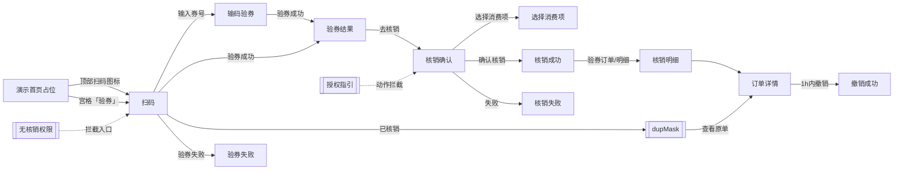

# PRD：抖音团购核销（单店 · 商户端）

| 字段 | 内容 |
|------|------|
| 文档版本 | v1.1 |
| 日期 | 2026-09-08 |
| 交互原型（唯一可视依据） | 同目录 `index.html` |
| 画布 | 390 × 844 |
| 目的 | 供前端 / 后端 / 测试及 AI 工具落地「抖音团购核销」；**只需本文 + 交互原型** |

---

## 怎么读这份 PRD

正文按模块编排。**不用通读全文**，按角色跳章即可。

| # | 模块 | 前端 | 后端 | 测试 | 说明 |
|---|------|:----:|:----:|:----:|------|
| 1 | 背景 / 目标 / 范围 / 能力映射 | ✓ | ✓ | ✓ | 本期变更叙事、防范围蔓延 |
| 2 | 用户场景与成功标准 | ✓ | 了解 | ✓ | 测「业务对不对」 |
| 3 | 信息架构与页面清单 | ✓ | 了解 | ✓ | 做哪些页、哪些层 |
| 4 | 状态机 | ✓ | **必看** | **必看** | 权限、授权、匹配、核销、撤销 |
| 5 | 交互细则 / 异常流 | ✓ | 了解 | ✓ | 输入规则、校验、toast、门禁 |
| 6 | 功能规格 | ✓ | 了解 | ✓ | 逐屏字段与跳转（含锚点 id） |
| 7 | 数据模型与接口约定 | ✓ | **必看** | ✓ | 会话字段 + 能力清单；路径【待联调确认】 |
| 8 | 业务规则 | ✓ | **必看** | ✓ | 匹配/业绩/权限/撤销口径 |
| 9 | 文案清单与权限 | ✓ | 部分 | ✓ | 文案；收银开单权限（rolePerm）/ 门店授权 |
| 10 | 验收 P0 + 造数场景 | 了解 | 了解 | **必看** | Given→When→Then |
| 11 | 非功能（极简） | ✓ | ✓ | ✓ | |
| 12 | 交付物 | ✓ | — | ✓ | 仅 PRD + 原型 |

**先读这几条（贯穿全文）**

1. **单店模式**：本期无总部/多分店；**无「业绩归属配置」页**（已删）。核销、授权、订单均按当前登录门店。
2. **APP 首页仅为演示占位，并非真实 APP 首页**。原型用占位首页承载扫码按钮，便于演示主链路；**真实产品入口以线上 APP 首页扫码核销入口为准**。占位首页提供 **2 个核销入口**：顶部右侧扫码图标（与线上一致）+ 宫格**「验券」**（功能入口，替换原仅展示的「抖音核销」格）；两者进入同一 `scan` 链路，门禁一致。详见模块 1 / 3 / 6.1。
3. **业绩归属一律默认空**：核销确认页点击选择服务员工；**不选也可确认核销**，按「未选服务员工」生成订单，**该单不计业绩**。成功页「操作人」= 当前登录账号，**与业绩归属解耦**。
4. **团购券无事先价目映射**：验券后默认「未匹配」；核销时手工「选择消费项」（项目/产品分组多选）。同一会话内按券名记忆匹配；标签在「未匹配」↔「已匹配」间切换。多项时展示文案「多项匹配按门店原价占比分摊计算业绩」（**不展示具体百分比**）。
5. **账号无核销权限**：`rolePerm` **对应 APP「角色权限 · 收银开单」**；该权限关闭则不可扫码核销。拦截全部核销入口（扫码 / 输码 / 主链路导航 / 重新扫码 / 手动输码等）→「无核销权限」页；验券、核销等动作时仍做兜底拦截。原型演示条文案为「收银开单权限 / 已开启 / 已关闭」。
6. **门店授权**状态：`none` / `pending` / `ok` / `expired`。未授权或到期时，**拦动作**并引导授权指引页。
7. **内部开单字段**：UI 支付方式仍显示「抖音团购」；内部写入 `orderType=快捷开单`、`payType=团购`。
8. **美团 / 优惠券 Tab**：仅占位视觉，**本期不做完整核销**。
9. **撤销**：核销后 **1 小时内**可撤；超时不可撤；顾客退款后内部状态 `refund`，**展示文案「已退款」**（列表标签、筛选、详情状态、禁用按钮）；幂等「已核销」弹窗可查看原单。
10. **员工选择**：开单式卡片翻转（点客/散客 → 大/中/小工），可多选；照片头像。
11. **核销成功页会员选填**：卡片内联「手机号 / 称呼 / 性别」三行选填（**无**独立 `phoneMask`）；点「完成」时：手机号有值须 11 位；**称呼与性别都已填**则自动注册会员（称呼 1 字时男→`X先生`、女→`X小姐`）；只填手机号或缺称呼/性别不注册，可直接离开。
12. **扫码结果演示条**（非正式规格）：已删「扫码成功」；保留「识别失败 / 已用过 / 价目未匹配 / 多匹配」；新增「价目已匹配」（预写默认券单项 `p21` 匹配记忆）。

交互行为与文案以 **`index.html` 当前表现** 为准。

---

# 模块 1　背景 / 目标 / 范围 / 能力映射
> 读者：前端 ✓ · 后端 ✓ · 测试 ✓

## 1.1 背景

门店需在商户端完成抖音团购券的验券与核销，并自动开单、支持短时撤销与明细查询。线下与评审确认：

- 本期按 **单店** 交付，不做总部/多分店与「业绩归属配置」页；
- 团购券与门店价目 **无事先映射**，需在核销时手工选择消费项，并支持会话记忆；
- 业绩归属与操作人解耦：归属可空（不计业绩），操作人固定为登录账号；
- 需覆盖账号无「收银开单」权限、门店未授权/到期、断网、相机权限、已核销幂等等异常；
- 原型首页仅为演示占位，真实入口对齐线上扫码核销。

## 1.2 目标

| 目标 | 说明 |
|------|------|
| 扫码 / 输码验券 | 识别或输入券码后验券，进入结果与确认 |
| 手工匹配消费项 | 无事先映射；项目/产品多选；会话记忆；未匹配也可核销 |
| 业绩归属可选 | 默认空；选员工可计业绩；不选不计业绩 |
| 确认核销开单 | 成功后自动开单；内部 orderType/payType 约定见 8 |
| 核销明细与撤销 | 列表/详情；1h 内可撤；超时/已退款态正确 |
| 权限与授权门禁 | 无「收银开单」权限（rolePerm）进页即拦；门店授权未 ok 拦动作 |
| 异常可达 | 相机无权限、断网、超时、验券失败、核销失败、幂等已核销 |
| 范围可控 | 美团/优惠券仅占位；单店；无业绩归属配置页 |

## 1.3 本期做（In）

- 演示占位首页：顶部扫码入口进入核销主链路（**非真实 APP 首页**）
- 扫码核销、输码验券（抖音 Tab 可用；美团/优惠券 Tab 占位）
- 验券结果 → 核销确认 →（可选）选择消费项 / 选择服务员工 → 核销成功 / 失败
- 选择消费项：项目/产品分组多选；会话按券名记忆；标签未匹配/已匹配；多项分摊提示文案
- 选择服务员工：卡片翻转（点客/散客 → 小工/中工/大工），多选，照片头像；默认未选可核销
- 核销成功：操作人=登录账号；成功页内联选填手机号/称呼/性别；称呼+性别齐全时自动注册会员（写入线上会员列表）
- 核销明细（抖音列表 + 筛选）→ 订单详情 → 撤销（1h）→ 撤销成功
- 授权指引（none/pending/ok/expired）
- 相机无权限、断网/超时/无权限模板、验券失败、已核销幂等弹窗等异常页/层
- 内部开单：`orderType=快捷开单`，`payType=团购`；UI 支付方式文案「抖音团购」

## 1.4 本期不做（Out）

- 真实 APP 首页信息架构与其它业务入口改造（原型首页仅为演示占位）
- 总部 / 多分店切换、「业绩归属配置」页
- 美团团购核销、优惠券核销完整流程（Tab 仅视觉占位）
- 次卡 / 其它平台券
- 团购券与价目的事先自动映射配置（本期仅手工匹配 + 会话记忆）
- 支付收银改造、会员体系全面改造（成功页选填自动注册沿用线上会员列表；不做独立会员中心改造）
- 撤销失败中间页（确认撤销后直接成功；无单独失败页）

## 1.5 旧 → 新能力映射

| 旧体系能力（语义） | 新体系如何表现 |
|--------------------|----------------|
| 线下/口头核销 | 商户端扫码/输码 → 验券 → 确认核销 → 自动开单 |
| 券与价目事先绑定 | **无事先映射**；确认页「选择消费项」手工多选 + 会话记忆 |
| 业绩强制选员工 | 默认空；可不选；未选则该单不计业绩 |
| 操作人=业绩人 | 操作人=登录账号；业绩归属独立字段 |
| 无授权引导 | 授权状态机 + 授权指引页；动作时拦截 |
| 无权限仍可进扫码 | `rolePerm`=收银开单关闭 → 全部核销入口拦截 → 无核销权限页；动作兜底 |
| 已核销重复扫 | 幂等弹窗，可查看原单 |
| 误核销无法回退 | 1 小时内可撤销；超时不可撤；已退款态（内部 `refund`） |
| 美团同页核销 | Tab 占位，本期不做 |

映射不足时以原型字段与行为为准。

---

# 模块 2　用户场景与成功标准
> 读者：前端 ✓ · 后端 了解 · 测试 ✓

## 2.1 角色

| 角色 | 说明 |
|------|------|
| 店员 | 日常扫码/输码核销（需开启「收银开单」权限） |
| 店长 | 核销 + 门店授权协同 |
| 店主 | 门店授权与权限发放 |

本期权限差异：**账号是否开启 APP「角色权限 · 收银开单」**（会话字段 `rolePerm`）与 **门店是否已授权**（`auth`）分开判定，见模块 4 / 8 / 9。店员日常核销依赖收银开单权限。

## 2.2 核心场景

| 场景 | 用户期望 | 成功标准 |
|------|----------|----------|
| 有权扫码主链路 | 扫码验券并核销开单 | 扫码→结果→确认→成功；生成开单；支付方式 UI「抖音团购」 |
| 输码验券 | 无相机或扫码失败时手输 | 输码→验券→同主链路 |
| 未匹配可核销 | 券未对手动价目也能核销 | 标签「未匹配」；可确认；按券面额开单 |
| 多匹配 / 记忆匹配 | 组合券选多项；下次同券名自动带出 | 多项提示分摊文案；记忆后标签「已匹配」 |
| 归属空可核销 | 赶时间不选员工 | 默认「未选」；确认成功；该单不计业绩；操作人仍显示登录账号 |
| 无收银开单权限 | 权限关闭账号无法核销 | 任何核销入口 → 无核销权限页（副文说明未开启收银开单） |
| 未授权 / 到期 | 引导完成来客授权 | 动作拦截 → 授权指引；状态展示正确 |
| 已核销幂等 | 重复扫不重复开单 | dup 弹窗；可看原单 |
| 1h 撤销 | 误核销可撤 | 详情可撤 → 撤销成功；状态已撤销 |
| 超时不可撤 | 超 1h 不可撤 | 按钮禁用；提示超时/客服指引 |
| 成功页会员选填 | 可选填手机号/称呼/性别 | 手机号有值须 11 位；称呼+性别齐全则自动注册会员；否则可直接完成离开 |

---

# 模块 3　信息架构与页面清单
> 读者：前端 ✓ · 后端 了解 · 测试 ✓

> **说明**：`home` 为 **演示占位首页**，不是真实 APP 首页。正式产品入口以线上首页扫码核销为准；原型用占位页承载扫码按钮演示。

```
抖音团购核销（单店）
 ├─ home 演示首页（占位）          <!-- #home -->
 │    ├─ 顶部扫码图标 → scan（与线上一致）
 │    └─ 宫格「验券」 → scan（功能入口；门禁与扫码一致）
 ├─ scan 扫码核销                  <!-- #scan -->
 │    ├─ 验券订单 → orders
 │    └─ 输入券号 → input
 ├─ input 输码验券                 <!-- #input -->
 │    └─ Tab：优惠券(占位) / 抖音 / 美团(占位)
 ├─ result 验券结果                <!-- #result -->
 │    └─ 去核销 → confirm
 ├─ confirm 核销确认               <!-- #confirm -->
 │    ├─ 选择消费项 → match-pick
 │    └─ 业绩归属 → empMask
 ├─ match-pick 选择消费项          <!-- #match-pick -->
 ├─ success 核销成功               <!-- #success -->
 │    └─ 卡片内联：手机号 / 称呼 / 性别（选填；无 phoneMask）
 ├─ fail 核销失败                  <!-- #fail -->
 ├─ orders 核销明细                <!-- #orders -->
 │    └─ 筛选 → filterMask
 ├─ detail 订单详情                <!-- #detail -->
 │    └─ 撤销 → revokeMask → revoke-ok
 ├─ revoke-ok 撤销成功             <!-- #revoke-ok -->
 ├─ owner-auth 授权指引            <!-- #owner-auth -->
 ├─ cam-denied 相机无权限          <!-- #cam-denied -->
 ├─ tpl-offline / tpl-timeout / tpl-noperm
 ├─ verify-fail 验券失败           <!-- #verify-fail -->
 └─ 弹层
      ├─ offlineMask / dupMask / empMask
      ├─ filterMask / revokeMask
      └─ loadingMask
```

### 3.0 页面流（示意）



| 页面/层 | 锚点 id | 导航标题（原型） | 说明 |
|---------|---------|------------------|------|
| 演示首页（占位） | `home` | — | **非真实 APP 首页**；两个核销入口：顶部扫码图标 + 宫格「验券」 |
| 扫码核销 | `scan` | 扫码 | 相机取景 + 输入券号 + 验券订单 |
| 输码验券 | `input` | 输入券号 | 抖音可用；美团/优惠券占位 |
| 验券结果 | `result` | 验券结果 | 券信息 + 匹配标签 |
| 核销确认 | `confirm` | 确认核销 | 匹配/金额/归属/支付方式 |
| 选择消费项 | `match-pick` | 选择消费项 | 项目/产品多选 |
| 核销成功 | `success` | 核销成功 | 操作人 + 内联会员选填（手机号/称呼/性别） |
| 核销失败 | `fail` | 核销失败 | 确认后平台失败 |
| 核销明细 | `orders` | 核销明细 | 抖音列表 + 筛选 |
| 订单详情 | `detail` | 核销详情 | 撤销入口 |
| 撤销成功 | `revoke-ok` | 撤销结果 | |
| 授权指引 | `owner-auth` | 抖音来客授权 | 四步指引 + 状态 |
| 相机无权限 | `cam-denied` | 无法使用相机 | |
| 断网模板 | `tpl-offline` | — | |
| 超时模板 | `tpl-timeout` | — | |
| 无核销权限 | `tpl-noperm` | — | 未开启「收银开单」统一落点 |
| 验券失败 | `verify-fail` | — | 验券阶段失败 |
| 选择服务员工 | `empMask` | 选择服务员工 | 翻转多选 |
| 其它弹层 | offline/dup/filter/revoke/loading | — | 见 6.17（无 phoneMask） |

---

# 模块 4　状态机
> 读者：前端 ✓ · 后端 **必看** · 测试 **必看**

## 4.1 账号核销权限 `rolePerm`（= APP「角色权限 · 收银开单」）

> **映射**：会话字段 `rolePerm` **对应** 线上 APP「角色权限 · 收银开单」。该权限关闭则不可扫码核销（入口全拦逻辑不变）。原型左侧演示条标签为「收银开单权限」，开关文案「已开启 / 已关闭」。

| 状态 | 含义 | 行为 |
|------|------|------|
| `true` | 收银开单已开启 | 可进入扫码/输码及后续主链路 |
| `false` | 收银开单已关闭 | **全部核销入口** → `tpl-noperm`；验券/核销动作兜底拦截 |

拦截范围包括：首页扫码、扫码页、输码页、结果/确认/成功等主链路导航、重新扫码、手动输码、左侧演示导航进入消费链路等。

`tpl-noperm` 副文示意：「当前账号未开启「收银开单」权限，无法扫码核销…」

## 4.2 门店授权 `auth`

| 状态 | 含义 | UI 标签（示意） | 动作（验券/核销） |
|------|------|-----------------|-------------------|
| `none` | 未发起 | 未发起 | 拦截 → `owner-auth`，toast「门店尚未完成授权」 |
| `pending` | 待确认 | 待确认 | 同 none |
| `ok` | 已授权 | 已授权 | 允许 |
| `expired` | 已到期 | 已到期 | 拦截 → `owner-auth`，toast「门店授权已到期」 |

- 授权页可查看当前状态与到期日。
- **进页**（仅无 `rolePerm`）与 **动作**（`rolePerm` + `auth===ok`）分层：无权限进页即拦；有权限但未授权可看指引，点验券/核销才拦。

## 4.3 匹配状态 `mismatched` / `selectedMatchIds`

```
验券成功
  ├─ 会话无该券名记忆 → mismatched=true，标签「未匹配」，selectedMatchIds=[]
  └─ 会话有记忆 → 回填 ids，mismatched=false，标签「已匹配」
手工选择消费项并确定
  → 写入 matchMemory[券名]，mismatched=false，标签「已匹配」
清空/未选确定
  → 可回到未匹配（以原型确定逻辑为准）
```

- **未匹配也可确认核销**：按券面额开单；提示「未匹配价目时，将按券面额开单；业绩归属未选则该单不计业绩。」
- **多项**（`selectedMatchIds.length > 1`）：展示「多项匹配按门店原价占比分摊计算业绩」，不展示百分比。

## 4.4 业绩归属 `selectedEmpIds` / 员工角色

| 状态 | 含义 |
|------|------|
| 空（默认） | 未选服务员工；可核销；**该单不计业绩** |
| 已选 ≥1 | 含点客/散客 + 大/中/小工；可计业绩（分摊规则见 8） |

- 成功页「操作人」取 `opName`（登录账号），**不随业绩归属变化**。

## 4.5 核销订单状态（明细/详情）

| status | 展示 | 撤销 |
|--------|------|------|
| `ok` 且 `canRevoke` | 已核销 | 可点「撤销核销」 |
| `ok` 且超时 | 已核销 | 按钮「已超时不可撤销」 |
| `revoked` | 已撤销 | 不可再撤 |
| `refund` | **已退款**（展示文案；内部码仍为 `refund`） | 不可撤；按钮文案「已退款」；示意业绩已回滚 |

撤销窗口：**核销成功后 1 小时内**。

## 4.6 网络 / 相机演示态

| 字段 | 影响 |
|------|------|
| `offline` | 进扫码可弹 offlineMask；验券/核销动作可进 tpl-offline |
| `camDenied` | 进扫码 → cam-denied |

---

# 模块 5　交互细则 / 异常流
> 读者：前端 ✓ · 后端 了解 · 测试 ✓

## 5.1 入口与门禁

| 动作 | 校验顺序 |
|------|----------|
| 进入扫码/输码/主链路 | `rolePerm` → 否：`tpl-noperm` |
| 进入扫码（相机） | 上一步通过后：`camDenied` → `cam-denied`；`offline` → `offlineMask` |
| 验券 / 确认核销 | `rolePerm` → 否：`tpl-noperm`；`auth!==ok` → `owner-auth` + toast；`offline` → `tpl-offline` |

## 5.2 输码规则

| 规则 | 说明 |
|------|------|
| 空券码点验券 | toast「请输入券码」 |
| 合法非空 | 走验券 loading → 结果或失败/幂等 |
| 演示关键字（**仅原型演示，不算产品规则**） | 含 `used`/`已核销` → 幂等弹窗；`fail`/`无效` → 验券失败；`mismatch`/`未匹配` → 未匹配结果 |

## 5.3 成功页会员选填（内联；无 phoneMask）

成功页卡片内联三行选填：**手机号**、**称呼**、**性别**（男/女分段控件）。**已删除**独立 `phoneMask` sheet。

| 规则 | 说明 |
|------|------|
| 全部选填 | 可不填直接点「完成」离开 |
| 手机号有值 | 须匹配 `1` 开头 11 位；否则 toast「请输入 11 位手机号」且**不离开** |
| 称呼 + 性别都已填 | 点「完成」时**自动注册会员**（写入线上会员列表）；原型 toast「已注册为会员：XXX」示意 |
| 称呼展示名 | 仅 1 个字：男→`X先生`，女→`X小姐`；≥2 字原样 |
| 只填手机号 / 缺称呼或性别 | **不注册**；校验通过后可直接完成离开 |
| 「继续核销」 | 不触发完成态注册逻辑（以原型为准：仅「完成」走注册校验） |

## 5.4 Loading

| 场景 | 文案（示意） |
|------|----------------|
| 验券 | 正在验券… |
| 核销 | 正在核销… |
| 撤销 | 正在撤销… |

## 5.5 Toast / 反馈（须与原型一致）

| 条件 | 提示 |
|------|------|
| 空券码验券 | 请输入券码 |
| 扫码识别失败（演示） | 识别失败（并可脉冲「输入券号」） |
| 门店未授权动作 | 门店尚未完成授权 |
| 门店授权到期动作 | 门店授权已到期 |
| 复制券码/单号 | 已复制 |
| 选员工完成 | 已选择：{姓名}（示意） |
| 匹配确定 | 已匹配项目（示意） |
| 筛选应用 | 已应用筛选 / 已显示全部 |
| 超时点撤销 | 已超时，请联系客服 |
| 手机号格式错（完成时） | 请输入 11 位手机号 |
| 自动注册会员 | 已注册为会员：{展示名} |
| 演示：收银开单权限 | 演示：收银开单权限已开启 / 已关闭 |

## 5.6 弹层交互

- 遮罩点击可关闭（loading 除外，按原型）。
- `dupMask`：已核销说明 +「查看原单」→ 订单详情。
- `revokeMask`：二次确认后 loading → 撤销成功（无撤销失败页）。
- `empMask`：关闭保留已选；重进不重置（同会话）。
- `filterMask`：重置/应用；应用后刷新列表角标点。
- **无 `phoneMask`**：会员选填已内联至成功页。

## 5.7 扫码结果演示条（**非正式规格**）

原型左侧「扫码结果演示」仅供评审，**不算产品正式规则**：

| 按钮 | 行为（示意） |
|------|----------------|
| 识别失败 | 扫码页反馈识别失败 |
| 这张券已用过 | 幂等已核销弹窗 |
| 价目未匹配 | 验券结果标签「未匹配」 |
| **价目已匹配** | 预写默认券「深层补水护理 · 单次体验」→ 单项 `p21` 匹配记忆；结果/确认页标签「已匹配」 |
| 多匹配演示 | 多项匹配示意 |

**已删除**「扫码成功」演示按钮（与「价目未匹配」等未匹配路径重复）。

---

# 模块 6　功能规格
> 读者：前端 ✓ · 后端 了解 · 测试 ✓

下列字段、按钮、跳转均须与原型一致。小节标题旁注释为 **稳定锚点 id**，供 HTML/`data-flow` 同步。

## 6.1 演示首页（占位） <!-- #home -->

> **本页仅为演示占位，并非真实 APP 首页。** 真实产品入口以线上 APP 首页扫码核销入口为准；原型用本页承载演示主链路。

- 门店名示意「悦颜美肌 · 旗舰店」。
- **核销入口（共 2 个，均经门禁进入 `scan`）**：
  - 顶部右侧扫码图标：与线上一致的正式演示入口。
  - 宫格「验券」（#FE2C55 红底「验」字块）：功能入口图标；替换原仅展示的「抖音核销」格；点击与扫码图标同一处理（无「收银开单」权限 → 无核销权限页；门店授权 / 相机 / 离线门禁一致）。
- 底部 Tab、经营概览、其它宫格均为占位视觉，不承载本期业务。

## 6.2 扫码核销 <!-- #scan -->

- 标题「扫码」；右侧「验券订单」→ `orders`。
- 取景框 + 提示：「扫描项目核销码，核销后即可分账」。
- 底部「输入券号」→ `input`（须过 `rolePerm`）。
- 识别成功闪层「识别成功」后进入验券 loading → `result`（或失败/幂等）。
- 相机无权限 → `cam-denied`；离线进扫码可弹 `offlineMask`。
- 左侧「扫码结果演示」见 5.7（非正式规格）；含「价目已匹配 / 价目未匹配」等，**无**「扫码成功」按钮。

## 6.3 输码验券 <!-- #input -->

- 标题「输入券号」。
- Tab：**优惠券（占位）** / **抖音（可用）** / **美团（占位，点击不切换完整流程）**。
- 抖音面板：券码输入 +「立即验券」。
- 空码拦截见 5.2；成功 → `result`；失败 → `verify-fail` 或 `dupMask`。

## 6.4 验券结果 <!-- #result -->

- 平台标识「抖音团购」。
- 券名 + 标签「未匹配」/「已匹配」；面额；适用门店；有效期；脱敏券码；平台「抖音」。
- 「重新扫码」→ `scan`（过权限门禁）；「去核销」→ `confirm`。

## 6.5 核销确认 <!-- #confirm -->

- 待核销券：券名 + 匹配标签；面额；脱敏券码。
- **匹配项目**：
  - 未选：CTA「选择消费项」→ `match-pick`；
  - 已选：列出消费项 +「修改」；多项时展示「多项匹配按门店原价占比分摊计算业绩」（无百分比）。
- **开单金额**：默认券面额（演示）。
- **业绩归属**：默认「未选 ▸」→ `empMask`；已选回填摘要（如「点客·大工」多人顿号连接）。
- **支付方式**：UI 固定文案「抖音团购」（内部字段见 7/8）。
- 未匹配提示条（未匹配时显示）：「未匹配价目时，将按券面额开单；业绩归属未选则该单不计业绩。」
- 「取消」返回；「确认核销」→ loading → `success`（失败则 `fail`）；须过授权门禁。

## 6.6 选择消费项 <!-- #match-pick -->

- 标题「选择消费项」。
- Tab：项目 / 产品；左侧分组（全部及分类）；列表多选；「已选 N 项」；「清空」。
- 「取消」/ 返回不写入；「确定」写入会话 `selectedMatchIds` + `matchMemory[券名]`，标签改「已匹配」，回 `confirm`。
- 价目数据接门店项目/产品；演示数据见 seed。

## 6.7 选择服务员工 <!-- #empMask -->

- 弹层标题「选择服务员工」（与开单一致的卡片翻转交互）。
- 员工网格：**照片头像** + 姓名 + 职位。
- **两步翻转**：点卡片 → 「点客 / 散客」→ 「小工 / 中工 / 大工」；可多选；已选勾选角标；可清空单人。
- 完成/关遮罩保留选择；回填确认页「业绩归属」。
- **允许不选直接核销**。

## 6.8 核销成功 <!-- #success -->

- 成功态文案：「已自动生成开单，可在验券订单中查看明细」。
- 券信息：券码/平台单号（可复制）/ 核销时间 / **操作人**（登录账号，与业绩归属解耦）。
- **会员选填卡片**（内联，无独立 sheet）：
  - 手机号（选填）输入；
  - 称呼（选填）输入；
  - 性别（选填）男/女分段控件。
- 「继续核销」→ `scan`。
- 「完成」：先按 5.3 校验/可选注册会员，通过后 → `home`（占位首页）。

## 6.9 核销失败 <!-- #fail -->

确认核销后平台失败。类型与主按钮（示意）：

| 类型 | 标题 | 主按钮去向 |
|------|------|------------|
| invalid | 券状态异常 | 重新扫码 |
| used | 券已核销 | 查看订单 |
| store | 非本店可用券 | 重新扫码 |
| perm | 无核销权限 | 授权指引 |
| network | 网络超时 | 重试核销（回 confirm） |

副按钮常驻「手动输码」→ `input`。

## 6.10 核销明细 <!-- #orders -->

- 标题「核销明细」；筛选图标 → `filterMask`。
- Tab：优惠券（占位空态）/ 抖音（列表）/ 美团（占位，不切换完整能力）。
- 抖音卡片：名称、金额、时间、操作人、平台标签、状态（已核销/已撤销/已退款）。
- 点卡片 → `detail`；空态「暂无核销信息」。

## 6.11 订单详情与撤销 <!-- #detail -->

- 字段：名称、金额、状态、券码、平台单号、核销时间、操作人、开单号、撤销时限提示。
- 券码/平台单号可复制。
- **撤销**：
  - 1h 内：`revokeMask` → 确认 → loading → `revoke-ok`；
  - 超时：按钮禁用「已超时不可撤销」；可展示客服指引卡；
  - 已撤销 / 已退款：按钮禁用对应文案（已退款态按钮文案「已退款」）。

## 6.12 撤销成功 <!-- #revoke-ok -->

- 「撤销成功」；说明：对应开单已冲销，员工业绩已回滚，撤销流水已保留。
- 「返回核销明细」→ `orders`。

## 6.13 授权指引 <!-- #owner-auth -->

- 标题「抖音来客授权」。
- 四步：打开来客 → 服务市场/授权管理 → 勾选核销相关能力 → 回剑琅确认状态。
- 当前门店授权状态卡：门店名、状态标签、到期日（随 `auth` 变化）。
- 提示：在抖音来客完成门店授权后，方可在本店核销抖音团购券。

## 6.14 相机无权限 <!-- #cam-denied -->

- 「未获得相机权限」；引导系统设置或改用「输入券号」。
- 可提供打开设置示意 toast；可返回或去输码。

## 6.15 断网/超时/无权限模板 <!-- #tpl-offline #tpl-timeout #tpl-noperm -->

| 页 | 用途 |
|----|------|
| `tpl-offline` | 断网模板；可「重试」切回联网示意 |
| `tpl-timeout` | 超时模板 |
| `tpl-noperm` | **无核销权限**；账号未开启 APP「收银开单」权限时的统一落点；副文：「当前账号未开启「收银开单」权限，无法扫码核销…」 |

文案与按钮以原型为准。

## 6.16 验券失败 <!-- #verify-fail -->

验券阶段（尚未核销开单）失败。类型示意：券无效或已过期 / 券已核销 / 非本店可用券 / 网络超时。  
「已核销」主按钮可「查看订单」；其它默认「重新扫码」。

## 6.17 弹层汇总

| 锚点 id | 名称 | 要点 |
|---------|------|------|
| `offlineMask` | 离线提示 | 可仍进入扫码（示意）或取消 |
| `dupMask` | 已核销幂等 | 说明不重复开单；查看原单 → detail |
| `empMask` | 选择服务员工 | 见 6.7 |
| `filterMask` | 筛选 | 状态：全部/已核销/已撤销/**已退款**（内部值 `refund`）；时间：全部/今日；重置/应用 |
| — | （已删）`phoneMask` | 会员选填改内联成功页，见 6.8 |
| `revokeMask` | 撤销确认 | 确认后直接成功链路 |
| `loadingMask` | 加载中 | 验券/核销/撤销文案 |

---

# 模块 7　数据模型与接口约定
> 读者：前端 ✓ · 后端 **必看** · 测试 ✓

**原则：路径与字段名标注【待联调确认】；语义以本文与原型为准。**

## 7.1 原型会话字段（前端状态，对齐实现）

| 字段 | 说明 |
|------|------|
| `offline` | 是否离线演示 |
| `camDenied` | 相机是否拒绝 |
| `auth` | `none` \| `pending` \| `ok` \| `expired` |
| `rolePerm` | 是否开启 APP「角色权限 · 收银开单」；关闭则不可扫码核销 |
| `selectedEmpId` / `selectedEmpIds` | 业绩归属员工；默认空 |
| `staffRoles` / `staffDesignated` | 工位（大/中/小工）与点客/散客 |
| `opName` | 当前登录账号名（成功页操作人） |
| `selectedProdId` / `selectedMatchIds` | 匹配消费项 |
| `matchMemory` | `{ [券名]: [{id,kind,name,price}, ...] }` 会话记忆 |
| `orderType` | 内部固定 `快捷开单` |
| `payType` | 内部固定 `团购` |
| `couponName` / `couponPrice` / `couponCode` | 当前券 |
| `mismatched` | 是否未匹配 |
| `phone` | 成功页选填手机号 |
| `nickname` | 成功页选填称呼 |
| `gender` | `male` \| `female` \| `null` |
| `registeredMembers` | 演示/会话：成功页自动注册的会员列表（正式写入线上会员列表） |

## 7.2 能力清单（路径【待联调确认】）

| 能力 | 说明 | 路径 |
|------|------|------|
| 验券准备 | 查询门店授权状态、账号核销权限、相机权限前置 | 【待联调确认】 |
| 验券 | 扫码/输码提交券码；返回券信息或失败码；已核销返回幂等 | 【待联调确认】 |
| 核销 | 提交券码 + 匹配消费项（可空）+ 服务员工（可空）+ 开单字段；成功生成快捷开单 | 【待联调确认】 |
| 撤销 | 核销后 1h 内撤销；冲销开单与业绩；超时拒绝 | 【待联调确认】 |
| 授权查询 | 查询/刷新门店来客授权状态与到期日 | 【待联调确认】 |
| 核销明细 | 列表筛选（状态/时间）；详情 | 【待联调确认】 |
| 价目 | 门店项目/产品分组列表（供匹配多选） | 沿用线上价目【待联调确认】 |
| 员工 | 在职员工头像/姓名/职位 | 沿用线上员工【待联调确认】 |
| 会员注册（轻量） | 成功页「完成」时：称呼+性别齐全则写入线上会员列表（含手机号可空） | 沿用线上会员【待联调确认】 |

## 7.3 核销开单字段约定

| UI 展示 | 内部字段 |
|---------|----------|
| 支付方式「抖音团购」 | `payType = 团购` |
| （无单独 UI） | `orderType = 快捷开单` |
| 开单金额 | 默认券面额；未匹配同面额 |
| 服务员工 | 可空；空则不计业绩 |
| 操作人 | 登录账号；写入流水展示 |

## 7.4 时序（示意）

```
进入核销入口
  → 无 rolePerm → tpl-noperm
  → 有权限 → 扫码/输码
验券
  → auth 非 ok → owner-auth
  → 成功 → result（套用 matchMemory）→ confirm
  → 已核销 → dupMask（可看原单）
  → 其它失败 → verify-fail
确认核销
  → 可选 match-pick / empMask
  → 提交（员工可空、匹配可空）→ success / fail
成功页内联选填；「完成」时校验手机号并可选自动注册会员
明细 → 详情 →（1h 内）撤销 → revoke-ok
```

---

# 模块 8　业务规则
> 读者：前端 ✓ · 后端 **必看** · 测试 ✓

1. **单店**：无总部/分店切换；无业绩归属配置页。
2. **演示首页占位**：非正式产品首页；正式入口=线上扫码核销。占位页提供顶部扫码图标与宫格「验券」两个演示入口，两者共用 `scan` 链路与权限/授权门禁（见 §6.1）。
3. **无事先价目映射**：验券不自动绑价目；仅手工匹配 + 会话记忆。
4. **未匹配可核销**：按券面额开单；标签「未匹配」。
5. **已匹配**：至少一项消费项；标签「已匹配」；多项显示分摊提示文案，**不展示百分比**；业绩按门店原价占比分摊（算法服务端实现，UI 不透出比例）。
6. **记忆匹配**：同会话同券名再次验券自动回填上次选择。
7. **业绩归属默认空**；可不选；未选 → 订单生成但 **不计业绩**。
8. **操作人 ≠ 业绩归属**：操作人=登录账号。
9. **员工选择**：点客/散客 → 小工/中工/大工；多选；照片头像。
10. **内部开单**：`orderType=快捷开单`，`payType=团购`；UI 支付方式「抖音团购」。
11. **rolePerm=false**（收银开单已关闭）：拦截全部核销入口 + 动作兜底 → `tpl-noperm`。
12. **auth≠ok**：拦验券/核销动作 → `owner-auth`。
13. **撤销窗口 1 小时**；超时不可撤；**已退款**态（内部 `refund`）不可撤且业绩已回滚示意；展示文案一律「已退款」。
14. **幂等已核销**：不重复开单；弹窗可看原单。
15. **美团/优惠券 Tab**：仅占位，本期不做完整核销。
16. **成功页会员选填**：手机号/称呼/性别均选填；手机号有值须 11 位；称呼+性别齐全才自动注册会员（1 字称呼按性别补先生/小姐）；否则不注册可离开。无 `phoneMask`。
17. **输码演示关键字**（used/fail/mismatch 等）及扫码结果演示条：**仅原型演示，不算产品规则**。
18. **范围边界**：其它收银/会员能力沿用线上；冲突以原型界面修正 PRD。

---

# 模块 9　文案清单与权限
> 读者：前端 ✓ · 后端 部分 · 测试 ✓

## 9.1 文案清单（须与原型一致）

**导航/按钮**：扫码、验券订单、输入券号、立即验券、重新扫码、去核销、选择消费项、修改、取消、确认核销、确定、清空、继续核销、完成、筛选、重置、应用、撤销核销、返回核销明细、查看原单、手动输码、查看订单、查看授权指引、重试核销、项目、产品、优惠券、抖音、美团、点客、散客、大工、中工、小工、男、女。

**标签/状态**：未匹配、已匹配、已核销、已撤销、**已退款**、未发起、待确认、已授权、已到期、抖音、抖音团购。

**关键提示**：扫描项目核销码，核销后即可分账；多项匹配按门店原价占比分摊计算业绩；未匹配价目时，将按券面额开单；业绩归属未选则该单不计业绩；已自动生成开单，可在验券订单中查看明细；对应开单已冲销，员工业绩已回滚，撤销流水已保留；在抖音来客完成门店授权后，方可在本店核销抖音团购券；当前账号未开启「收银开单」权限，无法扫码核销…

**占位符**：请输入券码；请输入手机号；如：王 / 王芳（称呼）。

**成功页字段标签**：手机号（选填）、称呼（选填）、性别（选填）。

**Toast**：见 5.5。

**失败标题**：券状态异常、券已核销、非本店可用券、无核销权限、网络超时、券无效或已过期、未获得相机权限 等（以原型 FAIL_MAP / VFAIL_MAP 为准）。

## 9.2 权限

| 维度 | 规则 |
|------|------|
| 账号核销权限 `rolePerm` | **映射 APP「角色权限 · 收银开单」**；关闭：全部入口 → 无核销权限页；动作兜底。演示条：「收银开单权限 / 已开启 / 已关闭」 |
| 门店授权 `auth` | 仅 `ok` 可验券/核销；否则引导授权页 |
| 店员/店长/店主 | 角色展示沿用线上；是否开启「收银开单」由账号角色权限配置决定 |

---

# 模块 10　验收 P0 + 造数场景
> 读者：测试 **必看**

## 10.1 造数

| 场景 | 说明 |
|------|------|
| 收银开单开/关 | `rolePerm` true/false（对应 APP 收银开单） |
| 授权四态 | none / pending / ok / expired |
| 未匹配券 | 无记忆的新券名 |
| 多匹配券 | 可选手动多项；或演示 multi |
| 记忆匹配 | 同券名二次验券 |
| 可撤订单 | 核销后 <1h |
| 超时订单 | 核销后 ≥1h |
| 已撤销 / 已退款 | 列表与详情态（展示「已退款」，内部 `refund`） |
| 员工 | ≥3 人，含头像，可点客/散客与三工位 |
| 价目 | 项目+产品至少各 1 分组 |
| 价目已匹配演示 | 默认券名 + 单项 `p21` 记忆 |
| 成功页会员 | 可造：仅手机号 / 称呼+性别 / 全空 |

正式环境自备等价数据；演示关键字造数不进产品规则。

## 10.2 Given → When → Then（P0）

**有权扫码主链路**
1. **Given** 有核销权限且门店已授权、联网、相机可用，**When** 从演示首页点扫码（顶部图标 / 宫格「验券」）并完成识别验券，**Then** 进入验券结果，可「去核销」→ 确认 →「确认核销」→ 核销成功，并生成开单（支付方式 UI 为「抖音团购」）。

**无收银开单权限拦截**
2. **Given** `rolePerm=false`（收银开单已关闭），**When** 点首页扫码图标 / 宫格「验券」/ 输码 / 主链路导航 / 重新扫码 / 手动输码，**Then** 均进入「无核销权限」页（副文含未开启「收银开单」），不进入扫码或核销。
3. **Given** 无权限，**When** 试图触发验券或核销动作，**Then** 兜底仍落到无核销权限页。

**未授权**
4. **Given** 有核销权限但 `auth=none|pending|expired`，**When** 点立即验券或确认核销，**Then** toast 对应文案并进入授权指引页。

**未匹配可核销**
5. **Given** 验券成功且无匹配记忆，**When** 查看结果/确认页，**Then** 标签「未匹配」；不选消费项也可「确认核销」成功；开单金额按券面额。

**多匹配**
6. **Given** 确认页，**When** 选择 ≥2 个消费项确定，**Then** 标签「已匹配」，展示「多项匹配按门店原价占比分摊计算业绩」，且不出现具体百分比数字。

**记忆匹配**
7. **Given** 某券名已手工匹配并确定，**When** 同会话再次验得同名券，**Then** 自动回填匹配项，标签「已匹配」。

**归属空可核销**
8. **Given** 确认页业绩归属为「未选」，**When** 确认核销成功，**Then** 订单生成；该单不计业绩；成功页「操作人」仍为当前登录账号。

**已核销幂等**
9. **Given** 券已核销，**When** 再次扫码/输码验券，**Then** 弹出已核销说明（不重复开单），可「查看原单」进入原订单详情。

**1h 撤销**
10. **Given** 订单在 1 小时内且状态已核销，**When** 详情点「撤销核销」并确认，**Then** 进入撤销成功；明细状态为已撤销。

**超时不可撤**
11. **Given** 订单超过 1 小时，**When** 查看详情，**Then** 撤销按钮为「已超时不可撤销」或等效禁用，无法完成撤销。

**输码关键字演示（非产品规则）**
12. **Given** 输码页（原型演示），**When** 输入含 `used`/`已核销`、`fail`/`无效`、`mismatch`/`未匹配` 的内容，**Then** 分别触发幂等弹窗、验券失败、未匹配结果——**仅用于原型演示，正式产品不以关键字作为业务规则**。

**员工翻转**
13. **Given** 选择服务员工弹层，**When** 点员工卡片，**Then** 翻转点客/散客 → 再选小/中/大工；可多选；头像为照片；回填确认页。

**美团/优惠券占位**
14. **Given** 输码或明细 Tab，**When** 点美团（或优惠券空态），**Then** 仅占位视觉，不进入完整美团核销流程。

**成功页会员选填**
15. **Given** 核销成功页，手机号填非 11 位合法号，**When** 点「完成」，**Then** toast「请输入 11 位手机号」且仍停留成功页。
16. **Given** 称呼与性别都已填（如称呼「王」、性别女），**When** 点「完成」，**Then** 自动注册会员（展示名「王小姐」），toast「已注册为会员：王小姐」，并离开至首页；写入线上会员列表（原型写入会话列表示意）。
17. **Given** 仅填手机号或缺少称呼/性别，**When** 点「完成」，**Then** 不注册会员，可直接离开。

**价目已匹配演示（非正式）**
18. **Given** 原型演示条，**When** 点「价目已匹配」，**Then** 默认券写入单项 `p21` 记忆，结果/确认页标签「已匹配」——**仅演示，非产品规则**。

**已退款展示**
19. **Given** 订单状态内部为 `refund`，**When** 查看列表/筛选/详情，**Then** 展示文案均为「已退款」（非「退款冲销」）；撤销按钮禁用文案「已退款」。

---

# 模块 11　非功能（极简）
> 读者：前端 ✓ · 后端 ✓ · 测试 ✓

- 画布与动效对齐原型 390 × 844。
- 原型为静态单页，状态内存模拟；刷新重置（含 matchMemory）。
- 埋点：无专表；若现网统一规范另案。
- 员工/价目/订单为演示资源；正式接入真实数据源。
- 本期仅单店。
- 交付只需 PRD + 交互原型。

---

# 模块 12　交付物

| 交付 | 说明 |
|------|------|
| 本文 `PRD-抖音团购核销.md` | 开发与测试 / AI 准稿 |
| `PRD-抖音团购核销.html` | PRD 自包含 HTML 预览（含 `?embed=1` 嵌入模式） |
| 交互原型 `index.html` | 唯一可视依据；桌面壳右侧可同步滚动 PRD；左侧导航「PRD 预览」可打开独立页 |

开发与测试只需 **PRD + 原型**。冲突时以原型界面为准修正 PRD。

> 原型左侧「演示条」（网络/相机/**收银开单权限**切换、扫码结果演示：识别失败 / 已用过 / 价目未匹配 / **价目已匹配** / 多匹配；**无**「扫码成功」）仅供评审演示，**不作为产品正式规格**；正式规则以本文状态机与业务规则为准。
